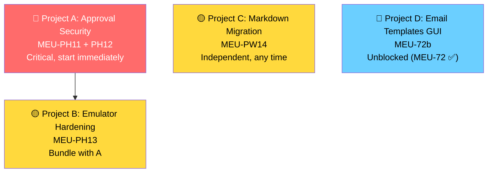

# Known Issues → Build Plan Remediation — Status Report

> Analysis of 8 active known issues and their mapping to new build-plan documents, new MEUs, and planning doc updates.
> **Status: ✅ Executed** — All primary changes applied 2026-04-27.

---

## 1. Issue Triage Summary

| Issue ID | Severity | Action | Status |
|----------|----------|--------|:------:|
| [MCP-APPROVBYPASS] | Critical | **New MEU (PH11) + new doc (09g)** | ✅ Scoped |
| [MCP-POLICYGAP] | High | **New MEU (PH12)**, extends 05g | ✅ Scoped |
| [EMULATOR-VALIDATE] | Medium | **New MEU (PH13)**, extends 09f | ✅ Scoped |
| [GUI-EMAILTMPL] | High | **New MEU (72b) + new doc (06k)** | ✅ Scoped |
| [PIPE-NOLOCALQUERY] | Medium | **ARCHIVED** | ✅ Done |
| [PIPE-DROPPDF] | Medium | **New MEU (PW14) + new doc (09h)** | ✅ Scoped |
| [STUB-RETIRE] | Low | No change | — Already tracked |
| [MCP-TOOLDISCOVERY] | Medium | **Update scope** | ✅ Updated |

---

## 2. New Build-Plan Documents Created

### 2.1 `09g-approval-security.md` — Approval Gate Security ✅

**Purpose:** Prevent AI agents from self-approving policy executions via CSRF challenge tokens.

**Scope:**
- CSRF token generation in Electron main process via IPC
- API-side token validation middleware on `POST /policies/{id}/approve`
- Missing MCP scheduling tools (`delete_policy`, `update_policy`, `get_email_config`)
- Audit logging for approval events

**Resolves:** [MCP-APPROVBYPASS], [MCP-POLICYGAP]

### 2.2 `06k-gui-email-templates.md` — Email Template Management GUI ✅

**Purpose:** Provide a GUI for email template CRUD within the Scheduling page.

**Scope:**
- Tab bar addition to SchedulingLayout: "Report Policies" + "Email Templates"
- Template list+detail split layout
- CodeMirror/textarea editor for `body_html`, `subject_template`, `description`
- Live preview via `POST /templates/{name}/preview` → sandboxed `<iframe srcDoc>`
- Default template protection (read-only + duplicate action)

**Resolves:** [GUI-EMAILTMPL]

**Dependencies:** MEU-PH6 ✅ (template backend), MEU-72 ✅ (scheduling GUI page — closed out this session)

### 2.3 `09h-pipeline-markdown-migration.md` — PDF → Markdown Migration ✅

**Purpose:** Remove PDF rendering pipeline, replace with Markdown output for AI-agent-friendly reports.

**Scope:**
- Delete `pdf_renderer.py` + Playwright rendering dependency
- Remove `_render_pdf()` from `RenderStep`, PDF-related enum values
- Add `_render_markdown()` to RenderStep (structured Markdown tables)
- Update `SendStep.local_file` channel to write `.md` files
- Update `ReportModel.format` default `"pdf"` → `"md"` or `"html"`

**Resolves:** [PIPE-DROPPDF]

---

## 3. New MEUs Registered

### P2.5d — Approval Security & Validation Hardening

> New sub-phase. Source: `09g-approval-security.md`, `09f-policy-emulator.md` (extension)
> Prerequisite: P2.5c ✅ complete
> Resolves: [MCP-APPROVBYPASS], [MCP-POLICYGAP], [EMULATOR-VALIDATE]

| MEU | Slug | Matrix | Description | Status |
|-----|------|:------:|-------------|:------:|
| MEU-PH11 | `approval-csrf-token` | 49.26 | CSRF challenge token: Electron IPC → API middleware; single-use, 5-min TTL, policy-scoped | ⬜ |
| MEU-PH12 | `mcp-scheduling-gap-fill` | 49.27 | 3 MCP tools: `delete_policy`, `update_policy`, `get_email_config` | ⬜ |
| MEU-PH13 | `emulator-validate-hardening` | 49.28 | VALIDATE improvements: EXPLAIN SQL, SMTP check, step wiring validation | ⬜ |

### P2 — GUI Addition

| MEU | Slug | Matrix | Description | Status |
|-----|------|:------:|-------------|:------:|
| MEU-72b | `gui-email-templates` | 35b.2 | Email Templates tab in SchedulingLayout (CRUD, preview, default protection). E2E Wave 8: +3 tests | ⬜ |

### P2.5b — Pipeline Addition

| MEU | Slug | Matrix | Description | Status |
|-----|------|:------:|-------------|:------:|
| MEU-PW14 | `pipeline-markdown-migration` | 49.29 | PDF removal, Markdown rendering, Playwright dep cleanup | ⬜ |

---

## 4. MEU-72 Closeout

> **Finding:** MEU-72 was marked `⏳ pending Codex` in all trackers, but the Codex implementation critical review had already reached `approved` on Pass 3 (2026-04-12). The verdict was never propagated.

### Tracker Updates Applied

| File | Before | After |
|------|--------|-------|
| `BUILD_PLAN.md:290` | ⏳ | ✅ |
| `meu-registry.md:195` | ⏳ 2026-04-12 (pending Codex) | ✅ 2026-04-12 |
| `112-…-bp06es1.md:6` | `status: "draft"` | `status: "approved"` |
| `task.md:5` | `status: "in_progress"` | `status: "complete"` |
| `BUILD_PLAN.md:291` (MEU-72b dep) | Depends on MEU-72 ⏳ | Depends on MEU-72 ✅ |
| Summary table P2 completed | 7 | 8 |
| Summary table total completed | 111 | 112 |

### Impact

MEU-72b (`gui-email-templates`) is now **unblocked** — it was previously gated on MEU-72.

---

## 5. Canonical Tracker State (Post-Update)

| Counter | Value |
|---------|:-----:|
| Total MEUs | **224** |
| Completed | **112** |
| In-progress (🟡) | 1 (MEU-PW8) |
| Closed won't-fix (🚫) | 1 (MEU-90c) |
| Remaining | 110 |

---

## 6. BUILD_PLAN.md Changes Applied ✅

| Change | Status |
|--------|:------:|
| Phase index: add 9g, 9h rows | ✅ |
| Phase 9 status row: mention P2.5d | ✅ |
| P2 section: add MEU-72b row | ✅ |
| P2.5b section: add MEU-PW14 row | ✅ |
| P2.5d section: create with PH11–PH13 | ✅ |
| MEU-72: ⏳ → ✅ | ✅ |
| MEU-72b dependency: ⏳ → ✅ | ✅ |
| Summary table: P2.5d row, P2 8/18, total 112/224 | ✅ |

---

## 7. Other Planning Docs Updated ✅

| Document | Change | Status |
|----------|--------|:------:|
| `build-priority-matrix.md` | P2.5d section (49.26–49.29), item 35b.2, count 212→217 | ✅ |
| `meu-registry.md` | P2.5d section + cross-phase MEUs + MEU-72 ✅ | ✅ |
| `known-issues.md` | PIPE-NOLOCALQUERY archived, MCP-TOOLDISCOVERY updated | ✅ |
| `known-issues-archive.md` | PIPE-NOLOCALQUERY entry added | ✅ |

---

## 8. Remaining Doc Updates (Not Yet Applied)

| Document | Change Needed | Priority |
|----------|---------------|:--------:|
| `06-gui.md` | Add 06k to GUI sub-spec index; update Wave 8 E2E test count | Low |
| `09-scheduling.md` | Add cross-references to 09g, 09h sub-phase docs | Low |
| `05g-mcp-scheduling.md` | Add `delete_policy`, `update_policy`, `get_email_config` tool specs | Medium — needed before PH12 execution |

> These are secondary cross-reference updates. They don't block implementation but should be completed before execution of their respective MEUs.

---

## 9. Execution Priority & Project Grouping

| Priority | Project | MEUs | Severity | Blocker |
|----------|---------|------|----------|---------:|
| 1 | **Approval Security** | PH11 + PH12 | Critical | None — ready |
| 2 | **Emulator Hardening** | PH13 | Medium | None — bundle with #1 |
| 3 | **Markdown Migration** | PW14 | Medium | None — independent |
| 4 | **Email Templates GUI** | 72b | High | **None** — MEU-72 ✅ |

> [!IMPORTANT]
> **Recommended first project:** Projects A+B as a single session (3 MEUs, security-focused). The approval bypass is a Critical security issue that should be prioritized above all pending P2 GUI work.
