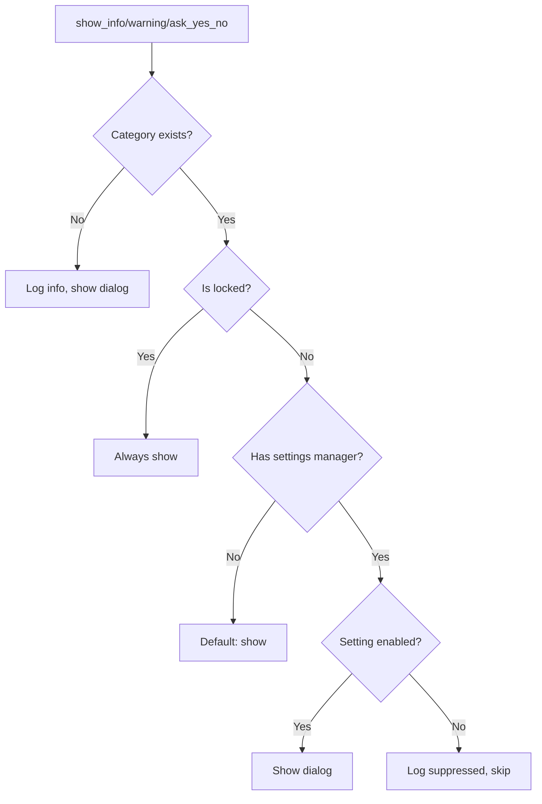
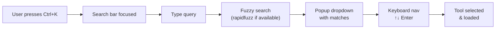

# GUI Settings Architecture

> Dialog suppression system, performance tuning, font configuration, data retention policies, and UI state persistence.

---

## Overview

GUI settings are managed by two components:

1. **`DialogManager`** — Configurable dialog display with suppression and category system
2. **`PersistenceManager`** — UI state persistence (window position, tab states, tool selection)

---

## Dialog Management (`core/dialog_manager.py`)

### Category System

Each dialog belongs to a category that can be individually enabled/disabled:

| Category | Lockable | Default | Examples |
|----------|----------|---------|----------|
| `success` | No | Enabled | Operation completed |
| `info` | No | Enabled | Status updates |
| `warning` | No | Enabled | Potential issues |
| `confirmation` | No | Enabled | Delete file? Clear all? |
| `error` | **Yes (always on)** | Enabled | Cannot be disabled |

**Locked categories**: Error dialogs are permanently visible — a safety requirement. `show_error()` bypasses all settings checks.

### Display Decision Flow



### Extension Points

Tools can register custom dialog categories:

```python
dialog_manager.register_dialog_type(
    category="custom_validation",
    description="Validation results for data processing",
    default_enabled=True,
    locked=False,
    examples=["Schema validation passed"]
)
```

---

## UI State Persistence (`core/persistence_manager.py`)

Persists and restores UI state across application sessions:

| What's Persisted | Storage |
|------------------|---------|
| Window geometry (position, size) | Settings DB |
| Active tab index (input/output) | Settings DB |
| Selected tool name | Settings DB |
| Recent tools list | Settings DB |
| Favorite tools | Settings DB |
| Panel collapse states | Settings DB |
| Font family and size | Settings DB |
| Theme preference | Settings DB |

---

## Console Log Architecture (`core/streaming_text_handler.py`)

### StreamingTextHandler

Handles progressive text insertion for AI response streaming:

| Feature | Implementation |
|---------|---------------|
| Chunked insertion | Background thread with queue |
| Auto-scroll | Follows new content |
| Highlight | Temporarily highlights new text |
| Metrics | Tracks chars/second, total chunks |
| Pause/resume | Stream control |
| Cancel | Abort mid-stream |

**States**: `IDLE` → `STREAMING` → `COMPLETED` (or `PAUSED` / `ERROR`)

### IncrementalTextUpdater

Efficient text replacement using diff algorithm:
- Computes minimal edit operations (insert/delete/replace)
- Avoids full text replacement when only parts changed
- Uses `difflib.SequenceMatcher` for diff computation

---

## Search Tool (`core/tool_search_widget.py`)

### Command Palette Pattern (Ctrl+K)

`ToolSearchPalette` implements VS Code-style tool search:



**Fuzzy search**: Uses `rapidfuzz.fuzz.partial_ratio` if installed, falls back to simple substring matching.

**Features**:
- Compact bar showing current tool name
- Click or Ctrl+K opens search
- Arrow keys + Enter to navigate/select
- Auto-hide on focus loss
- Tracks recent and favorite tools

---

## Design Decisions

1. **Category-based dialogs**: Rather than global on/off, each dialog type can be individually configured
2. **Error dialogs always show**: Safety requirement — user must always see errors
3. **Suppressed → logged**: Hidden dialogs are logged so information isn't lost
4. **Default action for confirmations**: When confirmation dialog is suppressed, uses `default_action` (configurable per category)
5. **Fuzzy search optional**: `rapidfuzz` is optional — degrades to substring matching without it
