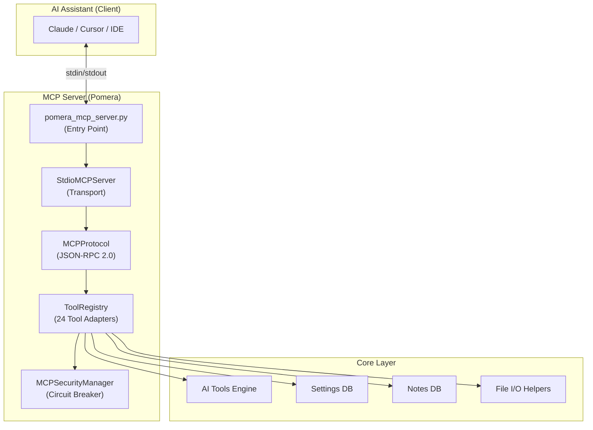
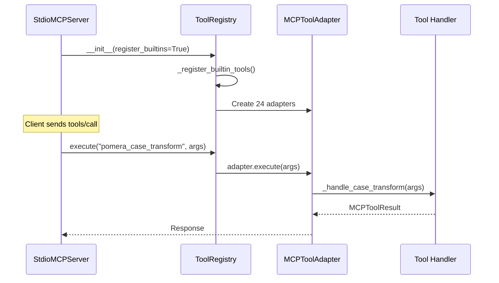

# MCP Architecture (replace stdio with Streamable HTTP) explore use of Mcp-Session-Id

> Model Context Protocol server exposing 24 tools via JSON-RPC 2.0 over stdio, with adapter pattern, security circuit breaker, and database access from subprocess context.

---

## Overview

Pomera implements a custom MCP server that exposes its text processing tools to AI assistants (Claude Desktop, Cursor, Antigravity, etc.) via the MCP protocol.



---

## Layer Architecture

### 1. Transport Layer (`core/mcp/server_stdio.py`)

`StdioMCPServer` reads JSON-RPC messages from `stdin` and writes responses to `stdout`.

**Critical rule**: All logging goes to `stderr`. Any output to `stdout` other than JSON-RPC messages will break the protocol.

**Supported methods**:
| Method | Handler |
|--------|---------|
| `initialize` | Returns server info and capabilities |
| `initialized` | Notification — no response |
| `tools/list` | Returns all 24 tool definitions |
| `tools/call` | Executes a tool with arguments |
| `resources/list` | Returns available resources |
| `resources/read` | Returns resource content |
| `notifications/cancelled` | Handles cancellation |

### 2. Protocol Layer (`core/mcp/protocol.py`)

`MCPProtocol` handles JSON-RPC 2.0 message parsing, serialization, and error creation.

- Protocol version: `2024-11-05`
- JSON-RPC version: `2.0`
- Error codes follow MCP spec: `METHOD_NOT_FOUND`, `INVALID_PARAMS`, `TOOL_NOT_FOUND`, `RESOURCE_NOT_FOUND`, `INTERNAL_ERROR`

### 3. Schema Layer (`core/mcp/schema.py`)

Dataclasses for MCP entities:
- `MCPMessage` — JSON-RPC message
- `MCPTool` — Tool definition with `inputSchema`
- `MCPToolResult` — Tool execution result with `content` array
- `MCPResource` — Resource with URI and mime type
- `MCPServerCapabilities` — Advertised capabilities
- `MCPError` / `MCPErrorCode` — Error handling

### 4. Registry Layer (`core/mcp/tool_registry.py`)

`ToolRegistry` is the core — 5801 lines mapping 24 MCP tools to Pomera's text processing functions.

**Pattern**: Adapter pattern — each tool gets an `MCPToolAdapter`:

```python
MCPToolAdapter(
    name="pomera_case_transform",
    description="Transform text case (upper, lower, title, ...)",
    input_schema={...},  # JSON Schema for parameters
    handler=self._handle_case_transform  # Method reference
)
```

**Registration flow**:


### 5. Security Layer (`core/mcp_security_manager.py`)

Circuit breaker for protected tools (`pomera_ai_tools`, `pomera_web_search`, `pomera_read_url`). Checked before every protected tool execution.

(See [security-architecture.md](security-architecture.md) for details.)

---

## Database Access from MCP Context

MCP tools run in a subprocess without GUI access. The `ToolRegistry._get_or_create_db_settings_manager()` method handles this:

1. **Try GUI context**: Check if `AppContext` has a shared settings manager
2. **Create standalone**: If no GUI, create a new `DatabaseSettingsManager` instance pointing to the correct database path

This allows MCP tools to read API keys, tool settings, and notes from the same database the GUI uses.

---

## File I/O via MCP (`core/mcp/file_io_helpers.py`)

Helper functions for tools that need file input/output:
- `load_file_content(path)` — Read file with UTF-8/Latin-1 fallback
- `save_to_file(path, content)` — Write content to file, creating parent directories
- Path validation and security checks (no path traversal)

---

## Tool Inventory (24 MCP Tools)

| MCP Tool Name | Source Tool | Category |
|--------------|------------|----------|
| `pomera_case_transform` | Case Tool | Text |
| `pomera_find_replace_diff` | Find & Replace | Text |
| `pomera_sort` | Sorter Tools | Text |
| `pomera_line_tools` | Line Tools | Text |
| `pomera_whitespace` | Whitespace Tools | Text |
| `pomera_column_tools` | Column Tools | Text |
| `pomera_text_wrap` | Text Wrapper | Text |
| `pomera_markdown` | Markdown Tools | Text |
| `pomera_encode` | Base64/Hash/NumberBase | Encoding |
| `pomera_string_escape` | String Escape | Encoding |
| `pomera_translator` | Translator (Morse/Binary) | Encoding |
| `pomera_extract` | Email/URL/Regex Extractor | Extraction |
| `pomera_html` | HTML Tool | Extraction |
| `pomera_email_header_analyzer` | Email Header Analyzer | Extraction |
| `pomera_url_parse` | URL Parser | Extraction |
| `pomera_json_xml` | JSON/XML Tool | Conversion |
| `pomera_timestamp` | Timestamp Converter | Conversion |
| `pomera_text_stats` | Text Statistics | Analysis |
| `pomera_cron` | Cron Tool | Analysis |
| `pomera_smart_diff_2way` | Smart Diff | Analysis |
| `pomera_generators` | Generator Tools | Generators |
| `pomera_ai_tools` | AI Tools | AI |
| `pomera_web_search` | Web Search | Web |
| `pomera_read_url` | URL Reader | Web |
| `pomera_notes` | Notes Widget | Utility |
| `pomera_list_compare` | List Comparator | Utility |
| `pomera_diagnose` | Diagnostics | System |

---

## Design Decisions

1. **Custom MCP server, not SDK**: Built from scratch for full control over protocol handling and tool registration. No dependency on MCP Python SDK.
2. **Adapter pattern**: Clean separation between MCP interface and Pomera tool logic. Tools don't need to know about MCP.
3. **Singleton registry**: One global registry accessed via `get_registry()`. MCP tools are registered once at server startup.
4. **Stderr-only logging**: Essential for JSON-RPC integrity. Any stdout pollution breaks communication.
5. **Standalone DB access**: MCP subprocess creates its own DB connection if no GUI context exists.
6. **File I/O helpers**: Centralized file handling with security checks prevents path traversal from MCP clients.
