# MCP Manager Widget Architecture

> GUI widget for managing the MCP server lifecycle — start/stop, status monitoring, tool browsing, configuration generation, tool testing, and log viewing.

---

## Overview

**Source**: [mcp_widget.py](file:///p:/Pomera-AI-Commander/tools/mcp_widget.py) (1418 lines)  
**Entry point**: Widgets menu → MCP Manager (Ctrl+M)  
**Registration**: [tool_loader.py](file:///p:/Pomera-AI-Commander/tools/tool_loader.py#L369) as widget type  
**Host integration**: [pomera.py](file:///p:/Pomera-AI-Commander/pomera.py#L4390) opens in separate Toplevel window

---

## Component Architecture

| Component | Lines | Role |
|-----------|-------|------|
| Helper functions | 40-147 | `get_pomera_executable_path()`, PID file management, process detection |
| `MCPServerProcess` | 150-342 | Subprocess lifecycle: start/stop/monitor with cross-platform support |
| `MCPManagerWidget` | 345-1397 | Main UI widget with 5 tabbed views |
| `MCPManager` | 1400-1418 | Integration wrapper for Pomera app |

---

## MCPServerProcess — Subprocess Manager

**Key design decisions:**

| Decision | Rationale |
|----------|-----------|
| PID file tracking (`.mcp_server.pid`) | Detect servers started by other Pomera instances |
| Cross-platform stop: `taskkill` (Win) vs `SIGTERM→SIGKILL` (Unix) | Windows has no SIGTERM |
| `CREATE_NEW_PROCESS_GROUP` flag on Windows | Allows the server to be killed independently |
| Log capture via `stderr` queue | MCP protocol uses stdout — logs must go to stderr |
| Two execution modes: our process vs external PID | Handles servers started by both Pomera and CLI |

**Process lifecycle:**
1. `check_existing_server()` — reads PID file, checks if process alive
2. `start()` — builds command (`pomera.py --mcp-server --debug`), spawns with `Popen`
3. `_monitor_process()` — daemon thread reads stderr, parses log levels, pushes to queue
4. `stop()` — kills process, cleans PID file, calls `on_stopped` callback

---

## MCPManagerWidget — 5-Tab UI

### Tab 1: Server Control
- **Status indicator**: Canvas circle (red=stopped, green=running)
- **Server info**: Version string, tool count from registry, PID display
- **Controls**: Start Server ▶, Stop Server ■, Refresh Tools 🔄
- **How to Use**: Instructions for test mode vs production (configure AI client)

### Tab 2: Available Tools
- **Treeview**: Lists all registered MCP tools (name + description columns)
- **Details pane**: Shows full description + input schema when tool selected
- **Data source**: `ToolRegistry()` loaded at init time

### Tab 3: Configuration
- **Path configuration**: Select pomera.py/pomera.exe and Python executable
- **Dynamic JSON generation**: Auto-generates `claude_desktop_config.json` and `.cursor/mcp.json`
- **Copy to clipboard**: One-click config copy for Claude Desktop and Cursor
- **CLI usage**: Generated command-line examples with current paths
- **Dual mode**: Adapts for frozen exe (`pomera.exe --mcp-server`) vs Python script (`python pomera.py --mcp-server`)

### Tab 4: Test Tool
- **Tool dropdown**: Populated from registry
- **Parameter hints**: Auto-generated from tool's input schema (required vs optional, types, defaults)
- **JSON input area**: Edit parameters as JSON
- **Two execution paths**:
  - Via running server: sends JSON-RPC to process stdin, reads stdout response
  - Direct execution: calls `registry.execute_tool()` (no server needed)

### Tab 5: Server Log
- **ScrolledText display** with color-coded log levels
- **Level filter**: ALL, DEBUG, INFO, WARNING, ERROR, CRITICAL dropdown
- **Log queue polling**: `_poll_log_queue()` runs every 100ms via `after()`
- **Clear button**: Reset log display
- **Color tags**: DEBUG=gray, INFO=black, WARNING=orange, ERROR=red, CRITICAL=red+bold
- **Auto-scroll**: Scrolls to bottom on new entries

---

## Integration with Pomera Main App

```mermaid
sequenceDiagram
    participant User
    participant Pomera as pomera.py
    participant MCPMgr as MCPManager
    participant Widget as MCPManagerWidget
    participant Server as MCPServerProcess

    User->>Pomera: Ctrl+M or Widgets → MCP Manager
    Pomera->>Pomera: open_mcp_manager()
    Pomera->>Pomera: Create Toplevel window
    Pomera->>MCPMgr: create_widget(window, app)
    MCPMgr->>Widget: MCPManagerWidget(parent, app)
    Widget->>Widget: _load_registry() → ToolRegistry()
    Widget->>Widget: create_widgets() → 5 tabs
    Widget->>Widget: after(500) → check_existing_server()
    Widget->>Server: check_existing_server()
    Server-->>Widget: Running/Stopped status
    Widget->>Widget: _update_status(running)
```

**Window management**: Opens as a separate `Toplevel` window (not embedded in main Pomera window). Window reference stored as `self.mcp_manager_window` in pomera.py to prevent garbage collection.

---

## Test Tool Execution Flow

---

## Design Patterns

| Pattern | Implementation |
|---------|---------------|
| Observer (callbacks) | `on_started`/`on_stopped` callbacks from `MCPServerProcess` → `MCPManagerWidget` |
| Producer-Consumer (log queue) | `_monitor_process` thread → `queue.Queue` → `_poll_log_queue` in main thread |
| Adapter (dual execution) | Test tool uses either stdin/stdout or direct registry, same result display |
| PID file lock | Simple file-based process discovery across Pomera instances |
| Dynamic config generation | Adapts JSON output based on frozen exe vs Python script mode |

---

## Remote GUI Launch via MCP (`pomera_launch_gui`)

AI agents can launch the Pomera GUI from the MCP server using the `pomera_launch_gui` tool. This is implemented in [tool_registry.py](file:///p:/Pomera-AI-Commander/core/mcp/tool_registry.py#L5590) → `_handle_launch_gui`.

### GUI Discovery (5 methods, tried in order)

| # | Method | How it finds `pomera.py` |
|---|--------|--------------------------|
| 0 | Frozen executable | `sys.frozen` — PyInstaller build, uses `sys.executable` directly |
| 1 | Installation dir | `core.data_directory._get_installation_dir()` → canonical path |
| 2 | Relative path | Navigate from `tool_registry.py` → project root → `pomera.py` |
| 3 | PATH entry point | `shutil.which("pomera")` — PyPI entry point |
| 4 | Environment variable | `POMERA_INSTALL_DIR` / `pomera.py` |
| 5 | Site-packages | Scan `sys.path` for `pomera/pomera.py` or `pomera_ai_commander/pomera.py` |

### Cross-Platform Process Detachment

The MCP server runs as a headless subprocess inside IDE processes (Antigravity, Cursor, etc.). Spawning a GUI from this context requires full process detachment to avoid crashes.

> [!WARNING]
> Python-level subprocess flags (`creationflags`, `start_new_session`) do NOT fully escape IDE-spawned MCP server contexts. OS shell commands are required.

| Platform | Strategy | Why |
|----------|----------|-----|
| **Windows** | `start "" "pythonw.exe" "pomera.py"` | `start` fully detaches; `pythonw.exe` prevents console window |
| **macOS** | `nohup python3 pomera.py > /dev/null 2>&1 &` | `nohup` survives parent exit; no terminal created |
| **Linux** | `setsid python3 pomera.py > /dev/null 2>&1 &` | `setsid` creates new session leader; no terminal created |

**Windows-specific notes:**
- `python.exe` is a console app → always creates a visible console window
- `pythonw.exe` is the windowless variant designed for GUI apps (tkinter, etc.)
- `DETACHED_PROCESS` flag (0x8) strips the window station that tkinter needs → **crashes**
- `CREATE_NO_WINDOW` flag (0x08000000) alone also crashes from IDE context
- The `start` command is the only reliable way to fully escape the parent's process context

### Tool Parameters

| Parameter | Type | Default | Description |
|-----------|------|---------|-------------|
| `wait_for_close` | bool | `false` | If true, blocks until GUI closes |
| `tool_tab` | string | `null` | Tab to focus on open (e.g., `"Notes"`, `"AI Tools"`) |

---

## Performance Metrics (`core/mcp/metrics.py`)

In-memory, per-session metrics collector for MCP tool execution. Exposed via `pomera_diagnose`.

**Source**: [metrics.py](file:///p:/Pomera-AI-Commander/core/mcp/metrics.py)  
**Instrumentation point**: [server_stdio.py](file:///p:/Pomera-AI-Commander/core/mcp/server_stdio.py) → `_handle_tools_call`  
**Consumer**: [tool_registry.py](file:///p:/Pomera-AI-Commander/core/mcp/tool_registry.py) → `_diagnose_performance`

### What's Collected

| Metric | Per-Tool | Session-Level |
|--------|----------|---------------|
| Latency | avg, min, max, p50, p95, p99 (ms) | — |
| Call count | ✅ | total_tool_calls |
| Error count + rate | ✅ | overall_error_rate |
| Payload size (bytes) | avg | — |
| Uptime | — | session_uptime_minutes |
| Calls/minute | — | calls_per_minute |
| Slowest tool | — | by avg latency |
| Most-errored tool | — | by error count |

### Design Decisions

| Decision | Rationale |
|----------|-----------|
| In-memory only (no persistence) | Per-session data; resets on restart to avoid stale metrics |
| Thread-safe (`threading.Lock`) | MCP server may handle concurrent tool calls |
| Singleton (`mcp_metrics` module-level) | One collector per server process |
| `stderr` logging | `[PERF] tool: 12.5ms [OK] (1024 bytes)` — immediate visibility without corrupting JSON-RPC stdout |
| No external dependencies | Uses only Python stdlib (`time`, `threading`, `dataclasses`) |

### Auto-Warnings in `pomera_diagnose`

| Condition | Warning |
|-----------|---------|
| Error rate > 10% | `Tool 'X' has 15% error rate (3/20 calls)` |
| p95 > 1000ms (non-network tools) | `Tool 'X' p95 latency is 1500ms` |

**Excluded from slow warnings**: `pomera_web_search`, `pomera_ai_tools`, `pomera_read_url` (network-bound, expected to be slow).

