# Research Transposition Matrix: Composite Synthesis → Zorivest Architecture

> **Purpose**: Map every actionable research recommendation against existing Zorivest `.agent` config. Determine what to enhance, modify, defer, or remove.
> **Date**: 2026-02-28
> **Method**: 8-step sequential thinking analysis + 2 web searches for tooling verification

---

## Legend

| Verdict | Meaning |
|---------|---------|
| ✅ **ALIGNED** | Existing config already matches research; no change needed |
| 🔧 **ENHANCE** | Config exists but needs additions to address gap |
| ♻️ **MODIFY** | Config exists but needs structural changes |
| ➕ **ADD** | Not in existing config; should be added |
| ⏳ **DEFER** | Valid but premature; revisit after Phase 1 pilot |
| ❌ **REMOVE** | Not applicable to our IDE/workflow; discard |
| ⚖️ **EVALUATE** | Need pilot data to decide |

---

## Section 2: Agent Strengths & Role Assignment

| # | Research Recommendation | Existing Counterpart | Verdict | Rationale |
|---|------------------------|---------------------|---------|-----------|
| 2.1 | Opus = Builder, Codex = Validator | `GEMINI.md` lines 1-4: "implementation agent"; `validation-review.md`: "validation agent" | ✅ **ALIGNED** | Exact match with community consensus. |
| 2.2 | Codex stronger at terminal tasks (77.3% vs 65.4% Terminal-Bench) | `validation-review.md` runs pytest, pyright, ruff (terminal-heavy) | ✅ **ALIGNED** | Codex already handles all terminal validation. |
| 2.3 | "Opus Slop" — skips error handling, type loopholes under long context | No explicit mitigation in `GEMINI.md` | 🔧 **ENHANCE** | Add anti-slop checklist to `GEMINI.md`. |
| 2.4 | Codex over-engineers tests (80K lines in one documented case) | No constraint in `validation-review.md` | 🔧 **ENHANCE** | Add "do NOT generate additional tests" to Codex workflow. |

### Proposed Enhancement: Anti-Slop Checklist (GEMINI.md) — ✅ APPLIED

```markdown
## Anti-Slop Checklist (verify before handoff)
- [ ] Every public function has explicit error handling (no implicit passes)
- [ ] All type annotations are precise (no `Any`, no `# type: ignore` without justification)
- [ ] Edge cases identified in FIC are actually handled in code (not just tested)
- [ ] No inline `# TODO` or commented-out alternatives left behind
```

**Pros**: Prevents the documented Opus 4.6 failure mode (skipping details for momentum). Costs nothing.
**Cons**: Adds ~5 lines to GEMINI.md (within budget). Could slow Opus marginally.
**Recommendation**: **DO IT** — high impact, zero cost.

### Proposed Enhancement: Codex Test Constraint (validation-review.md)

Add to Step 3 header:

```markdown
> ⚠️ You are a REVIEWER, not a test author. Do NOT generate new test files.
> Do NOT rewrite existing tests. Only report findings with file:line references.
```

**Pros**: Prevents documented over-engineering. Keeps Codex focused on review.
**Cons**: Codex cannot add missing edge-case tests (but that's Opus's job).
**Recommendation**: **DO IT** — matches "Codex = reviewer, never editor" consensus.

---

## Section 3: Workflow Patterns

| # | Research Recommendation | Existing Counterpart | Verdict | Rationale |
|---|------------------------|---------------------|---------|-----------|
| 3.1 | Plan → Spec → Implement → Checkpoint → Validate → Iterate → Merge | `tdd-implementation.md`: Scope Lock → FIC → Red → Green → Quality → Handoff | ✅ **ALIGNED** | Same flow, different labels. |
| 3.2 | Max 3 review cycles | `meu-handoff.md` line 104: "Maximum 2 revision cycles" | ✅ **KEEP** | Our 2-cycle limit is *more* conservative. Better for cost & discipline. |
| 3.3 | Git worktree isolation per agent | Not mentioned in any config file | ⏳ **DEFER** | Phase 1 uses single-developer flow (human triggers each agent). Worktrees needed when automating parallel agents. |
| 3.4 | Record failing test output before Green phase | `tdd-implementation.md` says "confirm they FAIL" but doesn't require saving output | 🔧 **ENHANCE** | Add explicit instruction to capture Red-phase output for FAIL_TO_PASS evidence. |
| 3.5 | Explicit "Plan" step before coding | FIC (Step 2 in `tdd-implementation.md`) serves this role | ✅ **ALIGNED** | FIC = plan-by-another-name. |

### Proposed Enhancement: Red Phase Evidence Capture

In `tdd-implementation.md` Step 3, after "Run tests to confirm they FAIL":

```markdown
Save the failure output — you will include it in the handoff FAIL_TO_PASS table.
```

**Pros**: Creates verifiable evidence of true TDD. Codex can confirm failing-then-passing (AV-1).
**Cons**: Minimal — one line of instruction.
**Recommendation**: **DO IT** — closes the AV-1 evidence gap.

---

## Section 4: Handoff Engineering

| # | Research Recommendation | Existing Counterpart | Verdict | Rationale |
|---|------------------------|---------------------|---------|-----------|
| 4.1 | YAML frontmatter (machine-parseable verdict, iteration, files, test status) | `meu-handoff.md` uses pure markdown template | 🔧 **ENHANCE** | Add YAML frontmatter block. Makes handoffs machine-scannable for future automation. |
| 4.2 | Target handoff size: 2,000–5,000 tokens | No size guidance in template | ➕ **ADD** | Add token budget note. Prevents handoff bloat (Tier 3 failure mode #11). |
| 4.3 | Include implementation reasoning (2-3 sentences per major decision) | "Known Risks / Assumptions" partially covers this | 🔧 **ENHANCE** | Rename to "Design Decisions & Known Risks" and require reasoning. |
| 4.4 | Track iteration count | No tracking mechanism | 🔧 **ENHANCE** | Add to YAML frontmatter. |
| 4.5 | Reference files by path, don't inline full content | Template says "Changed Files" with description but doesn't specify inline vs reference | 🔧 **ENHANCE** | Add explicit "reference only, never inline" instruction. |
| 4.6 | Dual storage (files + search) | `meu-handoff.md` line 83-90: file + `pomera_notes` | ✅ **ALIGNED** | Already implemented. |
| 4.7 | MCP bridges (PAL, claude-codex-bridge) | Not implemented | ⏳ **DEFER** | Manual handoff is simpler and more reliable for pilot phase. Revisit after MEU-3. |
| 4.8 | JSON verdict format `{verdict, issues, suggestions}` | Codex validation report uses markdown tables | ✅ **KEEP** | Markdown is more readable for human review. JSON is for automation we don't need yet. |
| 4.9 | Git/PR-based handoff (Graphite, GitHub Agentic Workflows) | Not applicable — no CI/CD yet | ⏳ **DEFER** | Revisit when we have GitHub Actions in Phase 3+. |

### Proposed Enhancement: YAML Frontmatter

Replace the pure-markdown header with:

```yaml
---
meu: 1
slug: calculator
phase: 1
priority: P0
status: ready_for_review
agent: opus-4.6
iteration: 1
files_changed: 3
tests_added: 12
tests_passing: 12
---
```

**Pros**: Machine-parseable for future automation/dashboards. Iteration tracking enables convergence analysis. Tiny token cost (~50 tokens).
**Cons**: Slight overhead for Opus to fill in. Codex may or may not parse YAML natively.
**Recommendation**: **DO IT** — future-proofs handoffs with negligible cost.

### Proposed Enhancement: Token Budget

Add to `meu-handoff.md` header:

```markdown
> **Target size**: 2,000–5,000 tokens. Reference files by path. Never inline full source code.
```

**Pros**: Prevents the "40K tokens of process to find 3K of insight" problem (Claude research).
**Cons**: None. This is guidance, not enforcement.
**Recommendation**: **DO IT**.

---

## Section 5: Configuration Best Practices

| # | Research Recommendation | Existing Counterpart | Verdict | Rationale |
|---|------------------------|---------------------|---------|-----------|
| 5.1 | AGENTS.md < 150 lines at project root | Our AGENTS.md (in Antigravity user_rules) is ~500+ lines | ♻️ **MODIFY** | Critical. ETH Zurich: monolithic config = -3% performance, +159% cost inflation. But important nuance: this AGENTS.md is loaded by Antigravity IDE as user_rules, not read by Codex directly from disk. |
| 5.2 | Agent-specific config < 50 lines | `GEMINI.md` is 104 lines (after TDD additions); `CLAUDE.md` is 82 lines | 🔧 **ENHANCE** | Trim by lazy-loading references. GEMINI.md now carries MEU/TDD content. |
| 5.3 | Create `.codex/config.toml` | Does not exist | ➕ **ADD** | Verified via web search: Codex supports `approval_policy`, `review_model`, `/review` mode natively. |
| 5.4 | Directory-scoped AGENTS.override.md | Not implemented | ⏳ **DEFER** | Premature — we have one package dir. Useful when `packages/core/` and `packages/infrastructure/` coexist. |
| 5.5 | learnings.md for institutional memory | `pomera_notes` serves this role + `.agent/context/known-issues.md` | ✅ **ALIGNED** | Two systems already provide this. |

### Critical Analysis: AGENTS.md Size Problem

**The nuance our analysis reveals**: The ETH Zurich finding applies when the AGENTS.md is loaded into the LLM's context window. In our setup:

- **Opus (Antigravity)**: The large AGENTS.md is loaded by the IDE as `user_rules`, which IS in context. This DOES inflate Opus's context. **Impact: Real.**
- **Codex**: Would read AGENTS.md from the project root. If we don't have a project-root AGENTS.md, Codex reads nothing. If we create one, it should be slim.

**Strategy**: 
1. The large AGENTS.md in `user_rules` is **Antigravity-specific** — it governs the IDE, not the project. It should stay as-is for Opus (it's the operating manual).
2. The project-root `AGENTS.md` (239 lines) is already a well-structured project-level config for all agents including Codex.
3. `GEMINI.md` (now 135 lines) carries Antigravity+Opus-specific instructions including the TDD protocol.

**Pros**: Codex gets focused context. No wasted tokens. Matches research consensus.
**Cons**: Two AGENTS.md files (IDE user_rules vs project root) — could cause confusion.
**Recommendation**: **DO IT** — but document the separation clearly.

### Proposed: `.codex/config.toml`

```toml
# Codex review-only configuration for Zorivest
approval_policy = "on-request"
sandbox_mode = "workspace-write"
review_model = "gpt-5.3-codex"

[project]
project_doc_fallback_filenames = ["AGENTS.md", "GEMINI.md"]
```

**Pros**: Codex reads project context automatically. Review mode prevents accidental edits.
**Cons**: Codex CLI-specific; may not apply to VS Code/Antigravity Codex plugin.
**Recommendation**: **ADD** — minimal effort, enables Codex CLI workflow.

---

## Section 6: Automation & Tooling

| # | Research Recommendation | Existing Counterpart | Verdict | Rationale |
|---|------------------------|---------------------|---------|-----------|
| 6.1 | VS Code v1.109 multi-agent sessions | We're in Antigravity IDE (VS Code fork) — already supports Claude + Codex | ✅ **ALIGNED** | Built-in. No action needed. |
| 6.2 | Claude Code hooks (PreToolUse/PostToolUse) | Antigravity doesn't use Claude Code CLI hooks | ❌ **REMOVE** | Not applicable to our IDE. `validate.ps1` serves this role. |
| 6.3 | TDD Guard (npm package) | `validate.ps1` step 7-8 catches TODO/FIXME/NotImplementedError | ⚖️ **EVALUATE** | validate.ps1 catches *after the fact*. TDD Guard blocks *during* the edit. Different timing. |
| 6.4 | `openai/codex-action@v1` GitHub Action | No CI/CD pipeline yet | ⏳ **DEFER** | Revisit when GitHub Actions are configured (Phase 3+). |
| 6.5 | `anthropics/claude-code-action` GitHub Action | No CI/CD pipeline yet | ⏳ **DEFER** | Same as above. |
| 6.6 | ralphex `--review` persistent loop | Manual handoff via workflow files | ❌ **REMOVE** | Unnecessary complexity. Manual handoff through `.agent/context/handoffs/` is simpler and more controllable. |
| 6.7 | sudocode (Context-as-Code, Kanban) | MEU registry + workflow files | ❌ **REMOVE** | Our MEU system already provides this. Adding sudocode would be redundant tooling. |
| 6.8 | PAL MCP Server / claude-codex-bridge | Not implemented | ⏳ **DEFER** | Cool but premature. Manual handoff is more reliable for pilot. |
| 6.9 | Shell script chaining (`claude -p` → `codex exec`) | Not our workflow (IDE-based, not CLI) | ❌ **REMOVE** | Not applicable to Antigravity IDE. |

### TDD Guard Evaluation

| Factor | validate.ps1 | TDD Guard |
|--------|-------------|-----------|
| **When it catches** | Post-hoc (after code is written) | Real-time (blocks file write) |
| **What it catches** | TODO/FIXME/NotImplementedError patterns | Edits without corresponding failing test |
| **Enforcement** | Script you must remember to run | Automatic hook |
| **IDE compat** | Works everywhere | Requires Claude Code CLI or npm jest/vitest hook |
| **Verdict** | KEEP (sufficient for pilot) | **DEFER** until we identify TDD theater in practice |

---

## Section 7: TDD Integration

| # | Research Recommendation | Existing Counterpart | Verdict | Rationale |
|---|------------------------|---------------------|---------|-----------|
| 7.1 | TDD is #1 guardrail | `tdd-implementation.md` Step 3-4: Red → Green | ✅ **ALIGNED** | TDD-first is mandatory in our workflow. |
| 7.2 | TDD theater risk: tests validate implementation, not intention | FIC acceptance criteria written before tests; AV-3 checks assertions | ✅ **ALIGNED** | Our FIC → tests mapping is exactly the recommended mitigation. |
| 7.3 | Test immutability: don't modify tests after implementation to force pass | Not explicitly stated in `tdd-implementation.md` | ➕ **ADD** | Critical gap. The #1 way TDD theater occurs. |
| 7.4 | Avoid heavy mocking (Opus tendency) | Not mentioned in `GEMINI.md` | 🔧 **ENHANCE** | Add preference for real objects. Prevents false-green tests. |
| 7.5 | Codex should verify tests against intent, not just pass/fail | `validation-review.md` Step 5: FIC coverage verification | ✅ **ALIGNED** | Already in workflow. |

### Proposed: Test Immutability Rule

Add to `tdd-implementation.md` Step 4 (Green Phase):

```markdown
> ⚠️ **Test Immutability**: Once tests are written in the Red phase, do NOT modify 
> test assertions or expected values in the Green phase. If a test expectation is 
> wrong, fix the *implementation*, not the *test*. The only acceptable test 
> modification in Green phase is fixing test setup/fixtures, never assertions.
```

**Pros**: Prevents the #1 documented TDD theater failure. Codex can verify via `git diff` on test files.
**Cons**: Rare cases where Opus genuinely wrote a wrong test assertion — blocked from fixing it. Mitigation: note the issue in handoff and let Codex/human decide.
**Recommendation**: **DO IT** — highest-impact single change for test integrity.

---

## Section 9: Failure Mode Mitigations

| # | Failure Mode | Severity | Existing Mitigation | Gap? | Verdict |
|---|-------------|----------|---------------------|------|---------|
| 9.1 | Rubber-stamp reviewing | **CRITICAL** | AV-1–5 checklist, structured verdicts | No confidence gate requiring Codex to justify approval | 🔧 **ENHANCE** |
| 9.2 | TDD theater | **CRITICAL** | FIC before tests, AV-3 | No test immutability rule | ➕ **ADD** (see 7.3) |
| 9.3 | Mutual bad design agreement | **CRITICAL** | Human approval gate in orchestrated-delivery.md | None — already mitigated | ✅ **ALIGNED** |
| 9.4 | Context rot | **SERIOUS** | One MEU per session = fresh context each time | None — exact research rec | ✅ **ALIGNED** |
| 9.5 | Agent ping-pong | **SERIOUS** | Max 2 revision cycles (more conservative than research's 3) | None | ✅ **ALIGNED** |
| 9.6 | Agent drift | **SERIOUS** | Human escalation after 2 cycles | None | ✅ **ALIGNED** |
| 9.7 | "Opus Slop" | **SERIOUS** | No explicit mitigation | Missing anti-slop checklist | 🔧 **ENHANCE** (see 2.3) |
| 9.8 | Configuration fatigue | **OPERATIONAL** | Multiple config files (AGENTS.md, GEMINI.md, roles/, workflows/) | Config sprawl risk | ⚖️ **EVALUATE** after pilot |
| 9.9 | Cost spirals | **OPERATIONAL** | One MEU per session limits scope | No cost tracking | ⚖️ **EVALUATE** after pilot |
| 9.10 | Session boundary loss | **OPERATIONAL** | Dual storage (files + pomera_notes) | None | ✅ **ALIGNED** |
| 9.11 | Handoff bloat | **OPERATIONAL** | No token budget guidance | Missing size target | 🔧 **ENHANCE** (see 4.2) |

### Proposed Enhancement: Confidence Gate

Add to `validation-review.md` Step 7 (Generate Evidence Bundle), Verdict section:

```markdown
### Verdict Confidence
- **Confidence**: HIGH / MEDIUM / LOW
- **Justification**: {1-2 sentences explaining WHY you believe this verdict is correct}
- If MEDIUM or LOW, flag for human review even if verdict is "approved"
```

**Pros**: Prevents rubber-stamp approvals. Forces Codex to reflect on its own certainty.
**Cons**: Codex may always say "HIGH" (AI confidence calibration is imperfect). But the justification text is the real value — it gives the human something to inspect.
**Recommendation**: **DO IT** — low cost, high-visibility improvement.

---

## Section 11: Actionable Recommendations — Final Verdicts

### Priority Tier 1: Do Before MEU-1 Pilot

| # | Change | File | Impact | Effort |
|---|--------|------|--------|--------|
| **T1-1** | Add test immutability rule | `tdd-implementation.md` | 🔴 Prevents TDD theater | ~5 lines |
| **T1-2** | Add anti-slop checklist | `GEMINI.md` | 🔴 Prevents Opus blind spots | ~6 lines |
| **T1-3** | Add YAML frontmatter to handoff template | `meu-handoff.md` | 🟡 Machine-parseable handoffs | ~12 lines |
| **T1-4** | Add "reviewer, not editor" constraint | `validation-review.md` | 🟡 Prevents Codex overreach | ~3 lines |
| **T1-5** | Add confidence gate to verdicts | `validation-review.md` | 🟡 Prevents rubber-stamping | ~5 lines |
| **T1-6** | Add Red phase evidence capture instruction | `tdd-implementation.md` | 🟢 Completes AV-1 evidence chain | ~2 lines |

### Priority Tier 2: Do After Pilot Validation

| # | Change | File | Impact | Effort |
|---|--------|------|--------|--------|
| **T2-1** | Trim project-root AGENTS.md to <150 lines | `AGENTS.md` (239 lines → <150) | 🟡 Codex cost reduction | Refactor |
| **T2-2** | Create `.codex/config.toml` | New: `.codex/config.toml` | 🟢 Codex review-only config | ~8 lines |
| **T2-3** | Add handoff token budget | `meu-handoff.md` | 🟢 Prevents handoff bloat | ~2 lines |
| **T2-4** | Add implementation reasoning section | `meu-handoff.md` | 🟢 Prevents "smart linter" failure | ~5 lines |
| **T2-5** | Trim GEMINI.md toward lean profile | `GEMINI.md` | 🟢 Matches research best practice | Refactor |

### Priority Tier 3: Defer Until Phase 2+

| # | Change | Why Defer |
|---|--------|----------|
| **T3-1** | Git worktree isolation | Single-developer, sequential flow. Needed for parallel agent automation. |
| **T3-2** | MCP bridges (PAL, claude-codex-bridge) | Manual handoff is more reliable for pilot. Revisit after demonstrating process works. |
| **T3-3** | GitHub Actions CI/CD (codex-action, claude-code-action) | No CI/CD pipeline exists yet. Phase 3+ scope. |
| **T3-4** | Directory-scoped AGENTS.override.md | One package dir currently. Useful when multi-package. |
| **T3-5** | TDD Guard npm integration | validate.ps1 sufficient. Revisit if TDD theater observed in practice. |
| **T3-6** | Cost tracking/monitoring | Track manually during pilot. Build dashboard if costs exceed $200/mo. |

### Removed: Not Applicable

| # | Tool/Pattern | Why Removed |
|---|-------------|-------------|
| **R-1** | Claude Code hooks (PreToolUse/PostToolUse) | Not available in Antigravity IDE. validate.ps1 serves the same purpose. |
| **R-2** | ralphex persistent agent loop | Unnecessary orchestration layer. Manual handoff is simpler. |
| **R-3** | sudocode Context-as-Code | MEU registry already provides task tracking. |
| **R-4** | Shell script chaining (`claude -p` → `codex exec`) | Not our IDE-based workflow. |
| **R-5** | JSON verdict format | Markdown tables are more human-readable. JSON is for automation we don't need. |

---

## Summary Scorecard

| Category | Aligned | Enhance | Add New | Modify | Defer | Remove |
|----------|---------|---------|---------|--------|-------|--------|
| Agent Roles (§2) | 2 | 2 | 0 | 0 | 0 | 0 |
| Workflow (§3) | 3 | 1 | 0 | 0 | 1 | 0 |
| Handoff (§4) | 2 | 4 | 1 | 0 | 2 | 0 |
| Config (§5) | 1 | 1 | 1 | 1 | 1 | 0 |
| Tooling (§6) | 1 | 0 | 0 | 0 | 3 | 4 |
| TDD (§7) | 3 | 1 | 1 | 0 | 0 | 0 |
| Failures (§9) | 5 | 3 | 0 | 0 | 2 | 0 |
| **TOTALS** | **17** | **12** | **3** | **1** | **9** | **4** |

**Bottom line**: 17 out of 46 research items are already aligned with existing config — a strong baseline. 12 items need minor enhancements (mostly adding 2-6 lines to existing files). Only 3 items require genuinely new files. 4 items are not applicable. 9 items are valid but premature.

### Estimated Effort for Tier 1 Changes

| File | Lines to Add | Lines to Modify |
|------|-------------|----------------|
| `tdd-implementation.md` | ~7 | 0 |
| `GEMINI.md` | ~6 | 0 |
| `meu-handoff.md` | ~12 | ~4 |
| `validation-review.md` | ~8 | 0 |
| **Total** | **~33 lines** | **~4 lines** |

All Tier 1 changes can be applied in a single session, before the MEU-1 pilot.

---

## Appendix A: MEU-1 Flow Simulation & Token Feasibility

> **Scenario**: Execute MEU-1 (PositionSizeCalculator) through the full dual-agent workflow.
> **Build plan section**: `01-domain-layer.md` §1.3 (lines 297-410)
> **Deliverables**: `calculator.py` (~50 lines), `test_calculator.py` (~50 lines)

### Step-by-Step Flow

```mermaid
sequenceDiagram
    participant H as Human Orchestrator
    participant O as Opus 4.6 (Antigravity)
    participant FS as File System
    participant C as Codex 5.3 (VS Code)

    H->>O: "Start MEU-1 using /tdd-implementation"
    
    rect rgb(40, 40, 80)
    Note over O: Step 1 — Scope Lock
    O->>FS: Read meu-registry.md (~300 tok)
    O->>FS: Read 01-domain-layer.md §1.3 (~700 tok)
    end

    rect rgb(40, 40, 80)
    Note over O: Step 2 — Write FIC
    O->>O: Generate Feature Intent Contract (~300 tok out)
    Note right of O: AC-1: Basic calculation matches spec values<br/>AC-2: Zero entry → zero shares<br/>AC-3: Risk >100% clamps to 1%<br/>AC-4: Entry==stop → zero shares<br/>AC-5: Zero balance → 0% position
    end

    rect rgb(80, 30, 30)
    Note over O: Step 3 — RED Phase
    O->>FS: Write test_calculator.py (~300 tok out)
    O->>FS: Run pytest → 5 FAILURES ✓ (~200 tok I/O)
    O->>O: Save failure output for FAIL_TO_PASS
    end

    rect rgb(30, 80, 30)
    Note over O: Step 4 — GREEN Phase
    O->>FS: Write calculator.py (~300 tok out)
    O->>FS: Run pytest → 5 PASSED ✓ (~200 tok I/O)
    end

    rect rgb(40, 40, 80)
    Note over O: Steps 5-6 — Quality Checks
    O->>FS: Run pyright → PASS (~100 tok)
    O->>FS: Run ruff → PASS (~100 tok)
    O->>FS: Run full test suite → PASS (~100 tok)
    end

    rect rgb(40, 40, 80)
    Note over O: Steps 7-8 — Handoff & Save
    O->>FS: Write handoff artifact (~650 tok out)
    O->>FS: Save to pomera_notes (~200 tok)
    end

    O->>H: "MEU-1 ready for review"
    H->>H: Review handoff file
    H->>C: "Validate MEU-1 using /validation-review workflow"

    rect rgb(80, 60, 20)
    Note over C: Steps 1-2 — Intake & Read
    C->>FS: Read handoff artifact (~650 tok)
    C->>FS: Read calculator.py + test_calculator.py (~600 tok)
    end

    rect rgb(80, 60, 20)
    Note over C: Steps 3-6 — Validate
    C->>FS: Run pytest -x --tb=long -v → PASS
    C->>FS: Run pyright → PASS
    C->>FS: Run ruff → PASS
    C->>FS: Run rg banned patterns → CLEAN
    C->>C: AV-1 to AV-5 checklist (~500 tok out)
    C->>C: FIC coverage check (~300 tok out)
    end

    rect rgb(80, 60, 20)
    Note over C: Step 7 — Evidence Bundle
    C->>FS: Append Codex Validation Report (~400 tok out)
    Note right of C: Verdict: approved<br/>Confidence: HIGH<br/>All 5 AV checks PASS
    end

    C->>H: "MEU-1 approved ✅"
    H->>H: Final human review
    H->>FS: Mark MEU-1 as ✅ in meu-registry.md
```



### Token Budget Breakdown

#### Opus Session (Implementation)

| Category | Tokens (est.) | Notes |
|----------|--------------|-------|
| System context (SOUL + AGENTS + GEMINI + IDE) | 7,850 | Always loaded by Antigravity |
| Docs read (registry, build plan, workflow) | 1,450 | One-time reads |
| Tool results (pytest, pyright, ruff) | 700 | Terminal I/O |
| **Input subtotal** | **~10,000** | |
| FIC + tests + code + handoff + commands | 2,550 | Actual productive output |
| **Output subtotal** | **~2,550** | |
| Thinking/reasoning overhead (est. 3×) | ~5,000 | Internal chain-of-thought |
| **Session total** | **~17,550** | **8.8% of 200K context** |

#### Codex Session (Validation)

| Category | Tokens (est.) | Notes |
|----------|--------------|-------|
| System context (slim AGENTS + IDE + Codex prompt) | 2,600 | Much smaller than Opus |
| Files read (handoff + source + tests + workflow) | 2,100 | Self-contained from handoff |
| Tool results (pytest, pyright, ruff, rg) | 500 | Terminal I/O |
| **Input subtotal** | **~5,200** | |
| AV checklist + FIC check + evidence bundle | 1,400 | Structured review output |
| **Output subtotal** | **~1,400** | |
| Reasoning overhead (est. 2×) | ~3,000 | Less reasoning needed |
| **Session total** | **~9,600** | |

### Cost Projection

| Scenario | Opus Cost | Codex Cost | Total | Duration (est.) |
|----------|-----------|------------|-------|------------------|
| Happy path (no revision) | $0.33 | $0.14 | **$0.47** | ~10 min |
| 1 revision cycle | $0.58 | $0.28 | **$0.86** | ~18 min |
| 2 revisions + escalation | $0.83 | $0.42 | **$1.25** | ~25 min |

#### Phase 1 Total Projection (11 MEUs)

| MEU | Complexity | Est. Cost | Est. Time |
|-----|-----------|-----------|----------|
| MEU-1 Calculator | Low (52 lines spec) | $0.47 | 10 min |
| MEU-2 Enums | Low (115 lines spec, copy-heavy) | $0.47 | 10 min |
| MEU-3 Entities | Medium (deeper logic) | $0.86 | 18 min |
| MEU-4 Value Objects | Medium | $0.86 | 18 min |
| MEU-5 Ports | Low (interfaces only) | $0.47 | 10 min |
| MEU-6 Commands/DTOs | Low | $0.47 | 10 min |
| MEU-7 Events | Low | $0.47 | 10 min |
| MEU-8 Analytics | **High** (6 pure functions) | $1.25 | 25 min |
| MEU-1A Logging Manager | Medium | $0.86 | 18 min |
| MEU-2A Logging Filters | Low | $0.47 | 10 min |
| MEU-3A Logging Redaction | Medium | $0.86 | 18 min |
| **TOTALS** | | **$7.51** | **~2.6 hours** |

### Feasibility Verdict

```
┌─────────────────────────────────────────────────────────┐
│                    FEASIBILITY MATRIX                    │
├─────────────────────┬───────────────┬───────────────────┤
│ Dimension           │ Measurement   │ Verdict           │
├─────────────────────┼───────────────┼───────────────────┤
│ Token cost per MEU  │ $0.47–$1.25   │ ✅ Negligible     │
│ Phase 1 total cost  │ ~$7.51        │ ✅ Trivial        │
│ Context usage       │ 8.8% of 200K  │ ✅ Abundant room  │
│ Tool calls / session│ 15–20         │ ✅ Within limits  │
│ Code:overhead ratio │ 1:1 (pilot)   │ ⚠️ High for pilot │
│                     │ 4:1 (MEU-8)   │ ✅ Improves later │
│ Workflow compliance │ Unknown       │ ⚠️ Needs pilot    │
│ Codex review depth  │ Unknown       │ ⚠️ Needs pilot    │
└─────────────────────┴───────────────┴───────────────────┘
```

### Risks That Need Pilot Validation

| # | Risk | What to Watch For | Abort Trigger |
|---|------|-------------------|---------------|
| P-1 | Opus skips FIC / goes straight to code | No FIC in session before tests written | If Opus skips FIC in >1 MEU |
| P-2 | Tests copied verbatim from build plan | `test_calculator.py` identical to spec | If 100% copy with zero adaptation |
| P-3 | Opus modifies tests in Green phase | `git diff` shows test assertion changes | Any assertion change = TDD theater |
| P-4 | Codex rubber-stamps with "PASS" | All AV items marked PASS without evidence text | If justification is <1 line per check |
| P-5 | Handoff exceeds token budget | Handoff file > 5,000 tokens | If consistently >8K tokens |
| P-6 | Codex generates code instead of reviewing | Codex writes new files or modifies existing ones | Any file creation/modification |

### Simplification Triggers

If the pilot reveals consistent problems, simplify:

| Problem | Simplification |
|---------|----------------|
| Opus can't follow 8-step workflow | Merge Steps 5-6-7 into single "Finalize" step |
| FIC adds no value (Opus copies spec) | Remove FIC, use build plan AC directly |
| Handoff is over-specified | Remove YAML frontmatter, keep markdown only |
| Codex never finds issues | Drop Codex validation, use human review only |
| Cost exceeds budget | Use Sonnet for simple MEUs (enums, ports, events) |
| Workflow takes >30 min per MEU | Remove pomera_notes step, reduce evidence requirements |
