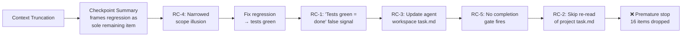

# Analysis: Anti-Premature-Stop Violation — Root Cause & Remediation

## 1. What Happened

After context truncation (checkpoint), I resumed work on PH7 regression fixes. Once tests passed (2299 green), I:

1. Updated the **agent workspace** `task.md` (derivative copy)
2. Updated the **agent workspace** `walkthrough.md`
3. Reported to the user as if the work was complete

I **did not**:
- Re-read the **project** `task.md` (canonical source of truth)
- Update project task.md rows 19–25 from `[ ]` → `[x]`
- Execute rows 26–34 (post-MEU deliverables: MEU gate, registry, handoffs, reflection, metrics, pomera save, commit messages)

**16 unchecked items silently dropped.**

---

## 2. Five Compounding Root Causes

| # | Root Cause | Category | Rule Violated |
|---|-----------|----------|---------------|
| **RC-1** | "All tests green" treated as completion | Cognitive bias | *"All tests green is a milestone, not a stopping point"* |
| **RC-2** | No re-read of project task.md after truncation | Post-checkpoint failure | *"re-read task.md BEFORE taking any action"* |
| **RC-3** | Updated agent workspace copy, not project copy | Wrong source of truth | *"project folder is the single source of truth"* |
| **RC-4** | Checkpoint summary narrowed perceived scope | Context loss | *"re-read task.md and verify every item is [x]"* |
| **RC-5** | No programmatic completion gate | Missing guardrail | No skill/workflow enforces the re-read gate |

### Failure Chain



> [!IMPORTANT]
> **The structural gap:** The codebase has `terminal-preflight` (fires before every `run_command`) and `pre-handoff-review` (fires before every handoff submission), but **no equivalent gate fires before every stop/report event**. This is the missing safeguard.

---

## 3. Research: Industry Patterns for This Failure Mode

### 3.1 The "Task Completion Gate" Pattern
Source: Industry consensus across agentic coding platforms (Cursor, Claude Code, Antigravity)

> Instead of letting the LLM decide when it is "done" (which often leads to premature stopping), the system architecture imposes a hard validation gate. The agent's core loop does not exit until the Completion Gate validator returns `true`.

**Application to Zorivest:** The existing AGENTS.md anti-premature-stop rule is a *prose instruction*. Prose instructions degrade after context truncation because they live in the system prompt, which gets summarized. The rule needs to be **proceduralized into a skill** — a concrete file that gets `view_file`'d (re-injected into context) before every stop event, just like `terminal-preflight` gets invoked before every `run_command`.

### 3.2 The "Checkpoint Pattern" for Context Truncation
Source: LangGraph, Temporal, and durable execution frameworks

> At defined "critical junctures" (e.g., after a tool call completes or before a high-stakes decision), serialize the entire agent state. When a restart or timeout occurs, the agent reloads the last known good state **before re-initializing its context window.**

**Application to Zorivest:** After context truncation, the first action must be deterministic state recovery — reading the canonical task file and counting unchecked items — not jumping into the first visible problem from the checkpoint summary.

### 3.3 Antigravity-Specific Considerations
Source: Antigravity IDE documentation and architecture

Antigravity provides several mechanisms that should be leveraged:

| Antigravity Feature | How It Helps |
|---|---|
| **Artifacts system** | Task.md and walkthrough persist across truncation — but only if the *project* copy is the one being updated |
| **Persistent context / Knowledge Items** | A KI summarizing "completion gate procedure" would survive truncation and appear at session start |
| **MCP servers (pomera_notes)** | Session state saved to pomera survives indefinitely — the completion gate should verify pomera save happened |
| **Skills system** | A new skill file gets `view_file`'d on demand, re-injecting the full procedure into context regardless of truncation |

### 3.4 The "Sliding Window with Head Preservation" Pattern
Source: Context management best practices

> Keep the System Prompt permanently fixed at the top of the context, regardless of how many subsequent turns are dropped from the middle.

**Application to Zorivest:** The AGENTS.md system prompt *does* persist through truncation (it's in the user_rules block). But the anti-premature-stop rule is buried ~800 lines deep. After truncation, the checkpoint summary becomes the dominant signal. The solution is to make the completion gate **invokable** (a skill file), not just **readable** (a paragraph in AGENTS.md).

---

## 4. Proposed Remediation

### 4.1 New Skill: `completion-preflight`

Create `.agent/skills/completion-preflight/SKILL.md` — modeled on `terminal-preflight/SKILL.md`:

**Trigger:** MUST be invoked before any stop, report, or summary to the user during execution.

**Checklist:**
1. `view_file` the **project** `task.md` (not agent workspace copy)
2. Count unchecked `[ ]` items
3. If any `[ ]` items remain that are not `[B]` blocked → **do NOT stop** — continue execution
4. Verify the project `task.md` path matches `docs/execution/plans/{project-slug}/task.md`
5. Confirm pomera session save exists (search pomera_notes)

This is the "completion gate validator" from the industry pattern, implemented as a Zorivest skill.

### 4.2 AGENTS.md Amendment: Post-Truncation Recovery Protocol

Add to the **Execution Contract** section, immediately after the existing "Post-checkpoint continuity" paragraph:

```markdown
> **Post-truncation recovery sequence (mandatory):**
> 1. `view_file` the project `task.md` at `docs/execution/plans/{project-slug}/task.md`
> 2. Count unchecked `[ ]` items — this is the remaining work queue
> 3. Only then address the specific issue from the checkpoint summary
> 4. After resolving the immediate issue, continue the task table sequentially
>
> Invoke `.agent/skills/completion-preflight/SKILL.md` before your first
> report to the user after any context truncation.
```

### 4.3 AGENTS.md Amendment: Completion Gate Cross-Reference

Add to the existing anti-premature-stop CAUTION block:

```markdown
> Invoke `.agent/skills/completion-preflight/SKILL.md` before any
> stop, summary, or "implementation complete" report. This is the
> procedural enforcement of the re-read gate.
```

### 4.4 Knowledge Item: Create a KI for Truncation Recovery

Create a KI titled "Zorivest/Completion Gate Protocol" so it appears in the KI summaries at session start — surviving any future truncation:

- Summary: "After context truncation, FIRST read project task.md, count unchecked items, then continue. Never update agent workspace task.md without also updating project copy."
- Artifact: Link to `completion-preflight/SKILL.md`

---

## 5. Why This Solution Works

| Failure Mode | How It's Addressed |
|---|---|
| **Tests green = done** | Skill checklist forces task.md re-read; unchecked items block stop |
| **Post-truncation scope loss** | Recovery sequence is now procedural (skill), not prose (AGENTS.md paragraph) |
| **Wrong task.md updated** | Skill step 4 explicitly requires project path verification |
| **No gate fires before stop** | New skill fills the gap between `terminal-preflight` and `pre-handoff-review` |
| **Checkpoint summary dominance** | Recovery sequence mandates task.md read *before* addressing checkpoint issue |

### Defense-in-Depth Layers

```
Layer 1: AGENTS.md prose rule (system prompt — always present but degrades after truncation)
    ↓
Layer 2: completion-preflight skill (re-injected into context via view_file on demand)
    ↓  
Layer 3: Knowledge Item (appears in KI summaries at session start — survives truncation)
    ↓
Layer 4: pomera_notes session save (external persistent state — survives session boundaries)
```

Each layer is a different persistence mechanism. Context truncation can defeat Layer 1, but Layers 2–4 remain intact.

---

## 6. Recommended Next Steps

1. **Create** `.agent/skills/completion-preflight/SKILL.md` with the checklist above
2. **Amend** `AGENTS.md` with the two additions (post-truncation recovery + completion gate cross-reference)
3. **Create** a Knowledge Item via pomera_notes for truncation recovery
4. **Resume** execution from project task.md row 19, using the new protocol immediately

> [!NOTE]
> The `terminal-preflight` skill has proven highly effective at preventing PowerShell buffer hangs — a problem that was similarly caused by "prose rules getting lost after long sessions." The same pattern (procedural skill file → invoked on demand → re-injected into context) should work equally well for the completion gate problem.
