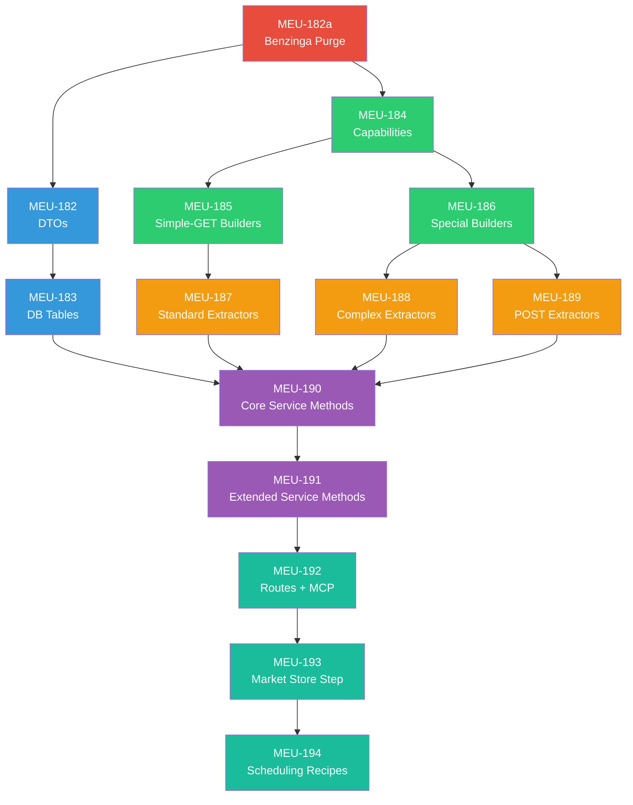

# P1.5a — Market Data Expansion: MEU Grouping Proposal

> **Phase**: 8a | **MEU Count**: 14 (MEU-182a → MEU-194) | **Est. Total Effort**: 25–35 hours
> **Status**: Proposal — awaiting human review

---

## Dependency Chain (from [08a spec](file:///p:/zorivest/docs/build-plan/08a-market-data-expansion.md))

Two parallel tracks converge at MEU-190:
- **Track A** (blue): Domain models → DB tables
- **Track B** (green → orange): Capabilities → Builders → Extractors

---

## Recommended: 5-Session Plan

### Session 1 — "Domain Foundation & Provider Metadata"

| MEU | Slug | Effort | Complexity |
|-----|------|:------:|:----------:|
| MEU-182a | `benzinga-code-purge` | 30 min | LOW |
| MEU-182 | `market-expansion-dtos` | 1–2 hr | MEDIUM |
| MEU-183 | `market-expansion-tables` | 1–2 hr | MEDIUM |
| MEU-184 | `provider-capabilities` | 1 hr | LOW-MED |

**Total**: ~4–6 hours | **MEU count**: 4

**Rationale**: All foundational. MEU-182a is a quick cleanup (grep-and-delete). MEU-182/183 define the data shapes the entire phase stores and retrieves. MEU-184 defines the metadata that every URL builder and extractor references. Doing all 4 here means **all downstream sessions can start building immediately** without reading domain/capability files for the first time.

**Context coherence**: All about data shapes and provider metadata — entity definitions, DB schemas, capability configs.

**Handoff state**: Clean codebase (no Benzinga refs) + 7 new DTOs + 4 DB tables + Alembic migration + capabilities registry for all 11 providers.

> [!WARNING]
> **Risks**: (1) Alembic migration chain — verify `heads` after adding market_earnings/dividends/splits/insider tables. (2) Rate limits in capabilities registry may need live verification against research synthesis.

**Quality gates**: `pytest`, `pyright`, `ruff`, `rg -i benzinga packages/ tests/ = 0 matches`

---

### Session 2 — "Simple-GET Data Pipeline"

| MEU | Slug | Effort | Complexity |
|-----|------|:------:|:----------:|
| MEU-185 | `simple-get-builders` | 1–2 hr | MEDIUM |
| MEU-187 | `extractors-standard` | 2–3 hr | MEDIUM-HIGH |

**Total**: ~3–5 hours | **MEU count**: 2

**Rationale**: 5 simple-GET URL builders + 5 standard JSON extractors for **the same 5 providers** (Alpaca, FMP, EODHD, API Ninjas, Tradier). Maximum context sharing — you read the provider's API docs once and build both the URL and the response parser.

**Context coherence**: VERY HIGH. Each provider's builder and extractor share the same response shapes, auth patterns, and field names.

**Providers covered**:

| Provider | Builder | Extractor Pattern | Field Mappings |
|----------|---------|------------------|:---------------:|
| Alpaca | `AlpacaUrlBuilder` | Dict-keyed multi / flat single | ~5 |
| FMP | `FMPUrlBuilder` | Root array / sometimes object | ~5 |
| EODHD | `EODHDUrlBuilder` | Root object / nested sections | ~5 |
| API Ninjas | `APINinjasUrlBuilder` | Root object, flat keys | ~5 |
| Tradier | `TradierUrlBuilder` | Root object, dict→list collapse | ~5 |

**Handoff state**: Complete URL→Extract pipeline for 5 simple-GET providers (~25 field mappings).

> [!WARNING]
> **Risks**: (1) Alpaca dual-shape (dict-keyed for multi-symbol, flat list for single). (2) Tradier single-result dict→list collapse. (3) Need fixture data — use synthetic or saved API responses?

**Quality gates**: `pytest`, `pyright`, `ruff`. Fixture-based extractor tests per provider × data_type.

---

### Session 3 — "Complex-Pattern Data Pipeline"

| MEU | Slug | Effort | Complexity |
|-----|------|:------:|:----------:|
| MEU-186 | `special-pattern-builders` | 2 hr | MEDIUM-HIGH |
| MEU-188 | `extractors-complex` | 3–4 hr | HIGH |
| MEU-189 | `extractors-post-body` | 1–2 hr | MEDIUM |

**Total**: ~6–8 hours | **MEU count**: 3

**Rationale**: The "hard" providers with non-standard patterns. 4 special-pattern builders + their complex extractors + POST-body extractors. These share deep context about non-standard API architectures.

**Context coherence**: HIGH. All providers here deviate from the simple-GET pattern — function-dispatch, dataset/table, POST-body.

**Providers covered**:

| Provider | Builder Pattern | Extractor Challenge |
|----------|----------------|---------------------|
| Alpha Vantage | Function-dispatch GET | Date-keyed dicts, CSV earnings, HTTP 200 rate limit |
| Nasdaq Data Link | Dataset/table GET | Parallel arrays + `column_names` header |
| OpenFIGI | POST with JSON body | v3 `error` → `warning` rename; **v2 sunsets July 2026** |
| SEC API | POST with Lucene query | `filings` array in response |
| Finnhub | (builder exists) | Parallel arrays `{c:[],h:[],l:[],o:[],t:[],v:[]}` |
| Polygon | (builder exists) | Millisecond UNIX timestamps (`t / 1000`) |

> [!CAUTION]
> **MEU-188 is the highest-complexity MEU in Phase 8a.** Alpha Vantage alone has 3 distinct extraction patterns (date-keyed OHLCV, CSV earnings, rate-limit body inspection). Budget accordingly.

**Handoff state**: All 11 providers have URL builders + response extractors. Layer 3 complete.

> [!WARNING]
> **Risks**: (1) Alpha Vantage CSV parser for `EARNINGS_CALENDAR`. (2) Finnhub OHLCV returns 403 on free tier — must gate/disable. (3) OpenFIGI v2 sunset date. (4) Polygon ms↔s timestamp confusion.

**Quality gates**: `pytest`, `pyright`, `ruff`. CSV parsing tests. Parallel-array zip tests. Timestamp conversion tests.

---

### Session 4 — "Market Data Service Methods"

| MEU | Slug | Effort | Complexity |
|-----|------|:------:|:----------:|
| MEU-190 | `service-methods-core` | 3–4 hr | HIGH |
| MEU-191 | `service-methods-extended` | 3–4 hr | HIGH |

**Total**: ~6–8 hours | **MEU count**: 2

**Rationale**: 8 total service methods (3 core + 5 extended) with provider fallback chains and per-provider normalizers. Both MEUs follow the exact same pattern: `dispatch to builder → fetch → extract → normalize → return canonical DTO`. MEU-191 directly extends patterns established in MEU-190.

**Context coherence**: VERY HIGH. Identical implementation pattern repeated 8 times with provider-specific variations.

**Methods & Fallback Chains**:

| Method | Primary | Fallback 1 | Fallback 2 | MEU |
|--------|---------|-----------|-----------|:----:|
| `get_ohlcv()` | Alpaca | EODHD | Polygon | 190 |
| `get_fundamentals()` | FMP | EODHD | Alpha Vantage | 190 |
| `get_earnings()` | Finnhub | FMP | Alpha Vantage | 190 |
| `get_dividends()` | Polygon | EODHD | FMP | 191 |
| `get_splits()` | Polygon | EODHD | FMP | 191 |
| `get_insider()` | Finnhub | FMP | SEC API | 191 |
| `get_economic_calendar()` | Finnhub | FMP | Alpha Vantage | 191 |
| `get_company_profile()` | FMP | Finnhub | EODHD | 191 |

**Handoff state**: Complete data retrieval service with all 8 new data types. Full fallback resilience.

> [!WARNING]
> **Risks**: (1) Fallback chain testing requires mocking HTTP failures for primary providers. (2) Per-provider normalizers must handle null/empty fields gracefully. (3) Extending existing `MarketDataService` class without breaking Phase 8 methods.

**Quality gates**: `pytest`, `pyright`, `ruff`. Mocked HTTP response coverage for all fallback paths. Edge case tests (empty results, null fields).

---

### Session 5 — "API Surface & Pipeline Automation"

| MEU | Slug | Effort | Complexity |
|-----|------|:------:|:----------:|
| MEU-192 | `market-routes-mcp` | 3 hr | MEDIUM-HIGH |
| MEU-193 | `market-store-step` | 2–3 hr | MEDIUM-HIGH |
| MEU-194 | `scheduling-recipes` | 1–2 hr | MEDIUM |

**Total**: ~6–8 hours | **MEU count**: 3

**Rationale**: The "exposure and automation" layer. MEU-192 makes service methods available to users (REST) and agents (MCP). MEU-193 connects them to the pipeline engine for automated data collection. MEU-194 provides ready-to-use policy templates.

**Context coherence**: GOOD. All three consume the service methods from Session 4. Unified theme of "making data retrieval automated and accessible."

**Deliverables**:

| MEU | Deliverables |
|-----|-------------|
| 192 | 8 REST endpoints + Pydantic `MarketDataQueryParams` (`extra="forbid"`) + 8 MCP actions in `zorivest_market` + Zod `.strict()` |
| 193 | `MarketDataStoreStep` pipeline step + `MarketDataStoreConfig` Pydantic model + Pandera validation + INSERT/UPSERT modes |
| 194 | 10 pre-built policy templates (valid JSON) + Alembic seed migration |

**Handoff state**: **Phase 8a complete.** All 11 [exit criteria](file:///p:/zorivest/docs/build-plan/08a-market-data-expansion.md#exit-criteria) satisfied.

> [!WARNING]
> **Risks**: (1) MEU-192 boundary validation — dual Pydantic + Zod schemas must be kept in sync. (2) MEU-192 TypeScript MCP changes interact with the 13-tool compound system (zorivest_market). (3) MEU-193 must integrate with existing `DbWriteAdapter` and pipeline step registry. (4) MEU-194 policy templates must pass `PolicyValidator` (8 validation rules).

**Quality gates**: `pytest` + `vitest`, `pyright`, `ruff`. TestClient for REST. MCP fixture tests. Pipeline integration test for store step.

---

## Summary

| Session | Project Name | MEUs | Count | Est. Hours | Complexity |
|:-------:|-------------|------|:-----:|:----------:|:----------:|
| **1** | Domain Foundation & Provider Metadata | 182a, 182, 183, 184 | 4 | 4–6 | 🟢 Medium |
| **2** | Simple-GET Data Pipeline | 185, 187 | 2 | 3–5 | 🟡 Medium-High |
| **3** | Complex-Pattern Data Pipeline | 186, 188, 189 | 3 | 6–8 | 🔴 High |
| **4** | Market Data Service Methods | 190, 191, [MKTDATA-YAHOO-UNOFFICIAL] | 2 | 6–8 | 🔴 High |
| **5** | API Surface & Pipeline Automation | 192, 193, 194, 195 | 3 | 6–8 | 🟡 Medium-High |
| | **Total** | | **14** | **25–35** | |

---

## Compact Alternative: 4-Session Plan

Merge Sessions 2+3 into a single "All Builders + Extractors" session:

| Session | MEUs | Count | Est. Hours |
|:-------:|------|:-----:|:----------:|
| 1 | 182a, 182, 183, 184 | 4 | 4–6 |
| **2** | **185, 186, 187, 188, 189** | **5** | **8–12** |
| 3 | 190, 191 | 2 | 6–8 |
| 4 | 192, 193, 194 | 3 | 6–8 |

> [!CAUTION]
> **Session 2 in the compact variant is extremely heavy** (5 MEUs, 8–12 hours, HIGH complexity). Real risk of hitting the 50% context window checkpoint. Recommend the 5-session plan unless session history shows consistent completion without checkpoints.

---

## Design Rationale: "Paired Vertical Slices"

The grouping principle is **builders paired with their extractors** rather than "all builders then all extractors." This is because:

1. **Provider context is king.** Understanding Alpaca's URL format and understanding Alpaca's response format require reading the same API docs. Doing both in one session avoids re-reading.
2. **Simple and complex providers have different cognitive loads.** Simple-GET providers (Session 2) follow a uniform pattern. Special-pattern providers (Session 3) each have unique quirks. Separating them prevents cognitive overload.
3. **Convergence at service methods.** Sessions 2+3 must BOTH complete before Session 4 can start. The 5-session plan keeps them as two focused sessions rather than one marathon.
