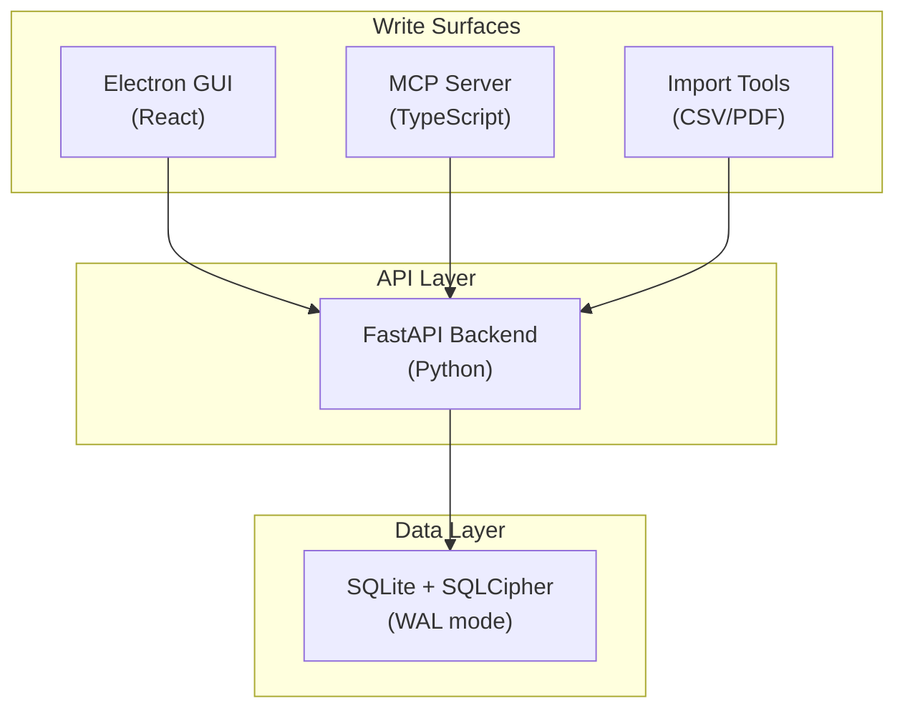

# Derived Data Architecture: Trade → TaxLot Materialization

**Research Date**: 2026-05-15  
**Problem**: How should Zorivest bridge `trade_executions` (source of truth) → `tax_lots` (derived data consumed by 7 tax GUI tabs, 8 MCP actions, 12 API endpoints)?  
**Sources**: 10+ primary sources across CQRS/Event Sourcing literature, SQLite concurrency research, database design catalogs, and financial software architecture patterns.

---

## System Topology (Why "Single-User Desktop" Is Wrong)

The initial framing of "single-user SQLite app" was too narrow. The actual access topology:



**Concurrent access patterns**:
- GUI browsing tax dashboard **while** MCP agent runs `zorivest_tax.simulate`
- Import tool ingesting trades **while** GUI displays lot viewer
- MCP agent calling `zorivest_tax.record_payment` **while** GUI refreshes quarterly view

SQLite WAL mode handles this: concurrent readers never block the single writer. But the **materialization design** must account for the fact that any of these surfaces could trigger a rebuild or read stale data.

---

## The Core Challenge: Derived Data With User-Editable State

This isn't a simple cache or materialized view problem. Tax lots have a **dual nature**:

| Aspect | Derived from Trades | User-Editable State |
|--------|-------------------|-------------------|
| `ticker`, `quantity`, `cost_basis` | ✅ Computed from BOT trades | — |
| `acquired_date`, `sold_date` | ✅ From trade timestamps | — |
| `holding_period` | ✅ Computed | — |
| `cost_basis_method` | — | ✅ User selects FIFO/LIFO/SpecificID per lot |
| `is_closed` + close price | ✅ From SLD trade matching | ✅ User picks which lots to close |
| `wash_sale_adjustment` | ✅ Detected by algorithm | ✅ User can override chain decisions |
| `linked_trade_ids` | ✅ Back-reference to source | — |

This dual nature is what eliminates one option and creates a third.

---

## Three Architecture Patterns

### Option A: User-Triggered Materialized Projection

**Pattern names**: CQRS Projection, Materialized View, "Consume and Project"

```
[Trades] ──── user clicks "Sync" ────→ [TaxLots table]
                                           ↕
                                    [Tax GUI / MCP / API reads]
```

**How it works**:
1. Trades are the write model / source of truth
2. `tax_lots` is a separate projection table, rebuilt on demand
3. User explicitly triggers materialization ("Process" button)
4. After sync, lots can be queried, filtered, and used for tax calculations

**Research backing**:
- Microsoft Azure Architecture Center: *"Projections create optimized read models from a stream of events"* — the standard CQRS pattern
- Event-Driven.io: *"Events are facts, projections are interpretations... we can rebuild read models"*
- DataCamp (Denormalization patterns): Manual refresh strategy — *"Simplest option for materialized views. Pick refresh windows that match your UX tolerance"*

**Strengths**:
- ✅ User controls when data refreshes (your stated preference)
- ✅ Simple mental model — press button, data appears
- ✅ Clean separation: trades are source, lots are cache
- ✅ Rebuild is idempotent — safe to re-run

**Weaknesses**:
- ⚠️ **Does not preserve user overrides on rebuild** — if user set `cost_basis_method=LIFO` on a lot, a full rebuild from trades would lose that choice
- ⚠️ Stale data risk — if new trades are imported but sync isn't triggered, tax GUI shows outdated lots
- ⚠️ No conflict detection — if a trade is corrected after materialization, the lot silently stays wrong until next sync

> [!WARNING]
> **Disqualifying flaw**: A pure rebuild destroys user-editable state. The existing `TaxService` has methods like `close_lot()`, `reassign_basis()`, and `process_option_assignment()` that **modify lots in place**. A full re-projection would wipe these user decisions.

---

### Option B: Live Computed View (No Storage)

**Pattern names**: Virtual View, Computed on Read, Live Query

```
[Trades] ──── computed at query time ────→ [Tax GUI / MCP / API]
                  (no tax_lots table)
```

**How it works**:
1. No `tax_lots` table at all
2. Every tax query dynamically computes lots from `trade_executions`
3. Lot matching (FIFO/LIFO/etc.) runs on every page load

**Research backing**:
- Epsio (Materialized Views guide): *"Regular views always return the most current data... eliminates the need for any refresh mechanism"*
- Database schema best practices: *"If a value can be derived from other columns, don't store it. Calculate it in queries or application code."*

**Strengths**:
- ✅ Always fresh — zero staleness risk
- ✅ True single source of truth — only trades table exists
- ✅ No sync button, no stale data, no rebuild logic

**Weaknesses**:
- ❌ **Cannot store user overrides** — where does `cost_basis_method=SpecificID` live? Where does "user chose to close lot #3 against this sale" live? Nowhere, because there's no lot entity to store it on.
- ❌ Expensive — lot matching + wash sale detection across all trades on every request. The `TaxService.get_trapped_losses()` method scans all lots, runs 30-day window detection, builds chains. This is O(n²) in trades.
- ❌ Concurrent requests multiply the computation — GUI refresh + MCP call = two full recomputations
- ❌ Would require rewriting 1,774 lines of `TaxService` which assumes stored, mutable `TaxLot` entities

> [!CAUTION]
> **Eliminated**. The existing domain model requires mutable `TaxLot` entities. Wash sale chains, lot closing, basis reassignment, and option pairing all depend on lots being persistent, updateable records. A pure view approach is architecturally incompatible.

---

### Option C: Derived Entity with Provenance Tracking (Hybrid)

**Pattern names**: Enriched Projection, Derived Entity, Mutable Read Model with Conflict-Aware Merge

```
                    user clicks "Sync"
[Trades] ──────────────────────────────→ [Sync Service]
                                              │
                                    ┌─────────┴─────────┐
                                    │  Merge Logic:      │
                                    │  • New lots → create│
                                    │  • Changed source  │
                                    │    → flag conflict  │
                                    │  • User-modified   │
                                    │    → preserve       │
                                    └─────────┬─────────┘
                                              │
                                        [TaxLots table]
                                         (with provenance)
                                              ↕
                                    [Tax GUI / MCP / API]
```

**How it works**:
1. `tax_lots` table exists as a **first-class domain entity** (not a disposable cache)
2. Each lot tracks its **provenance**:
   - `linked_trade_ids` — which trades produced this lot (already exists)
   - `materialized_at` — timestamp of last sync
   - `is_user_modified` — flag indicating user has overridden derived values
   - `source_hash` — hash of the source trade data at materialization time (for conflict detection)
3. **Sync operation** is a **merge**, not a rebuild:
   - Scans `trade_executions` for BOT trades → proposes new lots
   - Matches SLD trades to open lots using configured `cost_basis_method`
   - For lots that are **new** (no existing lot with these trade IDs) → creates them
   - For lots where **source trade changed** (hash mismatch) → flags conflict, optionally re-derives
   - For lots where **user has edited** (`is_user_modified=true`) → **preserves user state**, reports divergence
4. Supports **dry-run mode** — show what would change before applying
5. Runs wash sale detection as part of the sync pipeline

**Research backing**:

- Apex Cost Basis (industry-scale): *"Changes to input data trigger immediate recalculation... life-of-a-lot transparency... visualize the complete evolution of every tax lot through corporate actions, transfers, and journals"* — enterprise financial systems treat lots as entities, not views.
- Event-Driven.io (Oskar Dudycz): *"Projections, together with analytics, can bring valuable insights"* — but projections in mature systems preserve accumulated state.
- Stack Overflow CQRS discussion: *"Use the previously cached representation as a starting point, and then pull from the book of record only the changes that you need"* — incremental merge, not full rebuild.
- Microsoft Azure (Event Sourcing Pattern): *"Event sourcing doesn't have to be an all-or-nothing decision. Apply it selectively to the parts of your system that it benefits the most"* — we don't need full event sourcing, just the projection merge pattern.
- Martin Fowler (CQRS): *"Beware that it is difficult to use well"* — the hybrid avoids full CQRS complexity by keeping source and projection in the same database.
- DataCamp (Denormalization guide): Distinguishes between **sync strategies** — triggers (automatic), application dual-write, and scheduled jobs. Our "Process" button is the manual variant of the scheduled job pattern.

**Strengths**:
- ✅ User controls when to sync (your stated preference)
- ✅ **Preserves user overrides** across re-syncs
- ✅ **Detects conflicts** — if a source trade is corrected, the user sees a conflict flag rather than silently stale data
- ✅ Supports dry-run preview — "here's what would change if you sync now"
- ✅ Compatible with existing 1,774-line `TaxService` — lots remain mutable entities
- ✅ Incremental — doesn't rebuild everything, only processes new/changed trades
- ✅ Concurrent-safe — sync runs through the API as a single transaction, WAL handles concurrent reads

**Weaknesses**:
- ⚠️ More complex merge logic than pure rebuild
- ⚠️ Requires schema additions (`materialized_at`, `is_user_modified`, `source_hash`)
- ⚠️ Conflict resolution UX needed — what does the user see when source diverges from their override?

---

## Consensus Matrix

| Criterion | Option A (Rebuild) | Option B (Live View) | Option C (Hybrid Merge) |
|-----------|-------------------|---------------------|----------------------|
| User-editable state | ❌ Destroyed on rebuild | ❌ No storage | ✅ Preserved |
| Data freshness | ⚠️ Manual trigger | ✅ Always fresh | ⚠️ Manual trigger + conflict flags |
| Computation cost | ✅ One-time on sync | ❌ Every read | ✅ One-time on sync |
| Concurrent access | ✅ WAL safe | ⚠️ CPU contention | ✅ WAL safe |
| Compatibility with existing code | ⚠️ Loses user edits | ❌ Full rewrite | ✅ Compatible |
| Conflict detection | ❌ Silent staleness | N/A | ✅ Hash-based detection |
| Complexity | Low | Low (but wrong) | Medium |
| Industry pattern match | CQRS Projection | Virtual View | Enriched Projection |

---

## Recommendation: Option C — Derived Entity with Provenance

**The consensus from data architecture literature is clear**: when derived data has user-editable state, you need a **stored entity with provenance tracking** and a **conflict-aware merge** strategy. Pure materialized views (Option A) and pure computed views (Option B) are both insufficient because they can't represent the dual nature of the data.

### Concurrency Considerations for GUI + API + MCP

| Scenario | Behavior |
|----------|----------|
| GUI reads lots while MCP triggers sync | WAL mode: reader sees pre-sync snapshot, no blocking |
| Two MCP agents call sync simultaneously | API serializes writes — second sync waits for first to commit |
| Import adds trades while GUI views lots | Lots stay stale until next sync — user sees `materialized_at` timestamp |
| User edits lot basis method during sync | Sync preserves `is_user_modified` lots — no conflict |

### Schema Additions Needed

```sql
-- Additions to existing tax_lots table
ALTER TABLE tax_lots ADD COLUMN materialized_at TEXT;      -- ISO timestamp of last sync
ALTER TABLE tax_lots ADD COLUMN is_user_modified INTEGER DEFAULT 0;  -- 1 if user has overridden
ALTER TABLE tax_lots ADD COLUMN source_hash TEXT;           -- SHA256 of source trade data
ALTER TABLE tax_lots ADD COLUMN sync_status TEXT DEFAULT 'synced';  -- synced|conflict|orphaned
```

### API Surface (Resolved)

| Endpoint / Tool | Method | Purpose |
|-----------------|--------|---------|
| `POST /api/v1/tax/sync` | API | Trigger lot materialization; returns sync report |
| `zorivest_tax(action:"sync")` | MCP | Same as POST, for AI agents |
| GUI "Process Tax Lots" button | UI | Calls POST sync via API |

> [!NOTE]
> **No separate dry-run / preview endpoint.** See [Decision 3](#decision-3-resolved-no-dry-run-endpoint) below.

---

## Resolved Decisions

### Decision 1 (Resolved): Sync Trigger via GUI + API + MCP ✅

**Confirmed.** The sync operation is a single unified service callable from all three access surfaces. The user presses "Process Tax Lots" in the GUI, the API agent calls `POST /api/v1/tax/sync`, or an MCP agent calls `zorivest_tax(action:"sync")`. All three go through the same `TaxService.sync_lots()` method.

No additional research was needed — this was already implicit in the architecture.

---

### Decision 2 (Resolved): Configurable Conflict Strategy in Tax Settings ✅

**Setting**: `tax_conflict_resolution` with three options:

| Value | Behavior | When Triggered |
|-------|----------|----------------|
| **`flag`** (default) | Source-changed lots are marked `sync_status='conflict'`; user-modified lots are always preserved; user reviews conflicts manually | At sync time |
| `auto_resolve` | Source-changed lots are updated to match source, even if user-modified; user overrides are overwritten | At sync time |
| `block` | If any conflict is detected, the entire sync is rejected with a conflict report; no lots are changed | At sync time |

**Timing clarification**: This setting is evaluated **only at sync time** — when the user clicks "Process Tax Lots" or calls the sync API/MCP endpoint. It has no effect outside of sync operations.

**Industry precedent**:

| Product | Conflict Setting | Default | Location |
|---------|-----------------|---------|----------|
| **CCH ProSystem fx Tax** | 3 options: "Always apply updates" / "Prompt to apply" / "Only when changed" | Prompt | Tools > Preferences |
| **Git merge** | `-X ours` / `-X theirs` / default (stop and prompt) | Stop and prompt | `merge.conflictStyle` config |
| **Charles Schwab** | Cost basis method configurable per-account with per-trade override | FIFO | Account Settings |

The CCH ProSystem fx pattern is the closest analogue: a professional tax application that offers exactly three conflict resolution options in a preferences/settings menu, with "prompt the user" as the default. Git's merge strategy is the same pattern applied to source control: `ours` = preserve user edits (flag), `theirs` = take incoming (auto-resolve), default = stop (block).

**Research source**: CCH ProSystem fx Tax User Guide (Wolters Kluwer) — *"Users should set up personal preferences (Tax Preparation > Options > Preferences)"* with update-handling options for data from global settings.

---

### Decision 3 (Resolved): No Dry-Run Endpoint ✅

**Your argument holds.** Since `tax_lots` are derived from `trade_executions` (the immutable source of truth), the lot table itself is inherently a "sandbox":

> *"Projections are disposable. If one breaks or you need a new query pattern, you replay the event stream through a new projection function and rebuild it from scratch. The events are the truth. The projections are just views."* — Event Sourcing in Microservices (joudwawad/Medium)

> *"Application states can be stored either in memory or on disk. Since an application state is purely derivable from the event log, you can cache it anywhere you like."* — Martin Fowler, Event Sourcing

> *"Bug fixes occur when you look at past processing and realize it was incorrect... all you need to do is make the fix and reprocess the events. Your application state is now fixed to what it should have been."* — Martin Fowler, Event Sourcing

**Why dry-run is unnecessary with flag mode as default**:

The sync operation with `flag` mode is **inherently non-destructive**:

| Sync Scenario | What Happens | Data Loss Risk |
|--------------|--------------|---------------|
| New trades → new lots | Lots created (additive) | None |
| User-modified lots | Preserved unchanged | None |
| Source trade changed | Flagged `sync_status='conflict'` | None — user reviews |
| Orphaned lots (trade deleted) | Flagged `sync_status='orphaned'` | None — user reviews |

A dry-run of a non-destructive operation is redundant. The "preview" is the sync itself.

**Edge case — auto-resolve mode**: If the user switches to `auto_resolve`, user overrides could be overwritten. But this is an explicit user choice to accept aggressive behavior. Even then, the sync response includes a detailed **sync report** documenting every change, so the user sees what happened.

**What replaces dry-run — the Sync Report**:

Instead of a preview endpoint, every sync response includes a structured report:

```json
{
  "success": true,
  "sync_report": {
    "lots_created": 12,
    "lots_updated": 3,
    "lots_flagged_conflict": 1,
    "lots_orphaned": 0,
    "lots_unchanged": 45,
    "conflicts": [
      {
        "lot_id": "abc123",
        "ticker": "AAPL",
        "field": "cost_basis",
        "current_value": 150.00,
        "source_value": 152.50,
        "user_modified": true
      }
    ],
    "materialized_at": "2026-05-15T21:00:00Z"
  }
}
```

This is the standard pattern in event sourcing projections: you log what the projection **did**, not what it **would do**. The report serves the same informational purpose as a dry-run but with zero additional API complexity.

**Research backing for "report instead of preview"**:
- Idempotent projections (Domain Centric): *"If your event has all the necessary data to project, you don't really care how many times the projection processes the event"*
- CockroachDB (Idempotency in Event-Driven Systems): Transaction ID-based deduplication makes reprocessing safe
- Event-Driven.io (Rebuilding Read Models): *"The simplest rebuild is truncate and reapply... background worker tracks projection status"*

---

### Longevity Analysis

This architecture survives these future scenarios:

1. **New trade sources** (additional brokers) — sync just processes more trades
2. **Multi-year data** — lots persist across tax years, historical overrides preserved
3. **Additional MCP tools** — read from lots like any other consumer
4. **API redesign** — sync endpoint is independent of read endpoints
5. **Batch import** — import trades first, sync lots after, review before committing
6. **Audit trail** — `materialized_at` + `source_hash` provide provenance history
7. **Conflict strategy changes** — user can switch from flag→auto-resolve as confidence grows
8. **Re-sync safety** — idempotent merge means re-running sync is always safe

---

## Sources Referenced

| # | Source | Key Insight |
|---|--------|-------------|
| 1 | [Microsoft Azure — Event Sourcing Pattern](https://learn.microsoft.com/en-us/azure/architecture/patterns/event-sourcing) | "Apply selectively to parts that benefit most" |
| 2 | [Event-Driven.io — Projections Guide](https://event-driven.io/en/projections_and_read_models_in_event_driven_architecture/) | "Events are facts, projections are interpretations" |
| 3 | [Martin Fowler — CQRS](https://martinfowler.com/bliki/CQRS.html) | "Beware it is difficult to use well" |
| 4 | [Epsio — Materialized vs Regular Views](https://www.epsio.io/blog/database-materialized-view-vs-regular-view) | Freshness gap tradeoffs |
| 5 | [DataCamp — Denormalization Patterns](https://www.datacamp.com/tutorial/denormalization) | Sync strategy taxonomy |
| 6 | [Apex Fintech — Cost Basis & Tax](https://apexfintechsolutions.com/products/clearing-and-custody/cost-basis-tax/) | Industry-scale lot tracking architecture |
| 7 | [Stack Overflow — CQRS Projections](https://stackoverflow.com/questions/47311911/event-sourcing-cqrs-read-model-projections) | "Use cached representation as starting point" |
| 8 | [SQLite WAL Mode benchmarks](https://botmonster.com/posts/sqlite-application-database-when-how-to-use/) | Concurrent read/write patterns |
| 9 | [Stack Overflow — Triggers vs SPs for Denorm](https://stackoverflow.com/questions/2088905/pros-and-cons-of-triggers-vs-stored-procedures-for-denormalization) | Manual refresh vs automatic tradeoffs |
| 10 | [Redgate — Database Design Patterns 2024](https://www.red-gate.com/blog/database-design-patterns/) | Pattern taxonomy |
| 11 | [Martin Fowler — Event Sourcing](https://martinfowler.com/eaaDev/EventSourcing.html) | "Application state is purely derivable from the event log" |
| 12 | [Event Sourcing in Microservices (Medium)](https://joudwawad.medium.com/microservices-pattern-event-sourcing-0a18d2e6f7c5) | "Projections are disposable... rebuild from scratch" |
| 13 | [Domain Centric — Projection Deduplication](https://domaincentric.net/blog/event-sourcing-projection-patterns-deduplication-strategies) | Naturally idempotent projections |
| 14 | [CCH ProSystem fx Tax User Guide (Wolters Kluwer)](https://support.cch.com/uploads/ProSystem%20fx%20Tax%20User%20Guide.pdf) | 3-option conflict resolution in preferences |
| 15 | [CockroachDB — Idempotency in Event-Driven Systems](https://www.cockroachlabs.com/blog/idempotency-and-ordering-in-event-driven-systems/) | Transaction ID deduplication makes reprocessing safe |
| 16 | [Event-Driven.io — Rebuilding Read Models](https://event-driven.io/en/rebuilding_event_driven_read_models/) | Safe projection rebuild with checkpoint tracking |
| 17 | [Charles Schwab — Cost Basis Methods](https://www.schwab.com/learn/story/save-on-taxes-know-your-cost-basis) | Per-account configurable default with per-trade override |

---

> [!TIP]
> **All 3 decisions are now resolved.** This document is ready to feed into `/create-plan` for implementation planning. The next step is to register this as a new MEU or project in the build plan and implement the `TaxService.sync_lots()` method, schema migration, conflict resolution setting, and GUI "Process" button.
