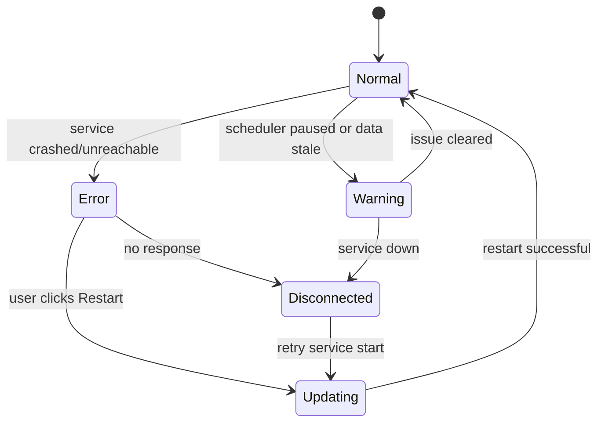
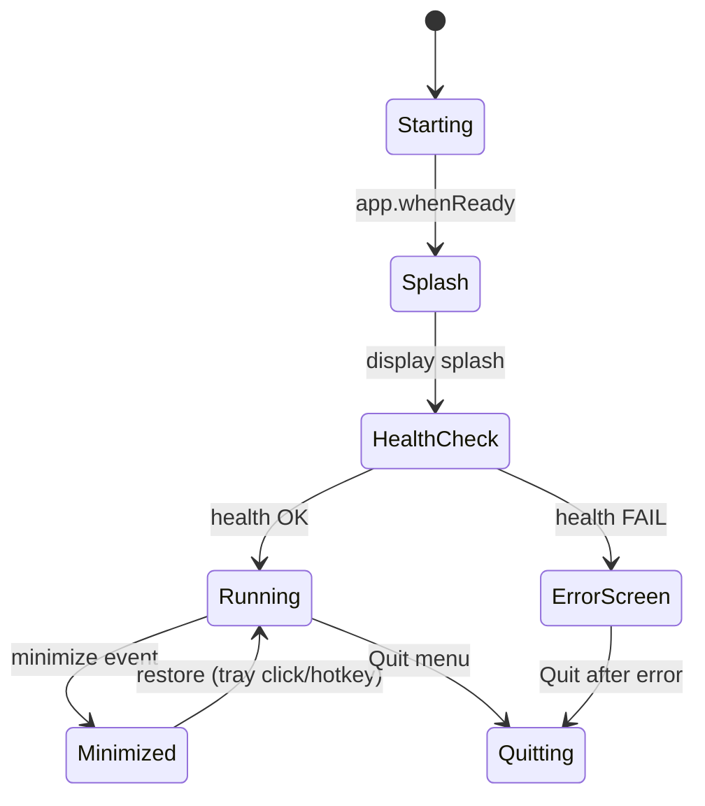
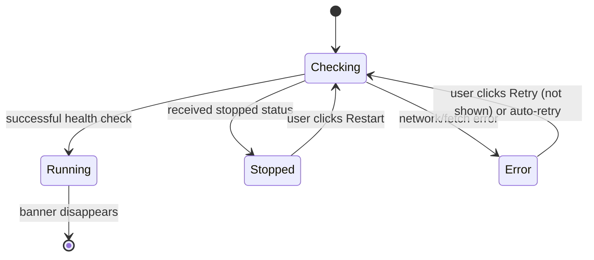
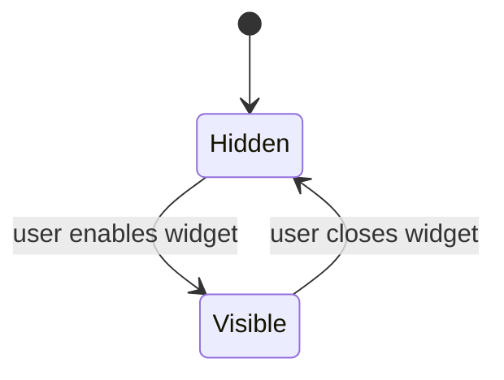
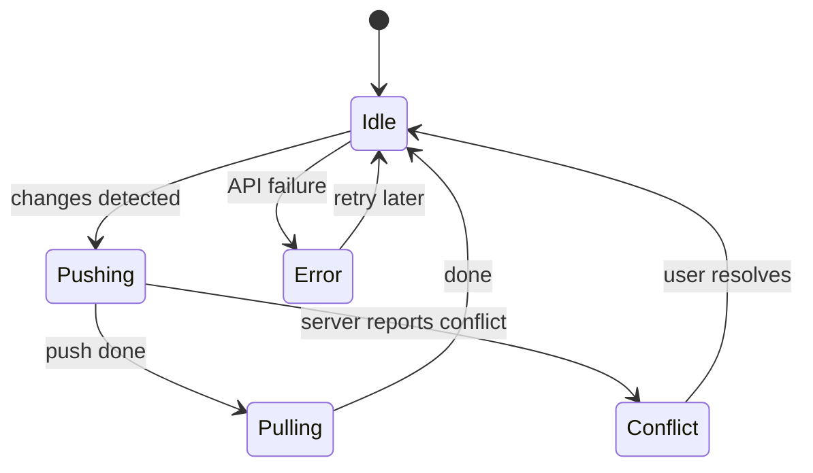
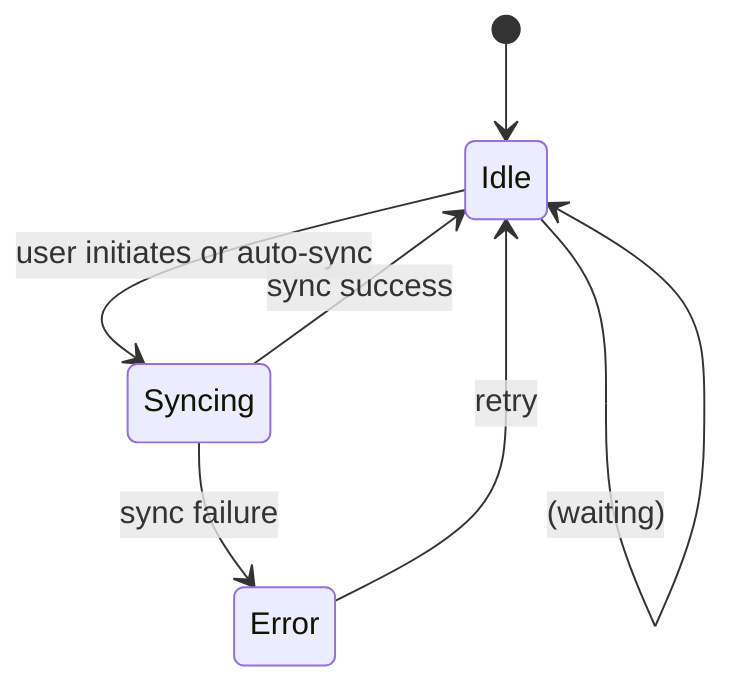
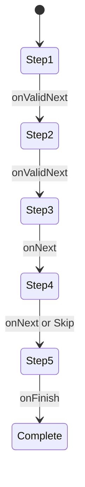

# 1. System Tray & Service Health Integration

**Architecture overview:** Zorivest’s `ZorivestTrayManager` (in the Electron **main process**) extends the pattern from OpenWhispr’s `TrayManager`【13†L865-L872】 to reflect both GUI and Python-backend status. It maintains an Electron `Tray` instance and a **HealthMonitor** that polls the backend’s health endpoint (e.g. `GET /api/service/health`). The tray icon image is updated with a colored dot overlay (green/yellow/red) based on the service state. The context menu is rebuilt whenever state changes or windows show/hide. Recent trades and quick actions are fetched asynchronously to avoid blocking UI: for example, pre-fetch the last 3 trades on a timer or when the user opens the menu, then call `tray.setContextMenu()` to refresh the menu【15†L1317-L1325】.  Starting or stopping the service invokes OS-specific commands (via the WinSW/launchd daemon spec【65†L171-L180】), and the “Quit” action, if the service is running, shows a confirmation (“Quit GUI only” vs “Quit and Stop Service”) before calling `app.quit()`.

**Component tree:** (Electron main process classes, not React)

- **ZorivestTrayManager** (class)
  - **tray**: Electron `Tray` icon
  - **healthMonitor**: polls backend `/health` (tracks `status: running|paused|error|down`)
  - **menuBuilder**:
    - *ServiceStatusItem*: shows “● Service: Running” with colored icon
    - *Separator*
    - *OpenZorivestItem*: click → show main window
    - *Separator*
    - *RecentTradesSubmenu*: built from last-3 trades (fetched via REST)
    - *Separator*
    - *QuickActionsSubmenu*: static items (New Trade, Watchlist, etc.)
    - *Separator*
    - *StartStopServiceItem*: toggles backend service (green/red dot icon)
    - *PreferencesItem*: opens settings
    - *Separator*
    - *QuitItem*: quits GUI (confirmation if service running)

**Code implementation (TypeScript sketch):** Key parts of `ZorivestTrayManager` might look like:
```ts
class ZorivestTrayManager {
  private tray: Tray;
  private health: 'running' | 'paused' | 'error' | 'stopped' = 'stopped';

  constructor() { /* ... */ }

  async updateTrayMenu() {
    // Poll backend health (async, non-blocking UI)
    try {
      const res = await fetch('http://localhost:8765/api/service/health');
      this.health = (await res.json()).status;
    } catch {
      this.health = 'error';
    }
    // Determine icon (colored dot) for status
    const statusIcon = this.getIconForHealth(this.health);
    this.tray.setImage(statusIcon);

    // Fetch recent trades (non-blocking; could use a cached result)
    const recent = await fetch('http://localhost:8765/api/trades/recent?limit=3')
                            .then(r => r.json()).catch(() => []);

    // Build context menu template
    const menuTpl: MenuItemConstructorOptions[] = [
      { label: `● Service: ${this.health}`, icon: statusIcon },
      { type: 'separator' },
      { label: 'Open Zorivest', click: () => this.focusMainWindow() },
      { type: 'separator' },
      {
        label: 'Recent Trades ▶',
        submenu: recent.map((t:any) => ({
          label: `${t.symbol} ${t.pnl} (${t.time})`,
          click: () => this.openTradeDetail(t.id)
        }))
      },
      { type: 'separator' },
      {
        label: 'Quick Actions ▶',
        submenu: [
          { label: 'New Trade Record', click: () => this.openNewTradeDialog() },
          { label: 'View Watchlist', click: () => this.openWatchlist() },
          { label: 'Run Pipeline Now', click: () => this.triggerPipeline() },
        ]
      },
      { type: 'separator' },
      { label: 'Start/Stop Service', click: () => this.toggleService() },
      { label: 'Preferences...', click: () => this.showSettings() },
      { type: 'separator' },
      { label: 'Quit', click: () => this.quitWithConfirm() }
    ];
    // Apply updated menu
    this.tray.setContextMenu(Menu.buildFromTemplate(menuTpl));
  }
  // ... other methods like getIconForHealth(), focusMainWindow(), toggleService(), etc.
}
```
*(Note: Use `async/await` to avoid blocking menu build. The menu template is rebuilt after fetching data.)*

**State machine diagram:** The tray icon can be in one of several states; for example:


**API contract:** The tray will rely on the following REST endpoints (all localhost, bearer token):
- `GET /api/service/health` → `{ status: "running"|"paused"|"error"|"stopped", detail?: string }`
- `POST /api/service/start` → `{ success: true }`
- `POST /api/service/stop`  → `{ success: true }`
- `GET /api/service/logs`  → `{ logs: string[] }`
- `GET /api/trades/recent?limit=3` → `{ trades: [{id, symbol, pnl, time}] }`
- (Potentially) `POST /api/trades/import` or similar for quick actions.

**Testing strategy:** Write unit tests for `ZorivestTrayManager.updateTrayMenu()`, mocking the health and trades API to verify the menu template. Simulate different backend states: e.g. health = "running" should show green icon, health = "error" should show red. Test asynchronous fetching: stub `fetch` calls and ensure `tray.setContextMenu` is called with correct labels. Integration tests can simulate the full Electron app: minimize/restore, and ensure clicking "Quit" triggers the correct behavior. Also test edge cases: backend unreachable (icon becomes “error”), and that the menu updates (use fake timers or manual triggers).

# 2. Window Management for a Trade Review Tool

### (a) Main Window Lifecycle

**Architecture overview:** The main Zorivest window is a standard Electron `BrowserWindow` hosting the React “AppShell” (with navigation rail). On startup, the main process first performs a health check of the Python backend (e.g. calling `GET /api/service/health`). While waiting, it shows a splash/loading screen. If the backend is healthy, the main window loads normally; otherwise it shows an error page. When minimized (via taskbar or code), the window is hidden (not closed) and only the tray icon remains, showing a toast “Zorivest still running”【28†L3277-L3285】. Clicking the tray icon or a global hotkey will restore and focus the main window. Intercepting the window’s close (X) event prevents quitting: if `app.isQuitting` is false, call `mainWindow.hide()` instead【28†L3277-L3285】. The “Quit” action from the tray menu then explicitly calls `app.quit()`, but first asks “Keep backend running?” if the Python service is active (giving the user a choice to continue it in background).

**Component tree (React, main window UI):**
```
- <ZorivestApp> (root)
  - <AppShell>
    - <NavigationRail/> (sidebar)
    - <ContentArea> (React Router outlet for pages)
    - <ServiceStatusBanner/> (conditionally visible at top)
    - <SyncStatusIndicator/> (footer/status bar showing sync)
```

**Code implementation:** In the Electron main process, window event handlers might be:
```ts
// Assume mainWindow is created earlier with BrowserWindow(config)
mainWindow.on('minimize', (e) => {
  e.preventDefault();
  mainWindow.hide();
  // Show a toast notification (renderer or HTML5)
  new Notification({ title: 'Zorivest', body: 'Zorivest is still running in the background.' }).show();
});

mainWindow.on('close', (e) => {
  if (!app.isQuitting) {
    e.preventDefault();
    mainWindow.hide(); // hide instead of quit
  }
});

// Handler for Quit from tray:
async function handleQuit() {
  const running = await fetch('http://localhost:8765/api/service/health').then(r=>r.json()).catch(()=>null);
  if (running?.status === 'running') {
    const choice = dialog.showMessageBoxSync({
      type: 'question', buttons: ['Quit & Stop Service','Quit & Keep Service','Cancel'],
      defaultId: 0, title: 'Quit Zorivest?', message: 'Stop the backend service?'
    });
    if (choice === 2) return;
    if (choice === 0) { await fetch('http://localhost:8765/api/service/stop',{method:'POST'}); }
  }
  app.isQuitting = true;
  app.quit();
}
```
*(Similar to OpenWhispr’s control-panel close handler【28†L3277-L3285】, we prevent default close to hide the window instead.)*

**State machine diagram:**


**API contract:** Reuses the service endpoints from Task 1 (e.g. `GET /api/service/health`). Additionally, the GUI might fetch data for initial rendering:
- `GET /api/user/account` → `{ user: {...} }` for personalizing the UI.
- Possibly `GET /api/trades/portfolio` for initial data load (although out of scope).
No new special endpoints beyond health/logs needed for window lifecycle.

**Testing strategy:**
- Unit tests: mock `mainWindow` and trigger `minimize` and `close` events; assert that `.hide()` is called instead of `.destroy()`. Simulate `app.isQuitting = true` and verify close proceeds. Test the Quit handler: mock the fetch to `/service/health` returning running vs stopped, simulate dialog choices, ensure correct POST to stop service or not.
- UI tests: end-to-end scenario where the app is minimized; verify a toast/notification appears. Simulate tray-click to restore window. Ensure that closing the window triggers the hide behavior (e.g. check `BrowserWindow.getAllWindows()` count). Test that error splash appears if backend mock returns down.

### (b) ServiceStatusBanner Component

**Architecture overview:** This is a React component shown at the top of the main window whenever the backend is not healthy. It displays messages like “Connecting…”, “Service stopped”, or “Service error” and offers actions (“Restart Service”, “View Logs”, “Ignore”). The banner polls the backend health endpoint with exponential backoff. For example, it might use a hook that calls `GET /api/service/health` on mount, and if it fails, retries after 2s, 4s, 8s, etc. When status becomes “running”, the banner auto-dismisses. A “Restart” button sends `POST /api/service/restart` and resumes health polling. A “View Logs” button could open a log file in a window. An “Ignore” button simply hides the banner (until another failure).

**Component tree:**
```
- <AppShell>
  - [if unhealthy] <ServiceStatusBanner>
    - Message (e.g. <span>Status: ...</span>)
    - Buttons: <Button>Restart Service</Button>, <Button>View Logs</Button>, <Button>Ignore</Button>
```

**Code implementation (React/TypeScript sketch):**
```tsx
const ServiceStatusBanner: React.FC = () => {
  const [status, setStatus] = useState<'checking'|'running'|'stopped'|'error'>('checking');
  const [message, setMessage] = useState<string>('Connecting to service...');
  // Exponential backoff polling
  useEffect(() => {
    let delay = 2000;
    let aborted = false;
    async function check() {
      if (aborted) return;
      try {
        const res = await fetch('http://localhost:8765/api/service/health');
        if (!res.ok) throw new Error();
        const { status: srvStatus } = await res.json();
        if (srvStatus === 'running') {
          setStatus('running'); // hide banner
          return;
        } else {
          setStatus('stopped');
          setMessage('Service stopped');
        }
      } catch {
        setStatus('error');
        setMessage('Service unreachable');
      }
      // retry with backoff
      setTimeout(check, delay);
      delay = Math.min(delay * 2, 60000);
    }
    check();
    return () => { aborted = true; };
  }, []);

  if (status === 'running') return null;

  return (
    <div className="banner">
      <span>{message}</span>
      {status !== 'running' && (
        <>
          <button onClick={() => fetch('/api/service/restart',{method:'POST'})}>Restart Service</button>
          <button onClick={() => window.open('/logs')}>View Logs</button>
          <button onClick={() => setStatus('running')}>Ignore</button>
        </>
      )}
    </div>
  );
};
```
*(This polls the health endpoint and updates state. Upon recovery, it sets `status='running'` which causes the banner to unmount.)*

**State machine diagram:**  


**API contract:**  
- `GET /api/service/health` → `{ status: "running"|"stopped"|"error", uptimeMs?: number }`.  
- `POST /api/service/restart` → `{ success: true }` (causes backend daemon to restart).  
- (Optional) `GET /api/service/logs` → `{ logs: string[] }` to view recent log lines.

**Testing strategy:**  
Unit-test the banner’s logic by mocking `fetch`. For example, have the first fetch throw an error (simulate “error”) and check that the component shows “Service unreachable”. Then mock a recovery (next fetch returns running) and ensure the banner unmounts. Test the “Restart Service” button issues the POST request (use `fetch-mock` or similar). Verify exponential backoff by faking timers: e.g. after setting a failure, advance timers and ensure multiple retry attempts. End-to-end test: simulate the backend process dying and ensure the banner appears, then restart the service and confirm the banner goes away.

### (c) Floating Widgets (Active P&L Monitor)

**Design:** Yes, Zorivest can support an always-on-top floating widget, akin to OpenWhispr’s agent overlay【21†L1031-L1040】. For example, a small window showing real-time active positions P&L, pipeline status, and a quick “New Trade” button. This widget would be created by the main process as a new `BrowserWindow` with overlay config: frameless, always-on-top, transparent (if design desires), skipTaskbar, and focusable (so the user can click it)【21†L1035-L1043】. On macOS it might use `type: "panel"`, on Linux perhaps `"toolbar"`, on Windows `"popup-menu"`. The widget’s React component might have:
```
- <PositionWidgetWindow>
    - <ActivePnLDisplay />
    - <PipelineStatus />
    - <QuickTradeButton />
```
**Window config example (TypeScript):**
```ts
const WIDGET_CONFIG: BrowserWindowConstructorOptions = {
  width: 300, height: 100,
  frame: false, transparent: true,
  alwaysOnTop: true, skipTaskbar: true,
  resizable: false, focusable: true,
  webPreferences: { preload: PRELOAD_PATH, nodeIntegration: false, contextIsolation: true }
};
function createWidget() {
  const win = new BrowserWindow(WIDGET_CONFIG);
  // Position near cursor or bottom-right:
  const {x,y} = screen.getCursorScreenPoint();
  win.setPosition(x-150, y-50);
  win.loadURL(app.isPackaged
    ? `file://${__dirname}/index.html#widget`
    : `http://localhost:3000?panel=widget`);
  // Crash recovery if needed
}
```
This follows OpenWhispr’s pattern for floating overlays【21†L1031-L1040】.

**State machine diagram:** (Widget visibility)


**API contract:**
- `GET /api/positions/active` → `{ positions: [{symbol, qty, unrealizedPnl}] }`
- `GET /api/pipeline/status` → `{ lastRun: ISO, status: "idle"|"running"|"error" }`
- These endpoints allow the widget to update its display in real time (either by periodic poll or SSE).

**Testing strategy:**  
Test that creating the widget window uses the correct configuration (platform-specific type if needed) and that it always stays on top. In React, test that the `<PositionWidget>` component fetches position data (mock the API) and displays it correctly. Simulate incoming position updates and ensure the UI refreshes. If using an IPC or event for quick trade entry, test that clicking the “New Trade” button opens the expected dialog (e.g. `mainWindow.webContents.send('open-new-trade')`).

# 3. Data Sync Architecture for Trading Data

### (a) Proposed Sync Architecture

**Architecture overview:** Zorivest needs a **local-first sync** with an optional cloud backup, similar in spirit to OpenWhispr’s push/pull, but with stronger consistency guarantees. A common pattern is a **server-authoritative merge** with conflict detection. Each trade record has a unique `cloud_id`, a local `version` (or timestamp), and a `sync_status`. On startup and periodically, a SyncService (in Python or Node) performs:
1. **Push:** Collect all locally-changed records (`sync_status != 'synced'`) and send them to the cloud API (`POST /api/sync/trades`). The server applies changes (inserting/updating) and responds with updated `cloud_id` and server timestamps. Client marks those items as synced (e.g. `sync_status='synced'` and store `cloud_id`).
2. **Pull:** Query `GET /api/sync/trades?since=<last_sync_time>` to fetch new/updated records from the server since the last sync. The client merges them: if a local record has not been modified, accept server update. If both local and server changed the same record (detected by comparing version or timestamp), then a **conflict** arises.
   - **Conflict resolution:** We can choose **last-write-wins** (by compare timestamps/version) or prompt the user. For financial data, safer is to flag conflicts to the user to manually merge.
   - An **audit trail** can be maintained by having a separate change-log table. Every change (create/update/delete) is appended to an audit log with user, timestamp, and before/after values (which the backend can store when processing sync pushes).
3. **Incremental & Offline:** The client only syncs deltas (`since=...`) and batches changes (e.g. 100 at a time). Users can work offline (all changes go to local encrypted SQLCipher DB), and sync resumes when back online. TLS is used for transit encryption; on the server, data is stored encrypted at rest (e.g. using the cloud database’s encryption or server-side encryption keys).

**Component tree:** (Sync is a service, not React)
```
- SyncService (backend/Python or client daemon)
  - LocalDB (SQLCipher)
    - trades table with sync metadata
  - CloudAPI client (REST client)
  - ConflictResolver
  - AuditLog (appends each sync action)
```

**Code implementation (pseudocode sketch):**
```ts
async function syncTrades() {
  // Push local changes
  const pending = db.query("SELECT * FROM trades WHERE sync_status != 'synced'");
  const payload = pending.map(t => ({
    cloud_id: t.cloud_id, data: t, version: t.version
  }));
  const res = await fetch('/api/sync/trades', {method: 'POST', body: JSON.stringify({trades: payload})});
  const result = await res.json(); // { syncedIds: {localId:cloudId,...}, conflicts: [...] }
  // Update local records as synced
  for(const [localId, cloudId] of Object.entries(result.syncedIds)) {
    db.execute("UPDATE trades SET sync_status='synced', cloud_id=? WHERE id=?", [cloudId, localId]);
  }
  // Handle conflicts (if any): maybe log them or prompt
  if (result.conflicts) {
    markConflicts(result.conflicts);
  }

  // Pull remote changes since last sync
  const remote = await fetch(`/api/sync/trades?since=${lastSyncTime}`).then(r=>r.json());
  for(const trade of remote.trades) {
    const local = db.queryOne("SELECT * FROM trades WHERE cloud_id=?", [trade.id]);
    if (local) {
      if (local.version < trade.version) {
        // Remote is newer - update local
        db.execute("UPDATE trades SET ... WHERE cloud_id=?", [..., trade.id]);
      } else if (local.version > trade.version) {
        // Local is newer - (may have been just pushed)
      } else {
        // Conflict same version - apply resolution (e.g. server wins or skip)
      }
    } else {
      // Insert new trade from server
      db.execute("INSERT INTO trades (...) VALUES (...)");
    }
  }
  lastSyncTime = remote.timestamp;
}
```
This mimics OpenWhispr’s push-then-pull strategy【65†L173-L181】 but adds version checks.

**State machine diagram:** (Sync job)


**API contract:** Example endpoints for sync:
- `POST /api/sync/trades` with body `{ trades: {cloud_id?, account, symbol, qty, price, etc, version, deleted_at}[] }`.  
  **Response:** `{ syncedIds: { localId:cloudId, ... }, conflicts: [{localId, remoteId, type, details}], timestamp: "<server-time>" }`.  
- `GET /api/sync/trades?since=<ISO>` returns `{ trades: [{id, account, symbol, ..., version, deleted_at}], timestamp: "<server-time>" }`.  
- Soft-deleted records are indicated by a non-null `deleted_at` field (both locally and in sync payload).  
- **Security:** all endpoints require authentication and only return the user’s data.

**Testing strategy:**  
- **Unit tests:** For the sync function: supply mock local DB states and fake API responses (including conflicts). Verify that local records get updated correctly and conflicts are handled/flagged.  
- **Conflict tests:** Create two mock clients, each editing the same trade differently. Simulate both syncing to the server and check resolution logic: e.g. the conflict is reported in the response, and after user chooses, the correct final data persists.  
- **Performance tests:** With 10k+ fake trade records (some changed, some unchanged), ensure `syncTrades()` only pushes/pulls deltas and completes in reasonable time.  
- **Audit trail tests:** Ensure that for every sync push, an audit entry is recorded (if implemented) with before/after values.  
- **Offline/online tests:** Work on client offline (simulate 50 local edits), then “come online” and run sync; assert all changes appear on server and local `sync_status` resets.

### (b) Database Schema Additions for Sync

Extend each trade-related table with sync metadata. For example, in SQL:

```sql
ALTER TABLE trades ADD COLUMN sync_status TEXT NOT NULL DEFAULT 'pending';
ALTER TABLE trades ADD COLUMN cloud_id TEXT;       -- ID on server
ALTER TABLE trades ADD COLUMN version INTEGER NOT NULL DEFAULT 0;
ALTER TABLE trades ADD COLUMN deleted_at DATETIME; -- soft delete timestamp
```

Then define indexes:
```sql
CREATE INDEX idx_trades_cloud_id ON trades(cloud_id);
```

If using ORM (SQLAlchemy or similar in Python backend), add fields:
```python
class Trade(Base):
    __tablename__ = 'trades'
    id = Column(Integer, primary_key=True)
    ...
    sync_status = Column(String, default='pending')
    cloud_id = Column(String, index=True, nullable=True)
    version = Column(Integer, default=0, nullable=False)
    deleted_at = Column(DateTime, nullable=True)
```
This mirrors OpenWhispr’s pattern of a cloud ID mapping and soft-delete flag.

**Testing strategy:** After applying migrations, tests should:
- Verify that existing data is preserved and the new columns exist (e.g. select * from pragma_table_info('trades')).  
- Create, update, delete trade records in the local DB and check that `version` increments and `deleted_at` is set on deletion.  
- Sync tests (from part a) should exercise these columns: e.g. after a push, `sync_status` should be `'synced'` and `cloud_id` set.

### (c) Sync Status UI Component

**Architecture overview:** A small UI widget (e.g. in the header or status bar) shows sync info. It displays the last successful sync timestamp, a count of pending changes, and an indicator (spinner or checkmark). If the sync is in progress, show a spinner. If there are unresolved conflicts, clicking it can open a “Resolve Conflicts” modal.

**Component tree:**  
```
- <SyncStatusIndicator>
  - <span>Last sync: {timestamp}</span>
  - { syncing && <Spinner /> }
  - { pending > 0 && <Badge text={`${pending} pending`} /> }
  - { conflicts > 0 && <Badge text={`${conflicts} conflicts`} /> }
```

**Code implementation:** (React/TypeScript sketch)
```tsx
const SyncStatusIndicator: React.FC = () => {
  const [status, setStatus] = useState({ lastSync: '', pending: 0, syncing: false });
  // Periodically or via WebSocket/SSE update status from API
  useEffect(() => {
    async function fetchStatus() {
      const res = await fetch('/api/sync/status');
      const data = await res.json(); // {lastSync, pending, syncing, conflicts}
      setStatus(data);
    }
    fetchStatus();
    const interval = setInterval(fetchStatus, 60000);
    return () => clearInterval(interval);
  }, []);
  return (
    <div className="sync-status">
      <span>Last sync: {status.lastSync}</span>
      {status.syncing ? <Spinner/> : status.pending > 0 ? (
        <span className="badge">{status.pending} pending</span>
      ) : <span className="icon-ok">✓</span>}
      {status.conflicts > 0 && <span className="badge">{status.conflicts} conflicts</span>}
    </div>
  );
};
```

**State machine diagram:**  


**API contract:**  
- `GET /api/sync/status` → `{ lastSync: "2026-04-18T12:34:56Z", pending: 5, syncing: false, conflicts: 1 }`.  
- `POST /api/sync/start` (optional) → `{ success: true }` to trigger manual sync.  
- `GET /api/sync/conflicts` → `{ conflicts: [{id, localVersion, remoteVersion}] }` (if manual conflict resolution needed).

**Testing strategy:**  
Mock the `/api/sync/status` endpoint to return various states. Verify that `<SyncStatusIndicator>` shows the correct badges/spinner. For example, when `pending=3, syncing=false`, it should display “3 pending”; when `syncing=true`, it should show the spinner. Also simulate a “conflicts” response: the UI should display a conflict badge and optionally open a modal when clicked. End-to-end test: after creating a local change, ensure the “pending” count increments; after a successful sync, the “Last sync” time updates and pending goes to 0.

# 4. Enhanced Command Palette for Trade Review

### (a) Command Registry System

**Architecture overview:** Build a **central registry** where each app module (trades, plans, accounts, settings, tools, etc.) registers its commands. This registry might be a simple array or a Zustand store. When the Command Palette opens, it queries this registry for candidate commands. Each command has an ID, label, keywords, category, icon, action callback, etc. This is similar to OpenWhispr’s command palette (which used Radix Dialog)【38†L665-L674】, but Zorivest’s is trade-focused. The Action (`() => void | Promise<void>`) can navigate to a page, open a dialog, or invoke an API.

**Component tree:**  
```
- <App>
  - <CommandPalette> (renders on Ctrl+Shift+P)
    - <Dialog>
      - <SearchInput placeholder="Type a command..."/>
      - <CommandList>
        - <CommandItem> (title, icon, optional preview)
```

**Code implementation:**  
Define the registration interface (given in the question) and use it. For example:
```ts
// Define the registry
const commandRegistry: CommandRegistration[] = [];

// Function to register a command
function registerCommand(cmd: CommandRegistration) {
  commandRegistry.push(cmd);
}

// Example registrations (could happen in different modules)
registerCommand({
  id: 'trade.new',
  label: 'New Trade Record',
  keywords: ['trade','new','record'],
  category: 'trades',
  icon: IconPlus,
  action: () => openNewTradeDialog(),
  shortcut: 'Ctrl+N'
});

registerCommand({
  id: 'trade.list',
  label: 'View Recent Trades',
  keywords: ['trades','recent','list'],
  category: 'trades',
  icon: IconList,
  action: () => navigateTo('/trades'),
  shortcut: 'Ctrl+Shift+T'
});

// The CommandPalette component fetches and filters commandRegistry based on user input.
```
Commands can also provide a `preview()` ReactNode for rich previews (e.g. trade summary when browsing trades).

### (b) Search Ranking Algorithm

**Design:** The palette should score and sort results by relevance:
- **Exact match priority:** If the query exactly matches a ticker symbol or command label, rank those highest (boost +100).  
- **Fuzzy matching:** Use a fuzzy search (e.g. [Fuse.js](https://fusejs.io/)) over labels/keywords. Lower edit distance yields higher score.  
- **Recency boost:** Give an extra boost to commands related to recent trades or recently used commands (e.g. store a timestamp for last-used commands). For instance, if the user viewed “AAPL +$340” trade 5 minutes ago, searching “AAPL” should prioritize that trade’s command.  
- **Frequency boost:** Commands with higher usage count get a slight score increase.  
- **Category filtering:** If user prefixes query with `trades:` or selects a category filter, only consider that category’s commands. For example, typing “account:balance” would filter to category `accounts`.  
- **Composite score:** Combine factors (text match score + recency boost + freq boost) and sort by total.

No open-source citation here, but this is a common approach. Testing would involve asserting that known trades and commands appear in expected order.

### (c) Quick Actions in Command Palette

**Design:** The palette doubles as a quick launcher for context actions. Examples:
- **Recent trades:** Upon opening, show a category “Recent Trades” with the last N trades (inline commands). Each entry might look like “AAPL +$340 (2h ago)” and clicking it opens that trade detail.
- **Account balances:** Typing “account” or “balance” could display current account values. Commands like “Account Cash Balance: $10,000” (with an eye icon) show in palette. Action might copy to clipboard or navigate to portfolio.
- **Navigate to settings:** Commands for specific settings pages, e.g. “Preferences: Currency” navigates to that section.
- **MCP tools:** If the MCP agent is integrated, commands like “Run Market Scan” could open a parameter form (via command preview) to invoke an agent (calls backend).
- **Shortcut cheat sheet:** The footer of the palette (like OpenWhispr’s Radix dialog) can show hints (e.g. “↑↓ to navigate, Enter to run, Esc to cancel”).

No code needed beyond what was shown. The key is that commands can be added at runtime (for recent trades, generate commands on each open). For example:
```ts
function updateRecentTradesCommands() {
  const recentTrades = await fetch('/api/trades/recent?limit=3');
  recentTrades.trades.forEach(t => {
    registerCommand({
      id: `trade.${t.id}`,
      label: `${t.symbol} ${t.pnl} (${t.time})`,
      keywords: [t.symbol],
      category: 'trades',
      icon: t.pnl.startsWith('+') ? IconArrowUp : IconArrowDown,
      action: () => openTradeDetail(t.id),
    });
  });
}
```
The palette’s search would then include these entries with their P&L inline.

**Testing strategy:** For ranking and quick actions, write integration tests: set up known trades and recent actions, then simulate typing in the palette (can test the search function directly). Assert that the top results match expectations (e.g. exact ticker matches first). Ensure that category filters exclude unrelated commands. For quick-actions, test that selecting a “Recent Trade” command triggers the correct navigation or detail view (mock the navigation function). For privacy mode (display mode with hide amounts), ensure the palette hides P&L if that setting is on.

# 5. Onboarding & First-Launch Experience

### (a) 5-Step First-Launch Wizard

**Architecture overview:** The wizard is a React flow (multi-step modal or full-screen) that runs on first launch. It persists state in `localStorage` so progress is not lost if the app crashes. We define five steps:

1. **Welcome & Security Setup:** Create a database passphrase and explain encryption. Optionally allow importing a backup (calls a file dialog and API to import). The “Next” button is disabled until a valid passphrase is entered (non-empty, maybe strength-checked).
2. **Account Setup:** Choose broker (e.g. a dropdown for IBKR, Alpaca, Tradier, or “Manual Entry”), enter account name/type, initial balance. Optionally enter API keys (if broker connection required). Validation: if API key provided, make an API call (`POST /api/accounts/validate`) to test it before advancing.
3. **Display Preferences:** Currency symbol, number format, privacy mode (show/hide amounts), theme, date format. No strict requirements (default values exist); can proceed without changes (all fields are optional after defaults).
4. **AI & Market Data Setup (Optional):** If AI features exist, collect API keys (with BYOK hint) and select data providers. Include a test connection button. These can be skipped; they just store keys in backend.
5. **Service Configuration:** Options to auto-start Zorivest service on login, MCP setup instructions, and quick tutorial links. Very few required fields.

At each step, the component for that step collects inputs and validates them. On “Next,” data is saved to a React context or local store and written to backend via REST (e.g. `PUT /api/settings`). On completion, show a summary or immediate transition to the main app.

**Component tree:**  
```
- <OnboardingFlow>
  - <Step1Welcome onNext={()=>goTo(2)}/>
  - <Step2AccountSetup onPrev={()=>goTo(1)} onNext={()=>goTo(3)}/>
  - <Step3Preferences onPrev={()=>goTo(2)} onNext={()=>goTo(4)}/>
  - <Step4AIConfig onPrev={()=>goTo(3)} onNext={()=>goTo(5)}/>
  - <Step5ServiceConfig onPrev={()=>goTo(4)} onFinish={()=>complete()}/>
```
Each `StepX` is a form component with its own fields and local state. The parent `OnboardingFlow` manages which step is shown and passes a `onNext` handler.

**Code implementation (example for Step1):**
```tsx
function Step1Welcome({ initialPass, onNext }: { initialPass: string, onNext: (pass: string) => void }) {
  const [pass, setPass] = useState(initialPass);
  const isValid = pass.length > 0;
  return (
    <div>
      <h2>Welcome to Zorivest</h2>
      <p>Create a passphrase to encrypt your data.</p>
      <input type="password" value={pass} onChange={e=>setPass(e.target.value)} />
      <button onClick={() => onNext(pass)} disabled={!isValid}>Next</button>
    </div>
  );
}
// Similar Step components for others.
```
Persistent state could be a React context or simply lifted to `OnboardingFlow` and saved in `localStorage` on change.

**State machine diagram:**

Each arrow represents clicking “Next” (or “Skip optional”) after passing validation. Steps can also go backward (“Back” button).

**API contract:** Each step may call API endpoints:
- `POST /api/settings/security` with `{ passphrase }` to store DB key. (or store only locally)
- `POST /api/accounts` with broker info to create an account on backend.
- `POST /api/accounts/validate` (body `{ broker, apiKey }`) → `{ success: true/false }`.
- `PUT /api/settings/preferences` with JSON of display options.
- `PUT /api/settings/ai` with API keys.
- `PUT /api/settings/service` for auto-start toggle.
Most steps just write to the local DB or config via the backend API. All calls return success or error.

**Testing strategy:**  
Unit-test each step component: for Step1, entering a passphrase and clicking Next should call `onNext`. Validate that the “Next” button is disabled when the field is empty. For Step2, test broker selection flows (e.g. selecting “IBKR” shows additional fields). Simulate entering an invalid API key (mock `/validate` response false) and check that the form won’t advance. For overall `OnboardingFlow`, simulate partial completion then crash (unmount the component) and reload, asserting that progress (step index and form data) is restored from `localStorage`. Finally, an end-to-end test: run through all steps with valid inputs and assert that the app transitions to the main window afterwards, with the settings correctly stored (via a GET to settings endpoints).

### (b) First Trade Record Experience

After onboarding, if the user has no trades in the database, the app should either launch a guided tour or show an “empty state” in the trades list view. Design options:
- **Guided Flow:** Open a modal or overlay prompting “Add your first trade” with a button. Once the user starts it, pre-fill some fields or show a template.
- **Demo Data:** Offer an “Explore with Example Data” button that populates the app with a few sample trades (for e.g. AAPL, TSLA) so the user can play around.
- **Tutorial Overlay:** Gray out UI with tooltips (“Click here to add a trade”, etc.). This can be a React tour library or a simple overlay with hints.
- **Documentation Link:** If user chooses not to add data, show a help link or short FAQ in the empty state page.

**Component design:** In the Trades list component, check if `trades.length === 0`; if so, render:
```
<div className="empty-state">
  <h2>No trades yet</h2>
  <button onClick={() => openNewTradeDialog()}>Add First Trade</button>
  <button onClick={() => importDemoTrades()}>Load Example Trades</button>
  <p>Learn how to add trades in the <a onClick={...}>user guide</a>.</p>
</div>
```
This ensures a friendly start rather than a blank screen.

# 6. Real-Time Settings Synchronization

### (a) Settings Sync System

**Architecture overview:** GUI and backend share a single source of truth for settings. The Python backend (via FastAPI and SQLCipher) stores settings. The Electron GUI keeps a local copy (Zustand store) for immediate responsiveness. On app startup or window open, the GUI does `GET /api/settings` and populates the store. When the user changes a setting in React, the GUI **optimistically** updates the Zustand store and immediately `PUT /api/settings/{key}` to the backend. If the call fails, the store must roll back to the old value.

For **backend-pushed updates** (e.g. when another device or a different GUI window changes a setting), the best option is to use **Server-Sent Events (SSE)** or WebSockets so the backend can notify all front-end instances of changes. FastAPI can implement SSE endpoints easily. Each renderer window can subscribe to `/api/settings/stream`; on update, the backend emits an event with `{ key, newValue }`, and the GUI updates the Zustand store.

Since Zorivest can have multiple renderer windows, it is ideal that **the main process** (or each renderer) listens for changes. One approach: each window establishes its own SSE/WebSocket to the backend. An alternative is to have the backend notify the Electron *main* (e.g. via a local loopback or file watch) and then use `BrowserWindow.webContents.send(...)` to each renderer. SSE is simpler for two-way (backend→renderer) updates.

**Component tree:**  
```
- <SettingsPage> (React)
  - [multiple <SettingField> entries bound to store]
```
SettingsPage reads from Zustand and writes via dispatches that call the REST API.

**Code implementation (example for one setting):**  
```tsx
// Zustand store
const useSettings = create(set => ({
  currency: 'USD',
  setCurrency: (val: string) => set({ currency: val })
}));

function CurrencySetting() {
  const currency = useSettings(s => s.currency);
  const setCurrency = useSettings(s => s.setCurrency);
  const update = async (newVal: string) => {
    const old = currency;
    setCurrency(newVal);
    try {
      await fetch('/api/settings/currency', {
        method: 'PUT', body: JSON.stringify({value:newVal})
      });
    } catch {
      // rollback on error
      setCurrency(old);
    }
  };
  return (
    <input value={currency} onChange={e => update(e.target.value)} />
  );
}

// Listening for backend push (in preload.js or useEffect in root component)
window.electronAPI.onSettingsUpdate((key, value) => {
  // e.g. this event is fired by main process when backend notifies
  useSettings.setState({ [key]: value });
});
```
*(The main process could open an SSE or WebSocket to `/api/settings/stream` and relay incoming changes via `window.electronAPI.emit('settings-update', key, value)`.)*

### (b) Backend Push Mechanism

**Options:**  
- **WebSocket:** Full-duplex; more complex to implement on both ends, but allows GUI → backend messages too.  
- **Server-Sent Events (SSE):** Unidirectional (server→client) over HTTP. FastAPI can use `EventSourceResponse` to push updates. Browsers/Electron support SSE natively.  
- **Polling:** GUI `setInterval` to `GET /api/settings` every N seconds. Simple, but less real-time.  
- **Electron IPC + File Watch:** The Python backend could write settings to a file or socket that main process watches, then main notifies renderers via IPC. More brittle.

Given FastAPI and the desire for real-time, **SSE** is a good choice. We might open `EventSource('http://localhost:8765/api/settings/stream')` in the GUI. When settings change on the backend (via its own code path), it sends an event. This keeps connections lightweight and avoids CORS (since it's same-origin on localhost).

Thus, the GUI will use SSE; on message, it updates the Zustand store (e.g. `store.setState({ key: value })`), which re-renders any open Settings pages. For multiple windows, each window has its own subscription. This is easier than central IPC.

### (c) Type-Safe Settings Contract

**Design:** On the Python side, define settings schemas using Pydantic models. For example:
```python
class DisplaySettings(BaseModel):
    currency: str
    showAmounts: bool
    theme: Literal['light','dark','system']

class AISettings(BaseModel):
    openai_key: Optional[str]
    market_data_key: Optional[str]

class AllSettings(BaseModel):
    display: DisplaySettings
    ai: AISettings
    # ...
```
Expose an endpoint `GET /api/settings` that returns a JSON matching this schema, and a `PUT /api/settings` that accepts a subset (perhaps via query param or route for each field).

On the TypeScript side, use [Zod](https://github.com/colinhacks/zod) to define the same schema:
```ts
const DisplaySettingsSchema = z.object({
  currency: z.string(),
  showAmounts: z.boolean(),
  theme: z.enum(['light','dark','system']),
});
type DisplaySettings = z.infer<typeof DisplaySettingsSchema>;

const AISettingsSchema = z.object({
  openai_key: z.string().optional(),
  market_data_key: z.string().optional(),
});

const AllSettingsSchema = z.object({
  display: DisplaySettingsSchema,
  ai: AISettingsSchema,
});
type AllSettings = z.infer<typeof AllSettingsSchema>;
```
Whenever the GUI fetches `/api/settings`, it can parse and validate with `AllSettingsSchema.parse(response)` to ensure data matches. Mismatches will throw errors, catching any backend drift. During development, one can generate JSON Schema from Pydantic and import it in TS, or vice versa. The key is **parity**: ensure every setting field is defined in both Pydantic and Zod; a missing field in either should be a build/test failure.

**Testing strategy:**  
- Write unit tests comparing the schemas: e.g. generate an example settings JSON with Pydantic and run it through Zod validation. Conversely, construct a Zod-typed object and attempt to feed it to a Pydantic model (using `model.parse_obj`) if desired.  
- Integration tests: fetch `/api/settings` from the running backend and assert the TypeScript code accepts it. Test invalid data: if the backend sends a wrong type (say `showAmounts: "yes"`), Zod should throw.  
- Also test the `PUT /api/settings/{key}` path: e.g. send an invalid value and expect a 400 response from Pydantic validation, and ensure the GUI handles that error gracefully (rolls back).
