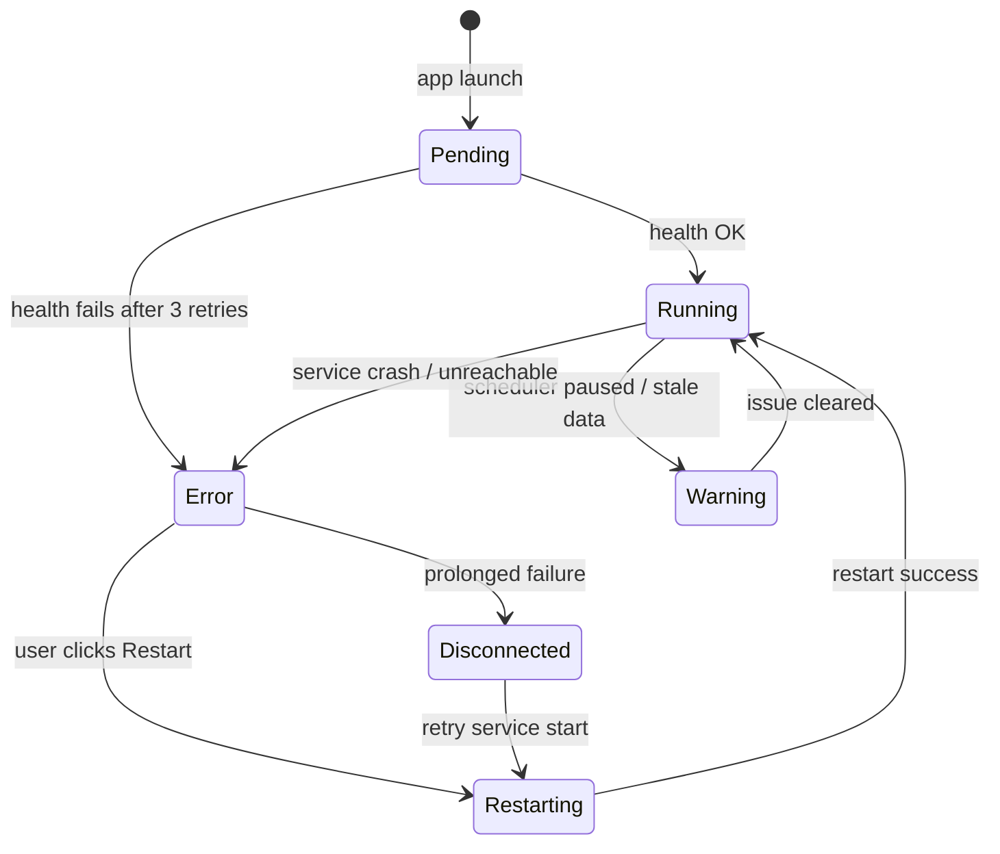

# Zorivest Feature Enhancement & Expansion — Composite Synthesis

> **Sources reviewed**: 4 documents totaling ~198K bytes from `_inspiration/features_enhancement_expansion/`
>
> | # | Source | Author Model | Focus | Size |
> |---|--------|-------------|-------|------|
> | 1 | [chatgpt-System Tray Service Health Integration.md](file:///p:/zorivest/_inspiration/features_enhancement_expansion/chatgpt-System%20Tray%20Service%20Health%20Integration.md) | ChatGPT | System tray, windows, sync, command palette, onboarding, settings | 784 lines |
> | 2 | [claude-Monetizing Zorivest without becoming a broker.md](file:///p:/zorivest/_inspiration/features_enhancement_expansion/claude-Monetizing%20Zorivest%20without%20becoming%20a%20broker.md) | Claude | Monetization tiers, BYOK security, licensing, referrals, metering | 500 lines |
> | 3 | [gemini-Electron-Python App Architecture Analysis.md](file:///p:/zorivest/_inspiration/features_enhancement_expansion/gemini-Electron-Python%20App%20Architecture%20Analysis.md) | Gemini | Architecture deep-dive: tray, settings, command palette, onboarding, IPC | 649 lines |
> | 4 | [openwhispr-research-prompts.md](file:///p:/zorivest/_inspiration/features_enhancement_expansion/openwhispr-research-prompts.md) | Manual | Deep research prompts targeting all three LLMs + pattern catalog | 948 lines |

---

## 1. System Tray & Service Health — Consensus Architecture

**Build plan mapping**: Phase 6a (GUI Shell) + Phase 10 (Service Daemon)

All three LLM outputs converge on a single architecture: a `ZorivestTrayManager` class in the Electron main process that **polls the Python backend's `/api/v1/health` endpoint** and updates both the tray icon and the renderer via IPC.

### Consensus Design

| Aspect | Agreement |
|--------|-----------|
| **Health polling** | 5-second interval, exponential backoff on failure |
| **Icon strategy** | Color-coded dot overlay (green/yellow/red) on base icon |
| **Status states** | `running` → `paused/warning` → `error` → `disconnected` |
| **Context menu** | Service status line, Open Zorivest, Recent Trades submenu, Quick Actions submenu, Start/Stop Service, Preferences, Quit |
| **Recent trades** | Async pre-fetch from REST API; non-blocking menu build |
| **Quit behavior** | Confirmation dialog: "Quit GUI only" vs "Quit & Stop Service" |
| **Platform icons** | `.ico` Windows, `Template.png` macOS, `.png` Linux; canvas fallback |

### Key State Machine (all sources agree)



### Divergences & Decisions Needed

| Topic | ChatGPT | Gemini | Decision |
|-------|---------|--------|----------|
| **Fallback icon** | Multiple icon files per state | Canvas-drawn overlay at runtime | **TBD** — runtime overlay is more maintainable; pre-drawn icons are sharper on HiDPI |
| **After 3 failures** | Keep polling silently | Break loop, show native error dialog with stderr | **Adopt Gemini** — silent polling is a black hole for users |
| **macOS menu bar** | Standard tray | Use `setIgnoreDoubleClickEvents(true)` | **Adopt** — macOS-specific quirk documented in Electron docs |

---

## 2. Window Management — Graceful Degradation

**Build plan mapping**: Phase 6a (GUI Shell)

### Consensus

| Aspect | Agreement |
|--------|-----------|
| **Close (X) button** | Hide to tray, NOT quit (both ChatGPT and Gemini cite OpenWhispr's pattern) |
| **Minimize** | Hide window + show "Zorivest still running" toast |
| **Crash recovery** | **Do NOT** destroy and rebuild window — retain shell, render disconnection overlay |
| **Window frames** | **Native OS frames** (not frameless like OpenWhispr) — professional finance tool UX |
| **Multi-window** | Main window + potential floating P&L widget |
| **Startup sequence** | Splash → health check → main window OR error screen |

> [!IMPORTANT]
> **Both Gemini and Claude converge on native window frames.** Frameless windows break OS tiling (Windows Snap Assist, macOS tiling). For a financial tool used alongside trading platforms, native frames are non-negotiable.

### Floating P&L Widget

ChatGPT proposes an always-on-top frameless widget (300×100px) showing active positions. Config follows OpenWhispr's overlay pattern:

```
alwaysOnTop: true, skipTaskbar: true, frame: false, transparent: true
Platform type: "panel" (macOS), "toolbar" (Linux), "popup-menu" (Windows)
```

**Decision needed**: Is the floating widget Phase 6a scope or deferred?

---

## 3. Settings Architecture — REST-Driven Optimistic Updates

**Build plan mapping**: Phase 6f (GUI Settings)

### Consensus: Bifurcated State Management

All sources agree on the same split:

| State Type | Managed By | Examples |
|-----------|-----------|----------|
| **Ephemeral (GUI-local)** | Zustand only | Sidebar toggle, active tab, sort order, column widths |
| **Persistent (DB-backed)** | REST API → Zustand cache | Currency, theme, risk limits, broker config, API keys |

### The `useSettings()` Hook Pattern

Both ChatGPT and Gemini converge on **React Query + Zustand** for persistent settings:

1. `useQuery` fetches `/api/v1/settings` on mount → populates Zustand
2. `useMutation` with `onMutate` for optimistic Zustand update
3. `onError` rolls back to `previousSettings` snapshot
4. `onSettled` invalidates query cache for re-sync
5. Toast notification on rollback to explain why the change reverted

### Backend Push Options

| Mechanism | ChatGPT | Gemini | Claude | Verdict |
|-----------|---------|--------|--------|---------|
| **SSE** | ✅ Recommended | Not discussed | ✅ Recommended | **Adopt** — FastAPI supports SSE natively; unidirectional is sufficient |
| **WebSocket** | Mentioned as option | Not discussed | Mentioned | Overkill for settings push |
| **Polling** | Fallback | Not discussed | Not discussed | Only as degraded mode |
| **Electron IPC relay** | Mentioned | Mentioned | Not discussed | Unnecessary complexity |

### Type-Safe Contract

ChatGPT proposes Pydantic ↔ Zod schema parity. **Generate JSON Schema from Pydantic; validate TS types against it.**

---

## 4. Command Palette — Hybrid Search Architecture

**Build plan mapping**: Build Item 16b

### Consensus: Component Registry Pattern

All sources agree: **NOT a monolithic search component.** Each entity domain registers its own `SearchProvider`:

```
CommandPaletteCore ──► LocalEntityProvider (Fuse.js, ~2-5ms)
                  ──► DeepRESTProvider (debounced, ~50-150ms)
                  ──► MCPToolProvider (slash-prefix "/" invocation)
```

### Search Ranking (ChatGPT proposal, adopted by Gemini)

| Factor | Boost |
|--------|-------|
| Exact ticker symbol match | +100 |
| Fuzzy label/keyword match (Fuse.js score) | Proportional |
| Recency (viewed in last hour) | +20 |
| Frequency (usage count) | +5 per use |
| Category prefix filter (`trades:`, `settings:`) | Exclusive filter |

### UI Anti-Flicker

Gemini warns: **staggered provider results cause layout shift.** Solution:
- Visual category separation (Recent Items vs Deep Search)
- Debounce master input (150ms)
- Delayed results append to bottom, never displace local results

---

## 5. Onboarding — 5-Step First-Launch Wizard

**Build plan mapping**: Phase 7 (Distribution)

### Consensus Steps

| Step | Content | Mandatory? | Validation |
|------|---------|-----------|-----------|
| 1. Welcome & Security | Create passphrase, explain encryption | ✅ Yes | Non-empty passphrase; recovery phrase verification (Gemini) |
| 2. Account Setup | Broker selection, account name/type, initial balance | ✅ Yes | At least one account created |
| 3. Display Preferences | Currency, theme, privacy mode, date format | ❌ No | Defaults are fine |
| 4. AI & Market Data | BYOK key setup, provider selection, test connection | ❌ No | Skip button visible |
| 5. Service Config | Auto-start toggle, MCP setup, tutorial links | ❌ No | Informational only |

### Critical Risk: Passphrase Loss

> [!CAUTION]
> **Gemini and Claude both flag this as catastrophic.** If the SQLCipher passphrase is lost, the entire database is unrecoverable. Mitigation: force user to re-type recovery phrase before proceeding past Step 1.

### Startup Dependency on Backend

All sources agree: **splash screen MUST mask backend startup.** Electron main process polls port 8765; React only mounts after health check passes.

```
ElectronSplash → DaemonCheck → (start if needed) → MountReact → CheckDB → Wizard or Dashboard
```

---

## 6. IPC Bridge Design — Strict Boundary Matrix

**Build plan mapping**: Phase 6a (GUI Shell)

### Consensus: Data Flow Boundaries

| Operation | Channel | Rationale |
|-----------|---------|-----------|
| Trade CRUD, analytics, portfolio | **REST** (renderer → localhost:8765) | Avoid IPC serialization bottleneck |
| Settings read/write | **REST** | Source of truth in SQLCipher |
| Window minimize/restore/hide | **IPC** (renderer → main) | OS-level operation |
| File dialogs (CSV import/export) | **IPC** | Electron API required |
| OS keychain access | **IPC** | System integration |
| Tray icon updates | **IPC** (main → renderer via events) | Main process owns tray |
| Service start/stop | **IPC → main → OS command** | WinSW/launchd/systemd |
| Native notifications | **IPC** | OS-level operation |

### Security: Typed Proxy, NOT Optional Chaining

All sources reject OpenWhispr's `window.electronAPI?.method?.()` pattern. **Strict typed proxy via `contextBridge.exposeInMainWorld()`** — missing methods throw descriptive errors caught by React Error Boundaries.

```ts
// ✅ Zorivest: strict typed proxy
contextBridge.exposeInMainWorld('electronAPI', electronBridge);

// ❌ OpenWhispr: optional chaining (silently swallows errors)
window.electronAPI?.someMethod?.();
```

---

## 7. Monetization — Three-Tier Freemium

**Build plan mapping**: Not yet in build plan (future phase)

### Claude's Tier Architecture (no other source covers this)

| Tier | Price | Key Limits |
|------|-------|-----------|
| **Free** | $0 | 1 account, 50 trades/mo, 10 AI reviews/mo, basic dashboards |
| **Pro** | $19/mo or $179/yr | Unlimited trades, 3 accounts, 100 AI reviews OR unlimited BYOK, PDF OCR, NBBO, TLH, cloud sync |
| **Team** | $39/user/mo | Pro + 10 seats, shared library, SSO, audit log |
| **Lifetime Pro** | $349 one-time | Desktop-only, no cloud/AI credits, BYOK only, 2yr major upgrades |

### Five Load-Bearing Decisions (Claude)

1. **License check in Python, not localStorage** — closes OpenWhispr's bypass vulnerability
2. **BYOK as permanent first-class feature** — unique in trade-journal category
3. **Never lock data behind lapsed subscription** — read-only degradation, never hostage
4. **Paddle + Keygen, not LemonSqueezy** — acquisition uncertainty
5. **Do not register as anything** — publisher's exclusion applies; no BD/RIA/FINRA needed

### Permanently Free (ethical baseline)

- Local trade storage & import
- Basic performance dashboards (win rate, P&L, drawdown)
- CSV import/export (GDPR Article 20 portability)
- Full data access & export regardless of subscription status

---

## 8. BYOK Key Security — Defense-in-Depth

**Build plan mapping**: Phase 8 (Market Data), future AI features

### Consensus: Keys NEVER in Renderer

| Layer | Protection |
|-------|-----------|
| **Storage** | SQLCipher DB + per-row AES-256-GCM wrapping (wrapping key in OS keychain) |
| **Transport** | REST API on `127.0.0.1` + ephemeral bearer token |
| **Access** | Renderer never sees keys; calls Python to "run AI review" |
| **Logging** | Regex filter redacts `sk-*`, `sk-ant-*`, `AIza*` patterns |
| **Validation** | Round-trip to provider API before persisting |
| **Lifecycle** | Invalid key → graceful degradation → banner → re-validate 24h later |

### Database Schema (Claude)

```sql
CREATE TABLE api_keys (
    id              INTEGER PRIMARY KEY AUTOINCREMENT,
    provider        TEXT NOT NULL CHECK (provider IN ('openai','anthropic','google','groq')),
    label           TEXT NOT NULL,
    ciphertext      BLOB NOT NULL,     -- AES-256-GCM of raw key
    nonce           BLOB NOT NULL,     -- 12-byte GCM nonce
    key_fingerprint TEXT NOT NULL,     -- SHA-256 prefix (display only)
    status          TEXT NOT NULL DEFAULT 'active',
    UNIQUE(provider, label)
);

CREATE TABLE api_usage (
    key_id          INTEGER REFERENCES api_keys(id) ON DELETE CASCADE,
    model           TEXT NOT NULL,
    prompt_tokens   INTEGER NOT NULL,
    completion_tokens INTEGER NOT NULL,
    estimated_cost_usd NUMERIC(10,6) NOT NULL
);
```

---

## 9. Licensing & Subscription Enforcement

**Build plan mapping**: Future phase

### Ed25519 JWT License Tokens (Claude)

- **Offline grace**: 14-day soft (full Pro), 30-day hard (cloud paused), then Free
- **Anti-rollback**: Persist monotonic `last_seen_ts` in 3 places (DB, keychain, HMAC'd file)
- **Device binding**: Hash of machine-id + disk serial + CPU family; 2 active bindings per seat
- **Enforcement**: Server gates AI credits + cloud sync; client verifies JWT locally for offline features

### Build vs Buy Verdict

| Scale | Recommended Stack |
|-------|------------------|
| **0–1K users** | Paddle (MoR, 5% + $0.50) + Keygen Std 1 ($49/mo) |
| **1K–10K users** | Same, reassess at ~$30K MRR |
| **10K+** | Stripe direct + Keygen + self-managed VAT |

### Tamper Resistance (worth doing)

1. Code-sign + notarize (Apple Dev ID + SSL.com eSigner)
2. ASAR integrity + hardened Electron fuses
3. License check in Python (not renderer)
4. Server-side gate for cloud sync + managed AI

### Tamper Resistance (NOT worth doing for solo dev)

- PyArmor, anti-debug tricks, custom packers, string encryption, JS obfuscation beyond minification

---

## 10. Data Sync (Future) & Growth Mechanics (Future)

**Build plan mapping**: Not yet planned (P4+)

### Sync Architecture Summary (ChatGPT)

- **Strategy**: Server-authoritative merge with conflict detection
- **Consistency**: Version column + `sync_status` + `cloud_id` + `deleted_at` soft delete
- **Offline**: Full local operation; delta sync on reconnect
- **Volume**: Incremental sync (50-100 items per batch), not full re-sync

### Growth Mechanics (Claude)

> [!TIP]
> **Skip peer referrals at launch.** Retail traders are privacy-conscious and skeptical of viral mechanics. Better alternatives:
> - Affiliate program for finance content creators (25% recurring via Paddle)
> - Shareable "trade replay" links (anonymized AI review, 3 free views/month)
> - Strategy template marketplace (community-driven)

### Usage Metering UX (Claude + ChatGPT)

- **Two parallel meters**: Trades imported (50/mo free) + AI reviews (10/mo free)
- **Calendar month** reset (not weekly — swing traders are bursty)
- **Approach-to-limit**: 60% subtle footer → 80% amber banner → 100% modal with 3 paths (Upgrade / BYOK / Wait)
- **Pro users**: ALL meter UI disappears. Zero cap anxiety for paying customers.

---

## Cross-Cutting Decision Matrix

| Decision | Sources Agreeing | Status | Build Plan Phase |
|----------|-----------------|--------|-----------------|
| Native window frames (not frameless) | Gemini, ChatGPT, Claude (implied) | **ADOPT** | Phase 6a |
| REST for data, IPC for OS ops only | Gemini, ChatGPT | **ADOPT** | Phase 6a |
| Zustand ephemeral + REST persistent | Gemini, ChatGPT | **ADOPT** | Phase 6f |
| React Query + Zustand for settings | Gemini, ChatGPT | **ADOPT** | Phase 6f |
| SSE for backend → GUI push | ChatGPT, Claude | **ADOPT** | Phase 6f |
| Component Registry for command palette | Gemini, ChatGPT | **ADOPT** | Item 16b |
| Fuse.js for local search index | Gemini, ChatGPT | **ADOPT** | Item 16b |
| Splash screen masking backend startup | Gemini, ChatGPT | **ADOPT** | Phase 6a |
| BYOK keys in Python, never renderer | Claude, Gemini, ChatGPT | **ADOPT** | Phase 8 |
| Typed IPC proxy (no optional chaining) | Gemini, ChatGPT | **ADOPT** | Phase 6a |
| Passphrase recovery verification step | Gemini | **ADOPT** | Phase 7 |
| Paddle + Keygen for licensing | Claude | **EVALUATE** | Future |
| Three-tier freemium model | Claude | **EVALUATE** | Future |
| Ed25519 JWT license tokens | Claude | **EVALUATE** | Future |
| Floating P&L widget | ChatGPT | **DEFER** — not Phase 6a | Future |
| Cloud sync architecture | ChatGPT | **DEFER** | P4+ |
| Referral/growth mechanics | Claude | **DEFER** | P4+ |

---

## Open Questions for Planning

1. **Floating widget scope**: Is the always-on-top P&L monitor in Phase 6a or deferred?
2. **Tray icon rendering**: Pre-drawn icon files per state, or canvas-drawn overlays at runtime?
3. **Monetization timing**: When should tier/licensing architecture enter the build plan? After Phase 7 (Distribution)?
4. **SSE vs WebSocket**: SSE is simpler, but does Zorivest need bidirectional push for any future feature?
5. **BYOK provider list**: OpenAI + Anthropic + Google + Groq — is this the right initial set?
6. **Lifetime SKU**: Is the $349 desktop-only lifetime plan something to commit to at launch, or evaluate post-launch?
