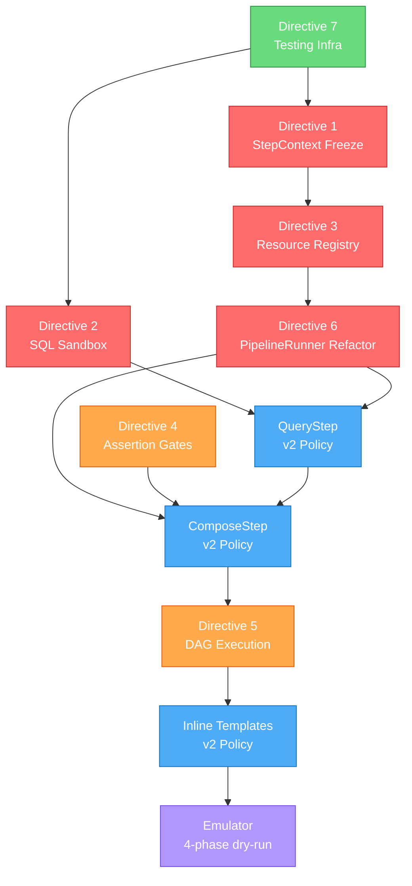

# Pipeline Architecture Synthesis
## Cross-Source Integration of DI Patterns, Adversarial Review, and Framework Survey

> **Purpose:** Distill findings from three independent research sessions into a unified, prioritized set of architectural improvements for the Zorivest policy pipeline engine. Each directive is sourced to the originating document(s) and evaluated for its impact on the v2 policy language defined in [retail-trader-policy-use-cases.md](file:///C:/Users/Mat/.gemini/antigravity/brain/d4a18e56-41f0-457d-af31-4a492273441e/retail-trader-policy-use-cases.md).

### Source Documents

| ID | Document | Model | Primary Focus |
|----|----------|-------|---------------|
| **S1** | [Service Layer Wiring – DI Patterns](file:///p:/zorivest/_inspiration/policy_pipeline_wiring-research/chatgpt-Service%20Layer%20Wiring%20%E2%80%93%20Dependency%20Injection%20Patterns.md) | ChatGPT | Scoped containers, step factories, saga compensation, testing patterns |
| **S2** | [Adversarial Review of Pipeline Engine](file:///p:/zorivest/_inspiration/policy_pipeline_wiring-research/claude-Adversarial%20review%20of%20the%20Zorivest%20pipeline%20engine.md) | Claude | Security hardening, data integrity, anti-patterns for desktop apps |
| **S3** | [AI Agentic Frameworks Survey](file:///p:/zorivest/_inspiration/policy_pipeline_wiring-research/gemini-AI%20Agentic%20Frameworks%20Survey.md) | Gemini | Framework comparison, I/O managers, DAG execution, gap analysis |

---

## Agreement Matrix

Before prescribing changes, it's valuable to see where the three independent analyses converge — convergent findings carry the highest confidence.

| Theme | S1 (ChatGPT) | S2 (Claude) | S3 (Gemini) | Agreement |
|-------|:---:|:---:|:---:|-----------|
| **No DI container** — use typed dataclasses | ✅ "Start with Scoped Resource Containers" | ✅ ADR-007: "Do not adopt a DI container" | ✅ "Dagster-style resources adapted to context managers" | **3/3 — Universal** |
| **StepContext immutability** | ✅ Per-run step factory for isolation | ✅ ADR-001: deep-copy boundary, `frozen=True` | ✅ Implicit via I/O Manager pattern (cache = snapshot) | **3/3 — Universal** |
| **SQL sandbox hardening** | ⬜ Not addressed | ✅ ADR-002: dual-connection, sqlglot pre-parser | ⬜ Not addressed (but references authorizer) | **1/3 — Single source** (but high confidence: primary-doc-sourced) |
| **Context-manager resource lifecycle** | ✅ `PipelineResources` with `__aenter__/__aexit__` | ✅ ADR-007: `compose(stack: AsyncExitStack)` | ✅ Dagster `yield_for_execution` adapted | **3/3 — Universal** |
| **Data validation / assertion gates** | ✅ Pydantic contracts at every boundary | ✅ ADR-009: strict evaluator, canonical serialization | ✅ "V1-Critical" Validation/Assertion step | **3/3 — Universal** |
| **No saga compensation** | ✅ "Use only when necessary" | ✅ ADR-013: "No saga. No full outbox." | ⬜ Not discussed | **2/3 — Strong** |
| **DAG-based concurrent execution** | ⬜ Sequential model assumed | ✅ Implicit via DAG in `depends_on` | ✅ Explicit: `asyncio.TaskGroup` fan-out | **2/3 — Strong** |
| **I/O Manager / idempotent caching** | ⬜ Not addressed | ⬜ Idempotency key on Send only | ✅ Primary recommendation: I/O Manager pattern | **1/3 — Single source** |
| **VCR cassette testing** | ✅ Full code examples with `respx` | ✅ Ranked #5 but endorsed with header scrubbing | ✅ Primary testing recommendation | **3/3 — Universal** |
| **Ban `asyncio.wait_for`** | ⬜ Not addressed | ✅ ADR-005: use `asyncio.timeout()` | ⬜ References cooperative cancellation generically | **1/3 — Single source** (CPython issue tracker-sourced) |
| **Schema drift detection** | ✅ `schema_hash()` CI job | ✅ Ranked #2 testing priority | ✅ Mentioned via `frouros` | **3/3 — Universal** |
| **Anti-cloud-native patterns** | ✅ "Avoid Kubernetes, message queues" | ✅ §7: 10 specific anti-patterns listed | ✅ "Anti-patterns for single-process desktop" | **3/3 — Universal** |

---

## Design Directives

### Directive 1: Freeze the StepContext Boundary

**Sources:** S1 (step factory isolation), S2 (ADR-001), S3 (I/O Manager snapshot)
**Confidence:** Universal (3/3)

The single most impactful safety improvement. All three sources agree that mutable shared state between pipeline steps is the #1 silent corruption risk.

#### What Changes

```python
# Before: mutable dict with aliased references
class StepContext:
    def __init__(self):
        self._data: dict[str, Any] = {}

    def put(self, step_id: str, value: Any) -> None:
        self._data[step_id] = value  # ← aliased reference

    def get(self, step_id: str) -> Any:
        return self._data[step_id]  # ← same aliased object

# After: deep-copy boundary prevents cross-step mutation
import copy

class StepContext:
    def __init__(self):
        self._data: dict[str, Any] = {}

    def put(self, step_id: str, value: Any) -> None:
        self._data[step_id] = copy.deepcopy(value)

    def get(self, step_id: str) -> Any:
        return copy.deepcopy(self._data[step_id])
```

#### Additional Hardening (from S2 ADR-001)

- All `PolicyDocument` step schemas: `model_config = ConfigDict(frozen=True)` with tuple-typed collections
- Global startup: `pd.options.mode.copy_on_write = True`
- CI assertion: hash each `ctx[step_id]` post-execution, verify no divergence at run end

#### Cost

~5–20 ms per step for deep copies. At ~10 steps/run, this adds 50–200 ms per pipeline run — negligible for a desktop app running 50 API calls/run.

#### Policy Language Impact

The `compose` step's `merge` strategy becomes the *only* sanctioned mechanism for combining data from prior steps. AI agents cannot mutate upstream results — they must explicitly declare what they consume.

---

### Directive 2: Dual-Connection SQL Sandbox

**Sources:** S2 (ADR-002), S2 (ADR-004 raw-key pattern)
**Confidence:** Single-source, but grounded in SQLite primary docs and OWASP guidance

This is the critical-path enabler for the `query` step type proposed in the v2 policy language. Without a sandboxed connection, AI-authored SQL queries run on the trusted app connection — an unacceptable risk.

#### Architecture

```
┌─────────────────────────────────────────────────────┐
│                   SQLCipher DB                       │
│                                                     │
│  ┌──────────────────┐    ┌────────────────────────┐ │
│  │  App Connection   │    │  Sandbox Connection     │ │
│  │  (trusted)        │    │  (policy queries)       │ │
│  │                   │    │                         │ │
│  │  Full authorizer  │    │  query_only=ON          │ │
│  │  Read + Write     │    │  trusted_schema=OFF     │ │
│  │  Used by repos,   │    │  VDBE op limit          │ │
│  │  UoW, store step  │    │  SQL length limit       │ │
│  │                   │    │  sqlglot pre-parser      │ │
│  └──────────────────┘    └────────────────────────┘ │
└─────────────────────────────────────────────────────┘
```

#### Pre-Parser Rules (sqlglot)

| Rule | Rejects |
|------|---------|
| Non-SELECT | `INSERT`, `UPDATE`, `DELETE`, `CREATE`, `DROP`, `ALTER` |
| ATTACH/DETACH | Prevents mounting external databases |
| PRAGMA (except whitelist) | Only `PRAGMA table_info()` and `PRAGMA table_list()` allowed |
| Virtual tables | `CREATE VIRTUAL TABLE`, `CREATE TRIGGER` |
| Load extension | Already blocked by compile-time `SQLITE_OMIT_LOAD_EXTENSION` |

#### `sqlite3_limit` Caps

| Limit | Value | Rationale |
|-------|-------|-----------|
| `SQLITE_LIMIT_VDBE_OP` | 50,000 | Bounds recursive CTE CPU cost |
| `SQLITE_LIMIT_SQL_LENGTH` | 10,000 | Prevents SQL injection via massive queries |
| `SQLITE_LIMIT_COMPOUND_SELECT` | 3 | Limits `UNION` abuse |

#### Integration with QueryStep

The `query` step type proposed in the use-cases doc routes *exclusively* through the sandbox connection. The `Infra` dataclass (Directive 6) holds both connections:

```python
@dataclass(frozen=True, slots=True, kw_only=True)
class Infra:
    app_conn: AsyncConnection       # trusted — repos, UoW, store
    sandbox_conn: AsyncConnection   # read-only — QueryStep only
    http_client: httpx.AsyncClient
    rate_limiter: PipelineRateLimiter
    mailer: Mailer
    pdf_renderer: PDFRenderer
    clock: Clock
    config: AppConfig
```

---

### Directive 3: Context-Manager Resource Registry

**Sources:** S1 (PipelineResources pattern), S2 (ADR-007), S3 (Dagster yield_for_execution)
**Confidence:** Universal (3/3)

Replace the current 8-kwarg `PipelineRunner.__init__` with a context-manager-based `Infra` container that guarantees resource cleanup regardless of failure mode.

#### Implementation

```python
from contextlib import asynccontextmanager, AsyncExitStack

@asynccontextmanager
async def compose_infra(config: AppConfig) -> AsyncIterator[Infra]:
    """App-lifetime resource composition root. Called once at boot."""
    async with AsyncExitStack() as stack:
        http_client = await stack.enter_async_context(httpx.AsyncClient())
        app_conn = await stack.enter_async_context(open_app_connection(config.db_path))
        sandbox_conn = await stack.enter_async_context(open_sandbox_connection(config.db_path))
        rate_limiter = PipelineRateLimiter(limit=100, period=60)
        mailer = await stack.enter_async_context(Mailer(config.smtp))
        pdf_renderer = PDFRenderer()
        clock = SystemClock()

        yield Infra(
            app_conn=app_conn,
            sandbox_conn=sandbox_conn,
            http_client=http_client,
            rate_limiter=rate_limiter,
            mailer=mailer,
            pdf_renderer=pdf_renderer,
            clock=clock,
            config=config,
        )
```

#### Per-Run Context

```python
@dataclass(frozen=True, slots=True, kw_only=True)
class RunContext:
    """Per-run dependencies. Created fresh for each pipeline execution."""
    session: AsyncSession
    repos: RepositoryBundle
    run_id: UUID
    policy: PolicyDocument
    step_context: StepContext
```

#### PipelineRunner Becomes Trivial

```python
class PipelineRunner:
    def __init__(self, *, infra: Infra):
        self.infra = infra

    async def execute(self, policy: PolicyDocument) -> RunResult:
        run_id = uuid4()
        async with self.infra.app_conn.begin() as session:
            ctx = RunContext(
                session=session,
                repos=RepositoryBundle(session),
                run_id=run_id,
                policy=policy,
                step_context=StepContext(),
            )
            return await self._run_steps(ctx)
```

**Why not a DI container?** All three sources agree: at 8 dependencies and one scope boundary (app vs. run), dishka/dependency-injector/that-depends add indirection without benefit. The `Infra`/`RunContext` split makes scope visible in the type system with zero new dependencies.

---

### Directive 4: Data Validation Assertions (Pre-Send Gates)

**Sources:** S1 (Pydantic contracts), S2 (ADR-009, §5 gap analysis), S3 (V1-Critical Validation step)
**Confidence:** Universal (3/3)

> [!CAUTION]
> S2 calls this "the single most under-weighted gap in the current design" and S3 rates it "V1-Critical". Both identify the same failure mode: silently rendering a report with corrupt data (stock split, schema drift, zero-balance portfolio) that gets emailed to the user before anyone checks the numbers.

#### Design

Rather than a new step type, implement as a **Transform sub-kind** with halt-on-fail semantics (per S2 §5 verdict):

```json
{
  "id": "pre_send_assertions",
  "type": "transform",
  "params": {
    "kind": "assertion",
    "assertions": [
      {
        "name": "portfolio_value_positive",
        "expression": "ctx.compose_report.total_portfolio_value > 0",
        "severity": "fatal",
        "message": "Total portfolio value is zero or negative — likely data error"
      },
      {
        "name": "daily_return_sanity",
        "expression": "abs(ctx.compose_report.daily_return_pct) < 25",
        "severity": "fatal",
        "message": "Daily return exceeds ±25% — likely stock split or data corruption"
      },
      {
        "name": "data_freshness",
        "expression": "(now() - ctx.transform_quotes.max_timestamp).hours < 24",
        "severity": "warning",
        "message": "Quote data is older than 24 hours"
      }
    ],
    "on_fatal": "halt_pipeline"
  }
}
```

#### Severity Levels

| Severity | Behavior | GUI Surfacing |
|----------|----------|---------------|
| `fatal` | Halt pipeline, emit `assertion_failed` event, skip Send | Error toast + "Failed Reports" inbox |
| `warning` | Log warning, continue pipeline, append warning to report | Warning badge on report |
| `info` | Log only | Audit log entry |

#### Integration with Policy Language

Assertions are expressed in the policy JSON as a step — fully agent-authorable. The AI agent can add pre-Send assertions to any policy without touching Python code. The expression language is a restricted subset evaluated by the existing `ConditionEvaluator` (extended with `abs()`, `now()`, and arithmetic operators).

---

### Directive 5: DAG-Based Concurrent Execution

**Sources:** S2 (implicit via `depends_on`), S3 (primary architectural recommendation)
**Confidence:** Strong (2/3)

The v2 policy language introduces `query` and `fetch` steps that are often independent of each other within a single policy. The Morning Check-In policy has 4 independent `query` steps and 2 independent `fetch` steps that currently run sequentially.

#### Proposed Execution Model

Add an optional `depends_on` field to the step schema:

```json
{
  "id": "get_accounts",
  "type": "query",
  "depends_on": []
},
{
  "id": "get_draft_plans",
  "type": "query",
  "depends_on": []
},
{
  "id": "fetch_watchlist_quotes",
  "type": "fetch",
  "depends_on": ["get_watchlist_tickers"]
},
{
  "id": "compose_report",
  "type": "compose",
  "depends_on": [
    "transform_quotes",
    "get_accounts",
    "get_draft_plans",
    "get_active_plans",
    "get_recent_trades",
    "fetch_economy_news"
  ]
}
```

#### Execution Engine

```python
async def _run_steps(self, ctx: RunContext) -> RunResult:
    dag = build_dag(ctx.policy.steps)  # Topological sort
    completed: set[str] = set()

    for level in dag.levels():  # Each level = set of independent steps
        async with asyncio.TaskGroup() as tg:
            for step_def in level:
                if self._should_skip(step_def, ctx.step_context):
                    completed.add(step_def.id)
                    continue
                tg.create_task(
                    self._execute_step(step_def, ctx)
                )
        completed.update(s.id for s in level)

    return RunResult(outputs=ctx.step_context._data)
```

#### Backward Compatibility

If `depends_on` is absent, the engine infers sequential ordering (step N depends on step N-1). This preserves v1 policy behavior without modification.

#### Performance Impact (Morning Check-In)

| Execution Model | Steps | Wall Clock (estimated) |
|-----------------|-------|------------------------|
| Sequential (current) | 10 steps × ~2s avg | ~20s |
| DAG concurrent | 3 levels (4 parallel queries, 2 parallel fetches, compose+send) | ~8s |

---

### Directive 6: Idempotent I/O Cache (Step Output Memoization)

**Sources:** S3 (primary recommendation: Dagster I/O Manager pattern)
**Confidence:** Single-source, but the rationale is compelling for a rate-limited API consumer

When a pipeline fails at the `render` step, the current engine must re-execute all `fetch` steps on retry — burning API quota and rate-limiter budget. An I/O cache intercepts step outputs and stores them by a deterministic input hash.

#### Design

```python
class StepIOCache:
    """Caches step outputs by input hash. Survives within a single run."""

    def __init__(self, session: AsyncSession):
        self._session = session

    def _compute_key(self, step_id: str, params: dict, deps: dict) -> str:
        payload = json.dumps(
            {"step_id": step_id, "params": params, "deps": deps},
            sort_keys=True, separators=(",", ":"), default=str
        )
        return hashlib.sha256(payload.encode()).hexdigest()

    async def get(self, key: str) -> dict | None:
        row = await self._session.execute(
            select(step_cache).where(step_cache.c.cache_key == key)
        )
        if row:
            return json.loads(row.data)
        return None

    async def put(self, key: str, value: dict) -> None:
        await self._session.execute(
            insert(step_cache).values(cache_key=key, data=json.dumps(value))
            .on_conflict(step_cache.c.cache_key).do_nothing()
        )
```

#### Cache Policy (per step)

```json
{
  "id": "fetch_watchlist_quotes",
  "type": "fetch",
  "cache": {
    "enabled": true,
    "ttl_seconds": 300,
    "scope": "run"
  }
}
```

| Scope | Behavior |
|-------|----------|
| `run` | Cache valid only within the current run (retry-safe) |
| `session` | Cache persists across runs within the app session |
| `none` | No caching (default for `send`, `store_report`) |

> [!IMPORTANT]
> Steps with side effects (`send`, `store_report`) are **never cached**. The cache only applies to pure data-fetching and transformation steps.

---

### Directive 7: Testing Infrastructure

**Sources:** All three (universal agreement on priorities)
**Confidence:** Universal (3/3)

All three sources converge on the same priority ordering:

#### Tier 1: Do First (1–2 days)

| Strategy | Source Agreement | Description |
|----------|:---:|-------------|
| **Pydantic contracts at stage boundaries** | S1 + S2 + S3 | `extra="forbid"`, `strict=True`, `AwareDatetime`, `condecimal`. Schemas *are* the tests. |
| **VCR cassette testing** | S1 + S2 + S3 | `pytest-recording` with header scrubbing for API keys. `record_mode="none"` in CI. |

#### Tier 2: Do Early (1 week)

| Strategy | Source Agreement | Description |
|----------|:---:|-------------|
| **Schema drift CI** | S1 + S2 + S3 | Weekly GitHub Actions cron hashing API response shapes for 3 canonical tickers. |
| **Golden file / snapshot tests** | S1 + S2 | `syrupy` for rendered reports. Inject fixed clock to eliminate timestamp nondeterminism. |

#### Tier 3: Do Selectively

| Strategy | Source Agreement | Description |
|----------|:---:|-------------|
| **Hypothesis property-based** | S1 + S2 | Surgical application: Decimal round-trips, OHLCV invariants, ledger state machine. |
| **Shadow pipeline runs** | S1 | `begin_nested()` savepoint for dry-run validation. |

#### Anti-Recommendations (skip these)

| Strategy | Why Skip | Source |
|----------|----------|-------|
| Shadow pipeline against *live* data | Markets move; tolerance windows are impossible to calibrate | S2 |
| Full contract testing (Pact) | Overkill for single-user desktop; Pydantic contracts achieve the same goal | S2 |
| Great Expectations | Heavy dependency; Pandera + Pydantic contracts cover the same surface | S3 |

---

## Anti-Patterns Summary (Desktop Context)

All three sources independently flag the same family of anti-patterns. This table consolidates them:

| Anti-Pattern | S1 | S2 | S3 | Desktop-Appropriate Alternative |
|-------------|:---:|:---:|:---:|--------------------------------|
| DI container | ✅ | ✅ | ✅ | Frozen `Infra`/`RunContext` dataclasses |
| Saga compensation | ✅ | ✅ | — | Idempotent Send + two-phase audit |
| OpenTelemetry | — | ✅ | ✅ | `structlog` + `contextvars` + `pipeline_run_events` table |
| Circuit breakers | — | ✅ | ✅ | Provider health log surfaced as GUI banner |
| Message queues / DLQ | ✅ | ✅ | ✅ | `failed_records` table + Electron "Errors" inbox |
| Kubernetes / Docker | ✅ | ✅ | ✅ | PyInstaller/Electron native bundle |
| Cloud config (Vault, Consul) | — | ✅ | — | Pydantic Settings + SQLCipher encrypted row |
| Automated remediation | — | ✅ | — | Visible, overridable, logged prompts |

---

## Implementation Roadmap

Integrating these directives with the v2 policy language phases from the use-cases doc:



### Phase 1: Foundation Hardening (Red nodes — do first)

| Directive | Effort | Dependency |
|-----------|--------|------------|
| D1: StepContext freeze | 4 hours | None |
| D3: Resource registry (`Infra`/`RunContext`) | 8 hours | None |
| D6: PipelineRunner refactor (uses D3) | 4 hours | D3 |
| D2: SQL sandbox (dual connection) | 12 hours | D3 (for `Infra` wiring) |
| D7: Testing infra (Pydantic contracts + VCR) | 8 hours | D1 (for frozen models) |

### Phase 2: Policy Language Extensions (Blue nodes)

| Feature | Effort | Dependency |
|---------|--------|------------|
| QueryStep | 12 hours | D2 (sandbox conn), D6 (runner refactor) |
| ComposeStep | 8 hours | D6 (runner refactor) |
| Inline templates + Markdown body | 8 hours | None |
| Variable injection | 4 hours | None |
| D4: Assertion gates | 8 hours | ComposeStep (assertions run post-compose) |

### Phase 3: Performance & Resilience (Orange nodes)

| Feature | Effort | Dependency |
|---------|--------|------------|
| D5: DAG concurrent execution | 16 hours | QueryStep + ComposeStep (to test with real policies) |
| I/O cache (Directive 6) | 12 hours | D6 (runner refactor), D1 (frozen outputs) |

### Phase 4: Emulator & Agent Tooling (Purple nodes)

| Feature | Effort | Dependency |
|---------|--------|------------|
| Emulator (4-phase) | 20 hours | All step types implemented |
| MCP discovery tools | 8 hours | Emulator |

---

## Key Design Decisions Requiring Human Input

> [!IMPORTANT]
> The following decisions have trade-offs that require product-level judgment, not purely technical resolution.

1. **Assertion expression language scope.** The `expression` field in assertion steps (Directive 4) needs a defined evaluation grammar. Options:
   - *Minimal:* Extend `ConditionEvaluator` with `abs()`, `now()`, and arithmetic — ~20 new lines of code, easy to audit
   - *Full:* Adopt a restricted Python expression evaluator (`ast.literal_eval` + `compile()` with whitelisted builtins) — more powerful, but harder to sandbox against LLM-authored exploits
   - **Recommendation:** Start minimal. The AI agent can always decompose complex assertions into multiple simple ones.

2. **I/O cache storage location.** Options:
   - *Same SQLCipher DB:* Simple, encrypted at rest, but adds write pressure to the main DB during fetches
   - *Separate ephemeral SQLite:* Unencrypted (cache data is public market data), faster, auto-deleted on app close
   - **Recommendation:** Separate ephemeral DB. Market quotes are not sensitive; cache writes should not contend with audit writes.

3. **DAG `depends_on` — explicit or inferred?**
   - *Explicit only:* Agent must declare `depends_on` for every step. Clear, auditable, no magic.
   - *Inferred from refs:* Engine scans `{ "ref": "ctx.step_id.field" }` patterns to build the DAG automatically. Less boilerplate, but hides execution order.
   - **Recommendation:** Inferred-by-default with explicit override. The engine builds the DAG from ref analysis; if `depends_on` is present, it overrides inference. This gives agents the convenience of auto-wiring while allowing explicit control for edge cases.

---

## Relationship to Existing Codebase

Cross-referencing each directive against current implementation status:

| Directive | Existing File(s) Affected | Current State | Migration Path |
|-----------|--------------------------|---------------|----------------|
| D1: StepContext | `pipeline_runner.py` | Mutable dict, no copy | Add `copy.deepcopy` to `put`/`get` |
| D2: SQL sandbox | `infrastructure/database/` | Single connection | Add `open_sandbox_connection()` |
| D3: Resource registry | `pipeline_runner.py` | 8 kwargs in `__init__` | Replace with `compose_infra()` + `Infra` dataclass |
| D4: Assertions | `transform_step.py` | No `kind` discriminator | Add `kind="assertion"` branch |
| D5: DAG execution | `pipeline_runner.py` | Sequential `for` loop | Replace with `build_dag()` + `TaskGroup` |
| D6: I/O cache | Not implemented | — | New module: `step_io_cache.py` |
| D7: Testing | `tests/` | Basic unit tests | Add VCR cassettes, Pydantic boundary contracts |

---

## Conclusion

The three research sources, despite being generated independently by different models with different analytical frames, converge strongly on the same five priorities:

1. **Freeze the StepContext** — deep-copy boundary eliminates silent corruption
2. **Harden SQL for LLM-authored queries** — dual-connection sandbox
3. **Context-manager resource lifecycle** — `Infra`/`RunContext` frozen dataclasses
4. **Pre-Send assertion gates** — the most under-weighted gap for a financial app
5. **Pydantic contracts + VCR testing** — highest-ROI testing investment

The areas of *disagreement* (I/O caching, DAG execution) represent lower-priority optimizations that become valuable only after the safety foundation is in place. The anti-pattern consensus is unambiguous: avoid DI containers, sagas, OTel, circuit breakers, and message queues in this single-process desktop context.

The v2 policy language (QueryStep, ComposeStep, inline templates, variables) is architecturally sound and well-integrated with these hardening directives. The `query` step requires the SQL sandbox; the `compose` step enables assertions; the inline templates enable agent-authored reports. The dependency chain is clean and the build order is natural.
