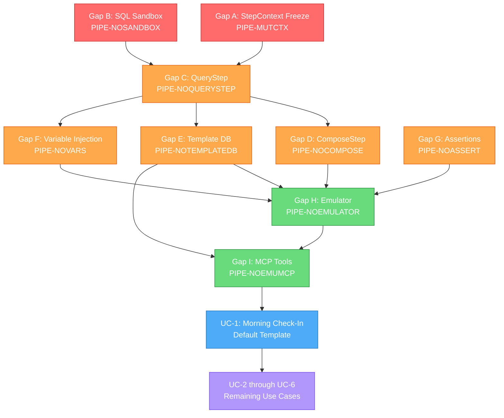

# Retail Trader Policy Use Cases & AI-Agent Policy Language Design

> **Purpose:** Define representative use cases for the Zorivest pipeline policy system based on common retail trading workflows, propose the AI-agent-first policy language extensions needed to support them, and specify the emulator architecture for pre-flight validation.

---

## Table of Contents

- [Use Cases](#use-cases)
  - [UC-1: Morning Check-In](#uc-1-morning-check-in)
  - [UC-2: End-of-Day Review](#uc-2-end-of-day-review)
  - [UC-3: Weekly Performance Report](#uc-3-weekly-performance-report)
  - [UC-4: Watchlist Screener](#uc-4-watchlist-screener)
  - [UC-5: Trade Plan Lifecycle Monitor](#uc-5-trade-plan-lifecycle-monitor)
  - [UC-6: News & Hot Stocks Alert](#uc-6-news--hot-stocks-alert)
- [Current Capability Matrix](#current-capability-matrix)
- [Implementation Gap Registry (9 Gaps)](#implementation-gap-registry-9-gaps)
  - [Tier 1: Essential Safety](#tier-1-essential-safety)
  - [Tier 2: New Step Types](#tier-2-new-step-types)
  - [Tier 3: Policy Language Extensions](#tier-3-policy-language-extensions)
  - [Tier 4: Emulator & Agent Tooling](#tier-4-emulator--agent-tooling)
- [Proposed Policy Language Extensions](#proposed-policy-language-extensions)
  - [New Step Type: `query`](#new-step-type-query)
  - [New Step Type: `compose`](#new-step-type-compose)
  - [Inline Template Support](#inline-template-support)
  - [Variable Injection](#variable-injection)
- [Gap Analysis: Hardcoded → Dynamic Migration](#gap-analysis-hardcoded--dynamic-migration)
- [Default Template: Morning Check-In (Full Example)](#default-template-morning-check-in-full-example)
- [Execution Trace: Morning Check-In (Pseudocode)](#execution-trace-morning-check-in-pseudocode)
- [Policy Emulator Architecture](#policy-emulator-architecture)
- [MCP Tool Additions](#mcp-tool-additions)
- [Implementation Priority](#implementation-priority)

---

## Use Cases

### UC-1: Morning Check-In

**Frequency:** `0 9 * * 1-5` (9:00 AM ET, weekdays)
**Audience:** Retail day/swing trader starting their session

**Data Sections:**

| # | Section | Data Source | Step Type Needed |
|---|---------|-------------|-----------------|
| 1 | Watchlist Tickers & Stats | Internal DB → watchlist tickers, External API → live quotes | `query` + `fetch` |
| 2 | Account Balances & Stats | Internal DB → accounts, balance_snapshots | `query` |
| 3 | Draft Trade Plans | Internal DB → trade_plans WHERE status = 'draft' | `query` |
| 4 | Active Trade Plans + Position Estimate | Internal DB → trade_plans WHERE status = 'active', External API → current price for position math | `query` + `fetch` |
| 5 | Recent Trades (7 days) | Internal DB → trades WHERE time >= now - 7d | `query` |
| 6 | Top Economy News | External API → news provider (macro/economy) | `fetch` |
| 7 | Hot Stocks / Movers | External API → screener / trending endpoint | `fetch` |

**Agent Workflow:**
1. Agent reads watchlist tickers from DB
2. Agent fetches live quotes for those tickers (dynamic — no hardcoded ticker list)
3. Agent queries accounts, plans, and recent trades from DB
4. Agent fetches economy news and hot stocks from external APIs
5. All sections composed into a single Markdown report
6. Report delivered via email

> [!IMPORTANT]
> This use case **cannot be built today** because there is no `query` step type to read internal DB tables. The `store_report.data_queries` mechanism is snapshot-only — results don't flow into the transform/send pipeline as template variables. This is the [PIPE-NOLOCALQUERY] gap.

---

### UC-2: End-of-Day Review

**Frequency:** `0 16 30 * * 1-5` (4:30 PM ET, after market close)

**Data Sections:**

| # | Section | Data Source | Step Type |
|---|---------|-------------|-----------|
| 1 | Today's Executed Trades | Internal DB → trades WHERE date(time) = today | `query` |
| 2 | P&L Summary (daily) | Internal DB → SUM(realized_pnl) by account | `query` |
| 3 | Active Plan Status | Internal DB → trade_plans WHERE status = 'active' | `query` |
| 4 | Closing Prices for Holdings | External API → quotes for active plan tickers | `fetch` |
| 5 | Market Close Summary | External API → major indices close data | `fetch` |

**Key Difference from UC-1:** Backward-looking (what happened today) vs. forward-looking (what to watch today). Emphasizes P&L aggregation and trade review prompts.

---

### UC-3: Weekly Performance Report

**Frequency:** `0 10 * * 0` (Sunday 10 AM — weekly digest)

**Data Sections:**

| # | Section | Data Source | Step Type |
|---|---------|-------------|-----------|
| 1 | Week's Trades with R-Multiple | Internal DB → trades JOIN trade_plans | `query` |
| 2 | Win/Loss Stats | Internal DB → computed aggregates | `query` |
| 3 | Account Balance Trend | Internal DB → balance_snapshots (last 4 weeks) | `query` |
| 4 | Plans Created vs. Executed | Internal DB → trade_plans (created_at this week) | `query` |
| 5 | Watchlist Performance | Internal DB → watchlist tickers, External API → weekly price change | `query` + `fetch` |

**Key Design:** Heavy SQL aggregation. Requires the `query` step to support multiple named queries in a single step (like `store_report.data_queries` does today).

---

### UC-4: Watchlist Screener

**Frequency:** `*/15 9-16 * * 1-5` (every 15 min during market hours)

**Data Sections:**

| # | Section | Data Source | Step Type |
|---|---------|-------------|-----------|
| 1 | Watchlist Tickers | Internal DB → watchlist_items | `query` |
| 2 | Live Quotes | External API → real-time quotes for watchlist tickers | `fetch` (dynamic criteria) |
| 3 | Alert Conditions | Computed — compare price to plan entry/target/stop | `compose` (new) |

**Key Design Challenge:** The ticker list for the `fetch` step must come from step 1's query output — i.e. `criteria.tickers` must be a `{ "ref": "ctx.get_watchlist.tickers" }` reference. This is **already supported** by the ref resolution system. The missing piece is step 1 (the `query` step).

**Conditional Send:** Only send alert if price crosses a threshold. Uses existing `skip_if` on the send step:

```json
{
  "skip_if": {
    "field": "ctx.compose_alerts.alerts_triggered",
    "operator": "eq",
    "value": 0
  }
}
```

---

### UC-5: Trade Plan Lifecycle Monitor

**Frequency:** `0 8 * * 1-5` (8 AM ET, pre-market)

**Data Sections:**

| # | Section | Data Source | Step Type |
|---|---------|-------------|-----------|
| 1 | Draft Plans Aging Out | Internal DB → trade_plans WHERE status='draft' AND age > 7d | `query` |
| 2 | Active Plans Approaching Stop/Target | Internal DB → active plans, External API → current price | `query` + `fetch` |
| 3 | Recently Executed Plans Needing Reports | Internal DB → executed plans without trade_reports | `query` |

**Agent Value:** Automates the "what did I forget?" workflow. Draft plans older than 7 days get flagged for review or cancellation.

---

### UC-6: News & Hot Stocks Alert

**Frequency:** `30 8 * * 1-5` (8:30 AM ET, pre-market)

**Data Sections:**

| # | Section | Data Source | Step Type |
|---|---------|-------------|-----------|
| 1 | Top Economy News | External API → Benzinga / Yahoo News (macro) | `fetch` |
| 2 | Sector News (user-configured) | External API → news filtered by sector | `fetch` |
| 3 | Trending Movers | External API → screener / gainers-losers | `fetch` |
| 4 | Watchlist Tickers in News | Cross-reference: watchlist × news mentions | `compose` |

**Can be partially built today** using existing `fetch` → `transform` → `send` pattern. Gaps: no `query` step for watchlist cross-reference, no `compose` step for merge.

---

## Current Capability Matrix

| Capability | Status | What Works | What's Missing |
|------------|--------|------------|----------------|
| Fetch external market data | ✅ Working | Yahoo quotes, OHLCV, news | Only Yahoo has full implementation |
| Transform & validate data | ✅ Working | 4 Pandera schemas, field mapping | No custom schemas, no custom mappings |
| Send email with template | ✅ Working | 2 templates, Jinja2, 4-tier body resolution | Templates are hardcoded in Python |
| Cross-step data references | ✅ Working | `{ "ref": "ctx.step_id.field" }` | — |
| Skip conditions | ✅ Working | 10 operators, runtime evaluation | — |
| Query internal DB tables | ❌ **Missing** | `store_report.data_queries` (snapshot only) | No pipeline-integrated DB query step |
| Dynamic ticker lists from DB | ❌ **Missing** | — | Needs `query` step + `ref` for criteria |
| Compose/merge heterogeneous data | ❌ **Missing** | — | Needs `compose` step |
| Inline Jinja2 templates in policy | ❌ **Missing** | Templates must be registered in code | Needed for agent-authored templates |
| Dynamic presentation mapping | ❌ **Missing** | `ticker→symbol`, `last→price` only | Policy-level custom renames |

---

## Implementation Gap Registry (9 Gaps)

> **Source:** Verified against live codebase on 2026-04-22. Each gap references the actual source file, line numbers, and the MEU or new build plan needed to resolve it.

### Tier 1: Essential Safety

These must be resolved before any v2 step types can be safely deployed.

#### Gap A: StepContext Deep-Copy Boundary (`PIPE-MUTCTX`)

| Attribute | Detail |
|-----------|--------|
| **Severity** | 🔴 Critical — silent data corruption risk |
| **Currently** | [`pipeline.py:159–177`](file:///p:/zorivest/packages/core/src/zorivest_core/domain/pipeline.py#L159-L177) — `StepContext.outputs` is a mutable `dict[str, Any]`. `get_output()` returns direct references. Steps can mutate upstream outputs without detection. |
| **Why Dangerous** | A `transform` step that modifies a list in-place will silently corrupt what a downstream `compose` or `render` step sees. In financial reporting, this means wrong P&L numbers in emailed reports. |
| **Fix** | Implement `safe_deepcopy()` with depth (64) and byte (10 MB) guards on both `put` (line 240 in `pipeline_runner.py`) and `get_output()` (line 173 in `pipeline.py`). Co-deliver `Secret` carrier class. ~4 hours. |
| **Build Plan** | **Modify existing MEU-78** (`policy-models`) — StepContext is defined here. Add deep-copy boundary + mutation isolation unit tests. |
| **Test** | New `test_stepcontext_isolation.py`: assert that mutating a `get_output()` result does NOT change the stored value. |
| **Co-Deliverables** | `Secret` carrier class (S6), `safe_deepcopy` guards (validated by 3-model review) |

**`Secret` Carrier Class** — credentials must never traverse `StepContext`. Injected via closure at FetchStep call time only.

```python
# NEW: safe_copy.py — co-deliverable with Gap A
import copy
import sys

class Secret:
    """Opaque credential wrapper — prevents leakage into StepContext or logs."""
    __slots__ = ("_value",)

    def __init__(self, value: str):
        object.__setattr__(self, "_value", value)

    def reveal(self) -> str:
        return self._value

    def __str__(self) -> str:
        raise RuntimeError("Secret must not be stringified — use .reveal() explicitly")

    def __repr__(self) -> str:
        return "Secret(***)"

    def __format__(self, format_spec: str) -> str:
        return "<REDACTED>"

    def __deepcopy__(self, memo: dict) -> "Secret":
        raise RuntimeError("Secret must not be deep-copied into StepContext")


MAX_DEEPCOPY_DEPTH = 64
MAX_DEEPCOPY_BYTES = 10 * 1024 * 1024  # 10 MB

def safe_deepcopy(obj: object) -> object:
    """Deep-copy with depth and byte guards to prevent DoS."""
    estimated = sys.getsizeof(obj)
    if estimated > MAX_DEEPCOPY_BYTES:
        raise ValueError(f"Object too large for deep-copy: {estimated} bytes > {MAX_DEEPCOPY_BYTES}")
    return copy.deepcopy(obj)
```

```python
# BEFORE (current — pipeline.py:173)
def get_output(self, step_id: str) -> Any:
    if step_id not in self.outputs:
        raise KeyError(f"No output for step '{step_id}'")
    return self.outputs[step_id]  # ← aliased reference!

# AFTER (proposed — uses safe_deepcopy)
from zorivest_core.services.safe_copy import safe_deepcopy

def get_output(self, step_id: str) -> Any:
    if step_id not in self.outputs:
        raise KeyError(f"No output for step '{step_id}'")
    return safe_deepcopy(self.outputs[step_id])  # ← guarded deep-copy
```

> [!TIP]
> **Future refactor (Gemini recommendation, deferred):** Replace mutable `StepContext` with `frozen=True` dataclasses + immutable DataFrames to eliminate deepcopy entirely. Out-of-scope for hardening — refactoring StepContext touches all step implementations.

#### Gap B: SQL Sandbox — Dual-Connection Architecture (`PIPE-NOSANDBOX`)

| Attribute | Detail |
|-----------|--------|
| **Severity** | 🔴 Critical — security prerequisite for QueryStep |
| **Currently** | [`pipeline_runner.py:80`](file:///p:/zorivest/packages/core/src/zorivest_core/services/pipeline_runner.py#L80) — single `db_connection` kwarg injected into `context.outputs`. [`store_report_step.py:58`](file:///p:/zorivest/packages/core/src/zorivest_core/pipeline_steps/store_report_step.py#L58) calls `_execute_sandboxed_sql()` on the same trusted connection used for writes. [`policy_validator.py:34–43`](file:///p:/zorivest/packages/core/src/zorivest_core/domain/policy_validator.py#L34-L43) — SQL blocklist is string-match only (`SQL_BLOCKLIST` set). |
| **Why Dangerous** | AI-authored SQL in a `query` step runs on the trusted app connection. A missed keyword bypasses the string blocklist. `ATTACH DATABASE` can mount external files. Recursive CTEs and nested DML bypass any blocklist approach. |
| **Fix** | New module `sql_sandbox.py`: **Primary defense: `sqlite3.Connection.set_authorizer()`** callback denying READ on sensitive tables, ATTACH, PRAGMA, load_extension. **Defense-in-depth:** `mode=ro` SQLite URI, `PRAGMA query_only=ON`, `PRAGMA trusted_schema=OFF`, `progress_handler(2s)`, sqlglot AST **allowlist** (not blocklist). ~12 hours. |
| **Build Plan** | **New MEU** — `sql-sandbox` — new module in `packages/core/src/zorivest_core/services/`. Modify `connection.py` in infrastructure to add `open_sandbox_connection()`. Replace `SQL_BLOCKLIST` in `policy_validator.py` with `sqlglot`-based AST **allowlist** validation. |
| **Dependencies** | New pip dependency: `sqlglot` (~3 MB). |
| **Co-Deliverables** | SendStep confirmation gate (S2), FetchStep content-type validation (S14) |

> [!CAUTION]
> **`set_authorizer` is the PRIMARY control** (validated by all 3 independent reviews — Claude, Gemini, ChatGPT). It operates at the SQLite C-level, sees inside CTEs, subqueries, views, and triggers at prepare-time. The sqlglot AST walk and `query_only=ON` remain as **defense-in-depth** layers. Never rely on string-matching blocklists as a primary control.

**Security Control Stack (layered, all mandatory):**

| Layer | Control | Purpose |
|:-----:|---------|--------|
| L1 | `sqlite3.Connection.set_authorizer()` | C-level: deny READ on `encrypted_keys`, `auth_users`, `sqlite_master`, `sqlite_schema`; deny ATTACH, PRAGMA write, load_extension |
| L2 | `mode=ro` SQLite URI parameter | C-level: read-only at connection open (immutable) |
| L3 | `PRAGMA query_only = ON` | Defense-in-depth: redundant write block |
| L4 | `PRAGMA trusted_schema = OFF` | Prevent untrusted view/trigger execution |
| L5 | `progress_handler(callback, 50_000)` | 2-second timeout cap on runaway queries |
| L6 | sqlglot AST **allowlist** | Pre-parse: only `{Select, With, Union, Subquery, CTE, Paren}` allowed; reject `exp.Command` and all DML |

**SendStep Confirmation Gate (S2):**

> [!IMPORTANT]
> Every `send` step requires interactive user approval of the rendered payload + destination. The `requires_confirmation` field ensures no automated email exfiltration is possible.

```python
# Interim implementation (until Electron UI is scaffolded):
class SendStep(RegisteredStep):
    class Params(BaseModel):
        # ... existing fields ...
        requires_confirmation: bool = True  # ← NEW: default safe

    async def execute(self, params, context):
        p = self.Params(**params)
        if p.requires_confirmation and not context.has_user_confirmation:
            raise PolicyExecutionError(
                "SendStep requires user confirmation. "
                "Set requires_confirmation=False only for pre-approved templates."
            )
        # ... existing send logic ...
```

**FetchStep Content-Type Validation (S14):**

```python
# Added to FetchStep.execute() — reject MIME mismatches
EXPECTED_MIME = {"quote": "application/json", "ohlcv": "application/json",
                 "news": "application/json", "fundamentals": "application/json"}
MAX_FETCH_BODY_BYTES = 5 * 1024 * 1024  # 5 MB

response = await httpx_client.get(url, headers=headers)
content_type = response.headers.get("content-type", "").split(";")[0].strip()
expected = EXPECTED_MIME.get(data_type, "application/json")
if content_type != expected:
    raise SecurityError(f"MIME mismatch: expected {expected}, got {content_type}")
if len(response.content) > MAX_FETCH_BODY_BYTES:
    raise SecurityError(f"Response body exceeds {MAX_FETCH_BODY_BYTES} bytes")
```

```python
# PSEUDOCODE: sql_sandbox.py (new file)
class SqlSandbox:
    """Read-only SQL execution sandbox for AI-authored queries."""

    # Table deny-list: never readable by AI-authored queries
    DENY_TABLES = frozenset({
        "encrypted_keys", "auth_users", "sqlite_master",
        "sqlite_schema", "sqlite_temp_master",
    })

    def __init__(self, db_path: str):
        # L2: mode=ro at URI level
        self._conn = sqlite3.connect(f"file:{db_path}?mode=ro", uri=True)
        # L1: set_authorizer — PRIMARY defense
        self._conn.set_authorizer(self._authorizer_callback)
        # L3-L4: defense-in-depth
        self._conn.execute("PRAGMA query_only = ON")
        self._conn.execute("PRAGMA trusted_schema = OFF")
        # L5: timeout
        self._start_time = 0.0
        self._conn.set_progress_handler(self._check_timeout, 50_000)

    def _authorizer_callback(self, action, arg1, arg2, db_name, trigger):
        """SQLite authorizer: deny access to sensitive tables and operations."""
        import sqlite3
        # Deny ATTACH (prevents mounting external files)
        if action == sqlite3.SQLITE_ATTACH:
            return sqlite3.SQLITE_DENY
        # Deny PRAGMA writes (allow reads for query planning)
        if action == sqlite3.SQLITE_PRAGMA and arg2 is not None:
            return sqlite3.SQLITE_DENY
        # Deny READ on sensitive tables
        if action == sqlite3.SQLITE_READ and arg1 in self.DENY_TABLES:
            return sqlite3.SQLITE_DENY
        # Deny function loading
        if action == sqlite3.SQLITE_FUNCTION and arg1 == "load_extension":
            return sqlite3.SQLITE_DENY
        return sqlite3.SQLITE_OK

    def validate_sql(self, sql: str) -> list[str]:
        """L6: AST ALLOWLIST — pre-parse SQL via sqlglot."""
        import sqlglot
        from sqlglot import exp
        ALLOWED_TYPES = (exp.Select, exp.With, exp.Union, exp.Subquery,
                         exp.CTE, exp.Paren, exp.Column, exp.Literal)
        parsed = sqlglot.parse(sql, dialect="sqlite")
        errors = []
        for stmt in parsed:
            # Walk entire AST — allowlist approach, not blocklist
            for node in stmt.walk():
                if isinstance(node, exp.Command):
                    errors.append(f"Command statement blocked: {node.key}")
                if isinstance(node, (exp.Insert, exp.Update, exp.Delete,
                                     exp.Drop, exp.Create, exp.Alter)):
                    errors.append(f"DML/DDL blocked: {node.key}")
        return errors

    def execute(self, sql: str, binds: dict) -> list[dict]:
        """Execute validated read-only SQL, return rows as dicts."""
        errors = self.validate_sql(sql)
        if errors:
            raise SecurityError(f"SQL blocked: {errors}")
        self._start_time = time.monotonic()
        cursor = self._conn.execute(sql, binds)
        columns = [d[0] for d in cursor.description]
        return [dict(zip(columns, row)) for row in cursor.fetchall()]

    def _check_timeout(self) -> int:
        """Progress handler: abort if query exceeds 2 seconds."""
        if time.monotonic() - self._start_time > 2.0:
            return 1  # non-zero = abort
        return 0
```

---

### Tier 2: New Step Types

These enable all 6 use cases to be expressed in policy JSON.

#### Gap C: QueryStep (`PIPE-NOQUERYSTEP`)

| Attribute | Detail |
|-----------|--------|
| **Severity** | 🔵 High — blocks UC-1 through UC-5 |
| **Currently** | No `query` step type exists. [`step_registry.py`](file:///p:/zorivest/packages/core/src/zorivest_core/domain/step_registry.py) has 5 registered types: `fetch`, `transform`, `store_report`, `render`, `send`. |
| **Depends On** | Gap B (SQL sandbox) — QueryStep routes exclusively through sandbox connection. |
| **Fix** | New `pipeline_steps/query_step.py`. Follows the `RegisteredStep` pattern from [`fetch_step.py:42–49`](file:///p:/zorivest/packages/core/src/zorivest_core/pipeline_steps/fetch_step.py#L42-L49). ~12 hours. |
| **Build Plan** | **New MEU** — `query-step` — depends on `sql-sandbox` MEU. |
| **Output Shape** | Same pattern as FetchStep so TransformStep auto-discovery works. |

```python
# PSEUDOCODE: pipeline_steps/query_step.py (new file)
class QueryStep(RegisteredStep):
    # Follows pattern from fetch_step.py:42-49 (existing ✅)
    type_name = "query"
    side_effects = False  # read-only

    class Params(BaseModel):
        model_config = {"extra": "forbid"}
        queries: list[QueryDef]  # [{name, sql, binds}]
        output_key: str = "results"
        row_limit: int = Field(default=1000, le=5000)

    async def execute(self, params: dict, context: StepContext) -> StepResult:
        p = self.Params(**params)
        # 1. Get sandbox from context (injected by PipelineRunner)
        #    EXISTING: context.outputs["db_connection"] — pipeline_runner.py:141
        #    CHANGE: will become context.outputs["sql_sandbox"] after Gap B
        sandbox = context.outputs["sql_sandbox"]  # ← Gap B provides this

        results = {}
        for q in p.queries:
            # 2. Resolve bind params via RefResolver (EXISTING ✅ — ref_resolver.py:17)
            resolved_binds = q.binds  # already resolved by runner
            # 3. Validate + execute via sandbox (Gap B provides validate+execute)
            rows = sandbox.execute(q.sql, resolved_binds)
            results[q.name] = rows[:p.row_limit]

        return StepResult(
            status=PipelineStatus.SUCCESS,
            output={p.output_key: results[p.queries[0].name],
                    "query_count": len(p.queries),
                    "total_rows": sum(len(r) for r in results.values())}
        )
```

#### Gap D: ComposeStep (`PIPE-NOCOMPOSE`)

| Attribute | Detail |
|-----------|--------|
| **Severity** | 🔵 High — blocks multi-section reports (UC-1, UC-3, UC-5, UC-6) |
| **Currently** | No mechanism to merge outputs from multiple prior steps into a single namespace for template rendering. |
| **Fix** | New `pipeline_steps/compose_step.py`. ~8 hours. |
| **Build Plan** | **New MEU** — `compose-step`. |

```python
# PSEUDOCODE: pipeline_steps/compose_step.py (new file)
class ComposeStep(RegisteredStep):
    type_name = "compose"
    side_effects = False

    class Params(BaseModel):
        model_config = {"extra": "forbid"}
        strategy: Literal["merge", "join", "enrich"] = "merge"
        sources: list[SourceDef]  # [{ref: "ctx.step.path", as: "name"}]

    async def execute(self, params: dict, context: StepContext) -> StepResult:
        p = self.Params(**params)
        merged = {}
        for src in p.sources:
            # Each source.ref is ALREADY resolved by RefResolver (EXISTING ✅)
            # pipeline_runner.py:204 calls _execute_step which resolves refs
            # ref_resolver.py:17-29 walks params and resolves {"ref": "ctx.x.y"}
            value = src.ref  # already resolved to actual data
            merged[src.as_name] = value

        # Add metadata
        merged["generated_at"] = datetime.now(timezone.utc).isoformat()
        merged["section_count"] = len(p.sources)

        return StepResult(
            status=PipelineStatus.SUCCESS,
            output=merged
        )
```

---

### Tier 3: Policy Language Extensions

#### Gap E: Template Database Entity (`PIPE-NOTEMPLATEDB`)

| Attribute | Detail |
|-----------|--------|
| **Severity** | 🟡 High — agent can't author reports without Python code changes |
| **Currently** | [`send_step.py:41`](file:///p:/zorivest/packages/core/src/zorivest_core/pipeline_steps/send_step.py#L41) — `body_template: str` does registry lookup only. [`email_templates.py`](file:///p:/zorivest/packages/infrastructure/src/zorivest_infra/rendering/email_templates.py) has 2 hardcoded templates. No database storage for templates. |
| **Fix** | Create `EmailTemplateModel` in DB, template repository, MCP CRUD tools, GUI templates page. Update `SendStep._resolve_body()` to add DB lookup tier. ~12 hours. |
| **Build Plan** | **New MEU** — `template-database-entity`. Touches: `models.py`, new `template_repository.py`, `send_step.py`, `scheduling-tools.ts`, GUI scheduling section. |

**Design:** Templates are first-class database entities, managed independently of policies via GUI or MCP. Policies reference templates by `name`. The emulator validates that referenced templates exist and that the pipeline provides the required variables.

```python
# PSEUDOCODE: New model in models.py
class EmailTemplateModel(Base):
    __tablename__ = "email_templates"

    id = Column(Integer, primary_key=True, autoincrement=True)
    name = Column(String(128), unique=True, nullable=False)   # Policy ref key
    description = Column(Text, nullable=True)                 # Human-readable purpose
    subject_template = Column(String(512), nullable=True)     # Jinja2 subject line
    body_html = Column(Text, nullable=False)                  # Jinja2 template source
    body_format = Column(String(10), default="html")          # "html" | "markdown"
    required_variables = Column(Text, nullable=True)          # JSON list: ["quotes", "accounts"]
    sample_data_json = Column(Text, nullable=True)            # Mock data for preview/emulator
    is_default = Column(Boolean, default=False)               # Ships with software
    created_at = Column(DateTime, nullable=False)
    updated_at = Column(DateTime, nullable=True)
    created_by = Column(String(128), default="")              # "user" | "agent:claude"

# PSEUDOCODE: Updated resolution chain in send_step.py
def _resolve_body(self, p: Params, context: StepContext) -> str:
    # Tier 1: html_body (explicit)                              ← EXISTING ✅
    if p.html_body:
        return p.html_body

    # Tier 2: DB template lookup (name → email_templates table) ← NEW (Gap E)
    if p.body_template:
        template_repo = context.outputs.get("template_repository")
        if template_repo:
            db_template = template_repo.get_by_name(p.body_template)
            if db_template:
                engine = context.outputs.get("template_engine")
                rendered = engine.render_string(db_template.body_html, template_vars)
                if db_template.body_format == "markdown":
                    rendered = markdown_to_html(rendered)
                return rendered

    # Tier 3: body_template → hardcoded registry lookup          ← EXISTING ✅
    # Tier 4: body_template as raw Jinja2 string                 ← EXISTING ✅
    # Tier 5: default fallback                                   ← EXISTING ✅

# PSEUDOCODE: New MCP tools for template CRUD
create_email_template(name, body_html, description?, subject_template?,
                      required_variables?, sample_data_json?)
get_email_template(name)
list_email_templates()
update_email_template(name, body_html?, description?, ...)
delete_email_template(name)
preview_email_template(name, context_data?)  # renders with sample or provided data
```

**GUI integration:** Scheduling section gets a **Templates** tab — table listing all templates with name, description, last updated. Edit view provides a code editor for Jinja2 source, variable list, and live preview panel.

**Emulator validation (Gap H integration):**
- VALIDATE phase: confirms referenced template `name` exists in `email_templates` table
- VALIDATE phase: compares `required_variables` against `context.outputs` namespace from preceding steps
- RENDER phase: renders template with `sample_data_json` and returns preview HTML

**Template Security Hardening (S3, S7, S20 — validated by 3-model review):**

> [!CAUTION]
> **Never use vanilla `Environment` or default `SandboxedEnvironment`.** All three independent security reviews agree: `ImmutableSandboxedEnvironment` with explicit overrides is the **minimum** Jinja2 defense against SSTI. The `HardenedSandbox` spec below is the implementation blueprint.

```python
# NEW: secure_jinja.py — co-deliverable with Gap E
from jinja2.sandbox import ImmutableSandboxedEnvironment

# Filter allowlist — ONLY these filters permitted in templates
ALLOWED_FILTERS = frozenset({
    "abs", "batch", "capitalize", "center", "count", "default", "d",
    "dictsort", "e", "escape", "filesizeformat", "first", "float",
    "format", "groupby", "indent", "int", "items", "join", "last",
    "length", "list", "lower", "map", "max", "min", "pprint",
    "reject", "rejectattr", "replace", "reverse", "round", "safe",
    "select", "selectattr", "slice", "sort", "string", "striptags",
    "sum", "title", "tojson", "trim", "truncate", "unique", "upper",
    "urlencode", "wordcount", "wordwrap", "xmlattr",
})

# Attribute deny-list — blocks MRO traversal SSTI chains
_DENY_ATTRS = frozenset({
    "__class__", "__subclasses__", "__mro__", "__bases__", "__init__",
    "__globals__", "__builtins__", "__import__", "__code__", "__func__",
    "__self__", "__module__", "__qualname__", "__reduce__", "__reduce_ex__",
    "__getattr__", "__setattr__", "__delattr__", "__dict__",
})

MAX_TEMPLATE_BYTES = 64 * 1024   # 64 KiB source cap (S20)
MAX_OUTPUT_BYTES = 256 * 1024    # 256 KiB render output cap
RENDER_TIMEOUT_SECONDS = 2.0     # Hard timeout

class HardenedSandbox(ImmutableSandboxedEnvironment):
    """Hardened Jinja2 sandbox for AI-authored email templates."""

    def __init__(self, **kwargs):
        super().__init__(**kwargs)
        # Remove disallowed filters
        self.filters = {k: v for k, v in self.filters.items()
                        if k in ALLOWED_FILTERS}

    def is_safe_attribute(self, obj, attr, value):
        if attr in _DENY_ATTRS:
            return False
        return super().is_safe_attribute(obj, attr, value)

    def render_safe(self, source: str, context: dict) -> str:
        """Render with source/output caps and timeout."""
        if len(source.encode()) > MAX_TEMPLATE_BYTES:
            raise SecurityError(f"Template source exceeds {MAX_TEMPLATE_BYTES} bytes")
        template = self.from_string(source)
        # Pass only simple DTOs — no ORM objects, no callables
        safe_ctx = {k: v for k, v in context.items()
                    if isinstance(v, (str, int, float, bool, list, dict, type(None)))}
        rendered = template.render(safe_ctx)
        if len(rendered.encode()) > MAX_OUTPUT_BYTES:
            raise SecurityError(f"Rendered output exceeds {MAX_OUTPUT_BYTES} bytes")
        return rendered
```

**Markdown Sanitization (S7):**

Templates with `body_format: "markdown"` use `nh3` (not deprecated `bleach`) for HTML sanitization after Markdown→HTML conversion:

```python
# NEW: safe_markdown.py — co-deliverable with Gap E
import nh3
from markdown_it import MarkdownIt

_md = MarkdownIt("commonmark", {"html": False})  # Disable raw HTML in source

def safe_render_markdown(md_source: str) -> str:
    """Convert Markdown → sanitized HTML."""
    raw_html = _md.render(md_source)
    # nh3 strips dangerous tags/attrs, keeps safe formatting
    return nh3.clean(raw_html)
```

**Dependencies:** `nh3` (~0.5 MB, Rust-based), `markdown-it-py` (~0.3 MB).

#### Gap F: Variable Injection (`PIPE-NOVARS`)

| Attribute | Detail |
|-----------|--------|
| **Severity** | 🟡 High — enables parameterized policies without duplicating JSON |
| **Currently** | [`pipeline.py:131–142`](file:///p:/zorivest/packages/core/src/zorivest_core/domain/pipeline.py#L131-L142) — `PolicyDocument` has no `variables` field. All values must be hardcoded in step params. |
| **Fix** | Add `variables: dict[str, Any]` to `PolicyDocument`. Resolve `{"var": "name"}` patterns in `RefResolver` before step execution. ~4 hours. |
| **Build Plan** | **Modify existing MEU-78** (`policy-models`) and **MEU-84** (`ref-resolver`). |

```python
# PSEUDOCODE: Changes to pipeline.py PolicyDocument (existing file)
class PolicyDocument(BaseModel):
    schema_version: int = Field(default=1, ge=1, le=99)
    name: str = Field(..., min_length=1, max_length=128)
    metadata: PolicyMetadata = Field(default_factory=PolicyMetadata)
    variables: dict[str, Any] = Field(default_factory=dict)  # ← NEW (Gap F)
    trigger: TriggerConfig
    # ── Validation caps (S17, S18 — validated by 3-model review) ──
    # Step-count cap: prevents DoS via mega-policies
    # Enforced at: PolicyDocument Pydantic validator
    @field_validator("steps")
    @classmethod
    def cap_step_count(cls, v):
        if len(v) > 20:
            raise ValueError(f"Policy exceeds 20-step limit ({len(v)} steps)")
        return v
    steps: list[PolicyStep] = Field(..., min_length=1, max_length=20)

# PSEUDOCODE: Changes to ref_resolver.py (existing file)
class RefResolver:
    def resolve(self, params: dict, context: StepContext,
                variables: dict | None = None) -> dict:  # ← added param
        return self._walk(params, context, variables or {})

    def _walk(self, obj, context, variables):
        if isinstance(obj, dict):
            if "ref" in obj and len(obj) == 1:
                return self._resolve_ref(obj["ref"], context)  # EXISTING ✅
            if "var" in obj and len(obj) == 1:
                return self._resolve_var(obj["var"], variables)  # ← NEW
            return {k: self._walk(v, context, variables) for k, v in obj.items()}
        # ... rest unchanged

    def _resolve_var(self, var_name: str, variables: dict) -> Any:
        if var_name not in variables:
            raise ValueError(f"Undefined variable: {var_name}")
        return variables[var_name]
```

#### Gap G: Assertion Gates (`PIPE-NOASSERT`)

| Attribute | Detail |
|-----------|--------|
| **Severity** | 🟠 High — financial data accuracy; all 3 research sources rate "V1-Critical" |
| **Currently** | [`transform_step.py:44`](file:///p:/zorivest/packages/core/src/zorivest_core/pipeline_steps/transform_step.py#L44) — `TransformStep.Params` has no `kind` discriminator. No pre-send validation exists. [`condition_evaluator.py`](file:///p:/zorivest/packages/core/src/zorivest_core/services/condition_evaluator.py) supports 10 operators but no `abs()`, arithmetic, or `now()`. |
| **Fix** | Add `kind: Literal["transform", "assertion"] = "transform"` to `TransformStep.Params`. When `kind="assertion"`, evaluate expressions and halt on fatal. Extend `ConditionEvaluator` with arithmetic. ~8 hours. |
| **Build Plan** | **Modify existing MEU-86** (`transform-step`) or **new MEU** — `assertion-gates`. |

```python
# PSEUDOCODE: Changes to transform_step.py (existing file)
class Params(BaseModel):
    # ... existing fields (EXISTING ✅) ...
    kind: Literal["transform", "assertion"] = "transform"  # ← NEW (Gap G)
    assertions: list[AssertionDef] | None = None  # ← NEW (Gap G)

async def execute(self, params: dict, context: StepContext) -> StepResult:
    p = self.Params(**params)
    if p.kind == "assertion":
        return await self._run_assertions(p, context)  # ← NEW
    # ... existing transform logic (EXISTING ✅) ...

async def _run_assertions(self, p: Params, context: StepContext) -> StepResult:
    failures = []
    warnings = []
    for assertion in p.assertions:
        # Uses EXISTING ConditionEvaluator (condition_evaluator.py ✅)
        # Extended with abs(), now(), arithmetic (Gap G modification)
        result = self._evaluate_expression(assertion.expression, context)
        if not result and assertion.severity == "fatal":
            failures.append(assertion.message)
        elif not result and assertion.severity == "warning":
            warnings.append(assertion.message)

    if failures:
        return StepResult(
            status=PipelineStatus.FAILED,
            error=f"Assertion(s) failed: {failures}",
            output={"failures": failures, "warnings": warnings}
        )
    return StepResult(status=PipelineStatus.SUCCESS,
                      output={"passed": True, "warnings": warnings})
```

---

### Tier 4: Emulator & Agent Tooling

#### Gap H: Policy Emulator — 4-Phase Dry-Run (`PIPE-NOEMULATOR`)

| Attribute | Detail |
|-----------|--------|
| **Severity** | ⚫ High — THE key feature for AI agent productivity |
| **Currently** | No emulator exists. Agents must execute real pipelines (with real API calls and emails) to validate policy changes. [`pipeline_runner.py`](file:///p:/zorivest/packages/core/src/zorivest_core/services/pipeline_runner.py) has `dry_run=True` mode (line 104) but it only skips `side_effects=True` steps — it doesn't validate refs, SQL, or templates ahead of time. |
| **Fix** | New module `services/policy_emulator.py`. Implements PARSE → VALIDATE → SIMULATE → RENDER with mandatory output containment. ~20 hours. |
| **Build Plan** | **New MEU** — `policy-emulator`. Depends on all Tier 1–3 gaps being resolved. |
| **Depends On** | Gap A, B, C, D, E, F, G (all prior gaps must exist for full emulation) |
| **Co-Deliverables** | Output containment (S4), cumulative session budget (S5), structured error schema (S8) |

> [!CAUTION]
> **The emulator is a security boundary, not just a dev convenience.** All three independent reviews identified the "headline attack" (F33): `QueryStep → RenderStep({{ q1 | tojson }})` can bulk-exfiltrate entire tables through MCP response — no SSTI escape needed. The emulator MUST ship with output containment from day one, or it is a net-negative security feature.

**Output Containment Controls (mandatory):**

| Control | Spec | Purpose |
|---------|------|---------|
| Per-call MCP response cap | 4 KiB max for emulator tool responses | Prevents bulk data exfil in single call |
| Cumulative session budget | 64 KiB per policy-hash per session, rate-limited to 10 calls/min | Defeats chunked exfil (F35) |
| SHA-256 hashed RENDER | RENDER phase returns `sha256(rendered_html)`, not raw content | Agent gets validity signal without seeing data |
| Sanitized error wrapper | Generic error codes only; stack traces to local log file | No PII in MCP responses |
| Anonymized snapshot DB | SIMULATE uses synthetic/anonymized data, not production rows | Production data never enters agent context |

**Structured Error Schema (S8):**

```python
# NEW: Pydantic model for emulator errors — enables agent self-correction loop
from pydantic import BaseModel
from typing import Literal

class EmulatorError(BaseModel):
    """Structured error from a specific emulation phase."""
    phase: Literal["PARSE", "VALIDATE", "SIMULATE", "RENDER"]
    step_id: str | None = None          # Which step failed (if applicable)
    error_type: str                      # e.g., "REF_UNRESOLVED", "SQL_BLOCKED"
    field: str | None = None             # e.g., "steps[2].params.criteria.tickers"
    message: str                         # Human-readable description
    suggestion: str | None = None        # Agent-actionable fix hint

class EmulatorResult(BaseModel):
    """Complete emulation result with structured errors."""
    valid: bool = True
    phase: str = ""                      # Last completed phase
    errors: list[EmulatorError] = []
    warnings: list[EmulatorError] = []
    mock_outputs: dict | None = None     # Simulated step outputs (anonymized)
    template_preview_hash: str | None = None  # SHA-256 of rendered output
    bytes_used: int = 0                  # Cumulative bytes this session
```

```python
# PSEUDOCODE: services/policy_emulator.py (new file)
class PolicyEmulator:
    """4-phase dry-run engine for AI policy authoring."""

    def __init__(self, sandbox: SqlSandbox, template_engine: TemplateEngine):
        self._sandbox = sandbox
        self._engine = template_engine

    async def emulate(self, policy_json: dict,
                      phases: list[str] = ["PARSE","VALIDATE","SIMULATE","RENDER"]
                     ) -> EmulatorResult:
        # ... implementation includes SHA-256 hashing and byte-tracking ...
        pass
```

#### Gap I: MCP Emulator & Discovery Tools (`PIPE-NOEMUMCP`)

| Attribute | Detail |
|-----------|--------|
| **Severity** | ⚫ Medium — enables full agent-first authoring loop |
| **Currently** | [`scheduling-tools.ts`](file:///p:/zorivest/mcp-server/src/tools/scheduling-tools.ts) has policy CRUD + `trigger_run` + `cancel_run`. No emulator, schema discovery, template CRUD, or provider documentation tools. |
| **Fix** | Add 11 new MCP tools + corresponding REST endpoints. ~12 hours. |
| **Build Plan** | **New MEU** — `emulator-mcp-tools`. Depends on Gap H (emulator) and Gap E (template DB). |
| **New REST Endpoints** | `POST /scheduling/emulate`, `GET /scheduling/step-types`, `GET /scheduling/db-schema`, `GET /scheduling/db-samples/{table}`, template CRUD under `/scheduling/templates/*` |
| **Co-Deliverables** | Secrets scanning (S11), content-addressable policy IDs (S12), `get_db_row_samples` tool (S9), `source_type` output metadata (R5*) |

**Secrets Scanning (S11):**

> [!IMPORTANT]
> Policy text is scanned for accidentally embedded credentials before save or emulation. This is a simple regex guard — not a full secrets manager.

```python
# Added to PolicyDocument validation or policy save path
import re

_SECRETS_PATTERN = re.compile(
    r"(sk-[a-zA-Z0-9]{20,}"      # OpenAI keys
    r"|AKIA[0-9A-Z]{16}"          # AWS access key IDs
    r"|ghp_[a-zA-Z0-9]{36}"       # GitHub personal access tokens
    r"|Bearer\s+[a-zA-Z0-9\-._~+/]+=*"  # Bearer tokens
    r"|-----BEGIN.*PRIVATE KEY-----"     # PEM private keys
    r")"
)

def scan_for_secrets(policy_json: str) -> list[str]:
    """Reject policies containing credential patterns."""
    matches = _SECRETS_PATTERN.findall(policy_json)
    if matches:
        return [f"Possible credential detected: {m[:10]}..." for m in matches]
    return []
```

**Content-Addressable Policy IDs (S12):**

```python
# Deterministic policy ID for audit trail and TOCTOU prevention
import hashlib, json

def policy_content_id(policy: dict) -> str:
    """SHA-256 of canonical JSON — stable identity across saves."""
    canonical = json.dumps(policy, sort_keys=True, separators=(",", ":"))
    return hashlib.sha256(canonical.encode()).hexdigest()
```

**Source Type Output Metadata (R5* prep):**

Every step output includes a `_source_type` metadata field indicating provenance. This creates the foundation for future taint tracking without implementing enforcement logic:

```python
# Added to StepResult or step output dict by PipelineRunner
# source_type: Literal["db", "provider", "computed"]
context.outputs[step_def.id] = {
    **step_result.output,
    "_source_type": step.source_type,  # e.g., "db" for QueryStep, "provider" for FetchStep
}
```

```python
# PSEUDOCODE: New MCP tools (scheduling-tools.ts additions)

# ── Emulator Tools ──

# Tool 1: emulate_policy
emulate_policy(policy_json, options={phases, mock_db, template_preview})
  → POST /scheduling/emulate
  → PolicyEmulator.emulate()  # ← Gap H provides this
  → { valid, phase, errors[], warnings[], mock_outputs, template_preview }

# Tool 2: get_policy_schema
get_policy_schema()
  → GET /scheduling/policy-schema
  → PolicyDocument.model_json_schema()  # ← EXISTING Pydantic method ✅
  → { schema: {...} }

# Tool 3: list_step_types
list_step_types()
  → GET /scheduling/step-types
  → STEP_REGISTRY items  # ← EXISTING step_registry.py ✅
  → [{type_name, side_effects, params_schema: Params.model_json_schema()}]

# Tool 4: get_db_schema
get_db_schema()
  → GET /scheduling/db-schema
  → sandbox.execute("SELECT * FROM sqlite_master WHERE type='table'")
  → [{table_name, columns: [{name, type, nullable}]}]

# ── Provider Discovery Tools ──

# Tool 5: list_provider_capabilities
# Returns provider names with docs_url for agent web search
list_provider_capabilities()
  → GET /market-data/providers
  → PROVIDER_REGISTRY items  # ← EXISTING provider_registry.py ✅
  → [{name, data_types: ["ohlcv","quote","news","fundamentals"], docs_url}]
  # Agent guidance: "Use web search against docs_url to discover
  # endpoint parameters, rate limits, and response schemas before
  # composing fetch steps."

# ── Template CRUD Tools (Gap E integration) ──

# Tool 6: create_email_template
create_email_template(name, body_html, description?, subject_template?,
                      body_format?, required_variables?, sample_data_json?)
  → POST /scheduling/templates

# Tool 7: get_email_template
get_email_template(name)
  → GET /scheduling/templates/{name}

# Tool 8: list_email_templates
list_email_templates()
  → GET /scheduling/templates

# Tool 9: update_email_template
update_email_template(name, body_html?, description?, ...)
  → PATCH /scheduling/templates/{name}

# Tool 10: preview_email_template
preview_email_template(name, context_data?)
  → POST /scheduling/templates/{name}/preview
  → Renders with sample_data_json or provided data
  → { rendered_html, rendered_subject, variables_used[] }

# Tool 11: get_db_row_samples (S9 — ChatGPT recommendation)
# Returns sample rows from a table for building sample_data_json in templates
get_db_row_samples(table_name, limit=5)
  → GET /scheduling/db-samples/{table_name}
  → sandbox.execute(f"SELECT * FROM {table_name} LIMIT {limit}")  # via set_authorizer
  → [{column_name: value, ...}]
  # Note: routes through SqlSandbox — DENY_TABLES enforced, no sensitive data exposed
```

**Provider `docs_url` implementation:** Add `docs_url: str | None` field to `ProviderConfig` in [`provider_registry.py`](file:///p:/zorivest/packages/infrastructure/src/zorivest_infra/market_data/provider_registry.py). Populate with official API documentation URLs for all 14 providers. The MCP tool description includes guidance: *"Use web search against the provider's docs_url to discover available endpoints, request parameters, rate limits, and response schemas before composing fetch steps in a policy."*

> [!IMPORTANT]
> **API credentials remain locked.** The `docs_url` field is public metadata — it never exposes keys, secrets, or auth tokens. The agent uses it for capability discovery only. All actual API calls still route through the hardcoded `PROVIDER_REGISTRY` with encrypted credentials.

---

### Gap Summary Matrix

| Gap | ID | Tier | Effort | Depends On | Build Action | Co-Deliverables |
|-----|:--:|:----:|:------:|:----------:|-------------|:---------------:|
| A — StepContext Freeze | `PIPE-MUTCTX` | 🔴 Safety | 4h | — | Modify MEU-78 | `Secret` carrier, `safe_deepcopy` |
| B — SQL Sandbox | `PIPE-NOSANDBOX` | 🔴 Safety | 12h | — | **New MEU** | `set_authorizer`, `mode=ro`, AST allowlist |
| B+ — Send/Fetch Guards | — | 🔴 Safety | 4h | B | Modify MEU | SendStep gate, MIME check, fan-out cap |
| C — QueryStep | `PIPE-NOQUERYSTEP` | 🔵 Steps | 12h | B | **New MEU** | `get_db_row_samples` tool |
| D — ComposeStep | `PIPE-NOCOMPOSE` | 🔵 Steps | 8h | — | **New MEU** | — |
| E — Template DB | `PIPE-NOTEMPLATEDB` | 🟡 Language | 12h | — | **New MEU** | `HardenedSandbox`, `nh3`, template size caps |
| F — Variables | `PIPE-NOVARS` | 🟡 Language | 4h | — | Modify MEU-78 + MEU-84 | Step-count cap |
| G — Assertions | `PIPE-NOASSERT` | 🟠 Language | 8h | — | Modify MEU-86 or **new MEU** | — |
| H — Emulator | `PIPE-NOEMULATOR` | 🟣 Emulator | 20h | A,B,C,D,E,F,G | **New MEU** | Output containment, session budget, error schema |
| I — MCP Tools | `PIPE-NOEMUMCP` | 🟣 Emulator | 12h | H, E | **New MEU** | Secrets scan, policy IDs, `source_type` |
| | | | **96h** | | |

### New Step Type: `query`

**Purpose:** Execute read-only SQL queries against the internal Zorivest DB and output results as records (same shape as FetchStep output, compatible with TransformStep and SendStep).

```json
{
  "id": "get_watchlist_tickers",
  "type": "query",
  "params": {
    "queries": [
      {
        "name": "tickers",
        "sql": "SELECT wi.ticker, wi.notes FROM watchlist_items wi JOIN watchlists w ON wi.watchlist_id = w.id WHERE w.name = :watchlist_name",
        "binds": { "watchlist_name": "Morning Watchlist" }
      }
    ],
    "output_key": "tickers"
  }
}
```

**Design Principles:**

| Constraint | Enforcement |
|------------|------------|
| Read-only (L1) | `sqlite3.Connection.set_authorizer()` — **PRIMARY** C-level control (blocks READ on sensitive tables, ATTACH, PRAGMA write) |
| Read-only (L2) | `mode=ro` SQLite URI parameter — immutable at connection open |
| Read-only (L3) | `PRAGMA query_only = ON` — defense-in-depth redundant write block |
| SQL validation (L6) | `sqlglot` AST **allowlist** — only `{Select, With, Union, Subquery, CTE, Paren}` allowed; reject DML/DDL |
| Parameterized queries | Named `:param` binds — no string interpolation of user values |
| Row limit | Max 1000 rows per query (configurable per-step) |
| Timeout (L5) | `progress_handler` — 2-second hard abort on runaway queries |
| Multi-query | `queries` array (like `store_report.data_queries`) |
| Ref support | `binds` values can be `{ "ref": "ctx.step_id.field" }` |
| Fan-out cap (S18) | Max 5 queries per step; global pool max 10 per policy execution |

**Output Shape:**

```json
{
  "tickers": [
    { "ticker": "AAPL", "notes": "Earnings next week" },
    { "ticker": "NVDA", "notes": "AI momentum play" }
  ],
  "query_count": 1,
  "total_rows": 2
}
```

> [!TIP]
> The output intentionally mirrors FetchStep's `content` key pattern so TransformStep's auto-discovery works unchanged.

---

### New Step Type: `compose`

**Purpose:** Merge, join, or derive new datasets from multiple prior steps. The "glue" step for heterogeneous data pipelines.

```json
{
  "id": "build_morning_report",
  "type": "compose",
  "params": {
    "strategy": "merge",
    "sources": [
      { "ref": "ctx.transform_quotes.quotes", "as": "watchlist_quotes" },
      { "ref": "ctx.get_accounts.accounts", "as": "accounts" },
      { "ref": "ctx.get_draft_plans.plans", "as": "draft_plans" },
      { "ref": "ctx.get_active_plans.plans", "as": "active_plans" },
      { "ref": "ctx.get_recent_trades.trades", "as": "recent_trades" },
      { "ref": "ctx.transform_news.records", "as": "economy_news" },
      { "ref": "ctx.transform_movers.records", "as": "hot_stocks" }
    ]
  }
}
```

**Strategies:**

| Strategy | Description |
|----------|------------|
| `merge` | Combine all sources into a flat namespace (default) |
| `join` | SQL-like left join on a specified key (e.g., ticker) |
| `enrich` | Add computed fields from expressions (e.g., `current_price - entry_price`) |

**Output:** All sources under their `as` keys in the step output, making them available as template variables.

---

### Inline Template Support

**Current problem:** Templates are hardcoded in `email_templates.py`. Adding a new template requires a Python code change.

**Proposed solution:** Allow `send.params.body_template` to accept either:
1. **Template name** (existing behavior) — looks up `EMAIL_TEMPLATES` registry
2. **Inline template** — a raw Jinja2 string directly in the policy JSON

```json
{
  "id": "send_morning_report",
  "type": "send",
  "params": {
    "channel": "email",
    "recipients": ["trader@example.com"],
    "subject": "📊 Morning Check-In — {{ generated_at[:10] }}",
    "body_template_inline": "## Watchlist\n\n| Ticker | Price | Change |\n|--------|-------|--------|\n| {{ q.symbol }} | ${{ q.price }} | {{ q.change_pct }}% |\n\n\n## Accounts\n\n**{{ a.name }}** ({{ a.account_type }}): Balance updated {{ a.last_updated }}\n\n\n---\n*Generated {{ generated_at }}*\n",
    "body_format": "markdown"
  }
}
```

> [!IMPORTANT]
> **`body_format: "markdown"`** is new. The agent-first design favors Markdown over HTML since AI agents natively produce Markdown. The send step would convert Markdown→HTML using a lightweight renderer (e.g., `markdown-it` or Python `markdown` library) before placing into the email HTML wrapper.

**Priority chain with inline templates (updated):**

| Tier | Resolution | Priority |
|------|-----------|----------|
| 1 | `html_body` (explicit HTML) | Highest |
| 2 | `body_template_inline` (inline Jinja2) | **New** |
| 3 | `body_template` → registry lookup | Existing |
| 4 | `body_template` as raw string | Existing |
| 5 | Default `<p>Report attached</p>` | Lowest |

---

### Variable Injection

Allow policies to declare top-level variables that get injected into all step params and templates:

```json
{
  "name": "Morning Check-In",
  "variables": {
    "watchlist_name": "Morning Watchlist",
    "lookback_days": 7,
    "recipient_email": "trader@example.com",
    "alert_threshold_pct": 2.0
  },
  "steps": [
    {
      "id": "get_watchlist",
      "type": "query",
      "params": {
        "queries": [{
          "sql": "SELECT ticker FROM watchlist_items wi JOIN watchlists w ON wi.watchlist_id = w.id WHERE w.name = :watchlist_name",
          "binds": { "watchlist_name": { "var": "watchlist_name" } }
        }]
      }
    }
  ]
}
```

**Benefits for AI agents:**
- Agent can parameterize policies without template string manipulation
- Variables are validated/typed before execution
- Emulator can substitute test values without modifying step params

---

## Gap Analysis: Hardcoded → Dynamic Migration

| Component | Current State | Migration Target | Priority | Effort |
|-----------|--------------|-----------------|----------|--------|
| **QueryStep** | Not implemented | New step type (`type="query"`) | 🔴 Critical | Medium |
| **ComposeStep** | Not implemented | New step type (`type="compose"`) | 🟡 High | Medium |
| Email templates | Hardcoded in `email_templates.py` | Inline templates in policy + Markdown body format | 🟡 High | Low |
| Field mappings | Hardcoded in `field_mappings.py` | Allow `transform.params.custom_mappings` | 🟢 Medium | Low |
| Presentation mapping | Hardcoded `_PRESENTATION_MAP` in `transform_step.py` | Allow `transform.params.presentation_mapping` | 🟢 Medium | Low |
| Validation schemas | 4 hardcoded Pandera schemas | Registry table + inline schema definition | 🟢 Medium | Medium |
| Provider registry | 14 providers in `provider_registry.py` | DB-backed registry table (future) | ⚪ Low | High |
| URL builders | Per-provider Python code | Plugin loader from config (future) | ⚪ Low | High |
| Policy variables | Not implemented | Top-level `variables` map with `{ "var": "name" }` refs | 🟡 High | Low |
| Markdown→HTML body format | Not implemented | `body_format: "markdown"` flag + renderer | 🟡 High | Low |

---

## Default Template: Morning Check-In (Full Example)

This policy would ship as a pre-loaded default that users can customize:

```json
{
  "schema_version": 2,
  "name": "Morning Check-In",
  "metadata": {
    "author": "zorivest-default",
    "description": "Daily pre-market briefing: watchlist quotes, accounts, plans, trades, and news."
  },
  "variables": {
    "watchlist_name": "Morning Watchlist",
    "lookback_days": 7,
    "recipient_email": "trader@example.com"
  },
  "trigger": {
    "cron_expression": "0 9 * * 1-5",
    "timezone": "America/New_York",
    "enabled": true,
    "misfire_grace_time": 3600,
    "coalesce": true,
    "max_instances": 1
  },
  "steps": [
    {
      "id": "get_watchlist_tickers",
      "type": "query",
      "params": {
        "queries": [{
          "name": "tickers",
          "sql": "SELECT wi.ticker, wi.notes FROM watchlist_items wi JOIN watchlists w ON wi.watchlist_id = w.id WHERE w.name = :wl_name",
          "binds": { "wl_name": { "var": "watchlist_name" } }
        }],
        "output_key": "watchlist_tickers"
      }
    },
    {
      "id": "fetch_watchlist_quotes",
      "type": "fetch",
      "params": {
        "provider": "Yahoo Finance",
        "data_type": "quote",
        "criteria": {
          "tickers": { "ref": "ctx.get_watchlist_tickers.watchlist_tickers[*].ticker" }
        }
      }
    },
    {
      "id": "transform_quotes",
      "type": "transform",
      "params": {
        "target_table": "market_quotes",
        "validation_rules": "quote",
        "output_key": "watchlist_quotes",
        "source_step_id": "fetch_watchlist_quotes"
      }
    },
    {
      "id": "get_accounts",
      "type": "query",
      "params": {
        "queries": [{
          "name": "accounts",
          "sql": "SELECT a.account_id, a.name, a.account_type, a.currency, bs.balance, bs.datetime as last_updated FROM accounts a LEFT JOIN balance_snapshots bs ON a.account_id = bs.account_id AND bs.datetime = (SELECT MAX(datetime) FROM balance_snapshots WHERE account_id = a.account_id) WHERE a.is_archived = 0"
        }],
        "output_key": "accounts"
      }
    },
    {
      "id": "get_draft_plans",
      "type": "query",
      "params": {
        "queries": [{
          "name": "plans",
          "sql": "SELECT ticker, direction, strategy_name, entry_price, stop_loss, target_price, conviction, created_at FROM trade_plans WHERE status = 'draft' ORDER BY created_at DESC LIMIT 20"
        }],
        "output_key": "draft_plans"
      }
    },
    {
      "id": "get_active_plans",
      "type": "query",
      "params": {
        "queries": [{
          "name": "plans",
          "sql": "SELECT id, ticker, direction, strategy_name, entry_price, stop_loss, target_price, shares_planned, position_size, executed_at FROM trade_plans WHERE status = 'active' ORDER BY executed_at DESC"
        }],
        "output_key": "active_plans"
      }
    },
    {
      "id": "get_recent_trades",
      "type": "query",
      "params": {
        "queries": [{
          "name": "trades",
          "sql": "SELECT t.exec_id, t.time, t.instrument, t.action, t.quantity, t.price, t.realized_pnl, t.commission, a.name as account_name FROM trades t JOIN accounts a ON t.account_id = a.account_id WHERE t.time >= datetime('now', :lb_expr) ORDER BY t.time DESC",
          "binds": { "lb_expr": "-7 days" }
        }],
        "output_key": "recent_trades"
      }
    },
    {
      "id": "fetch_economy_news",
      "type": "fetch",
      "params": {
        "provider": "Yahoo Finance",
        "data_type": "news",
        "criteria": {
          "tickers": ["^GSPC", "^DJI", "^IXIC"]
        }
      },
      "on_error": "log_and_continue"
    },
    {
      "id": "compose_report",
      "type": "compose",
      "params": {
        "strategy": "merge",
        "sources": [
          { "ref": "ctx.transform_quotes.watchlist_quotes", "as": "watchlist_quotes" },
          { "ref": "ctx.get_accounts.accounts", "as": "accounts" },
          { "ref": "ctx.get_draft_plans.draft_plans", "as": "draft_plans" },
          { "ref": "ctx.get_active_plans.active_plans", "as": "active_plans" },
          { "ref": "ctx.get_recent_trades.recent_trades", "as": "recent_trades" },
          { "ref": "ctx.fetch_economy_news.content", "as": "economy_news" }
        ]
      }
    },
    {
      "id": "send_morning_email",
      "type": "send",
      "params": {
        "channel": "email",
        "recipients": [{ "var": "recipient_email" }],
        "subject": "📊 Morning Check-In — {{ generated_at[:10] }}",
        "body_template_inline": "# Morning Check-In\n\n## 📈 Watchlist Quotes\n\n| Ticker | Price | Change | Volume |\n|--------|-------|--------|--------|\n| {{ q.symbol }} | ${{ '%.2f'|format(q.price) }} | {{ '%.2f'|format(q.change_pct) }}% | {{ '{:,}'.format(q.volume) }} |\n\n\n## 🏦 Accounts\n\n**{{ a.name }}** ({{ a.account_type }}): ${{ '%.2f'|format(a.balance or 0) }}  \n\n\n## 📝 Draft Plans ({{ draft_plans|length }})\n\n• **{{ p.ticker }}** {{ p.direction }} @ ${{ p.entry_price }} → ${{ p.target_price }} ({{ p.conviction }}, {{ p.strategy_name }})  \n\n\n## 🎯 Active Positions ({{ active_plans|length }})\n\n• **{{ p.ticker }}** {{ p.direction }} — Entry: ${{ p.entry_price }} | Stop: ${{ p.stop_loss }} | Target: ${{ p.target_price }}  \n\n\n## 🔄 Recent Trades ({{ recent_trades|length }})\n\n• {{ t.time[:10] }} {{ t.action }} {{ t.quantity }} {{ t.instrument }} @ ${{ t.price }} → PnL: ${{ '%.2f'|format(t.realized_pnl) }}  \n\n\n---\n*Generated {{ generated_at }}*\n",
        "body_format": "markdown"
      }
    }
  ]
}
```

---

## Execution Trace: Morning Check-In (Pseudocode)

> This trace walks through the Morning Check-In policy step-by-step, showing exactly how `PipelineRunner.run()` processes each step, which existing code runs, which gaps block execution, and what the `StepContext.outputs` dict looks like at each boundary.

### Entry Point

```python
# PipelineRunner.run() — pipeline_runner.py:100-250 (EXISTING ✅)
# Called by: SchedulingService.trigger_run() via REST POST /scheduling/policies/{id}/run

async def run(self, policy: PolicyDocument, trigger_type="scheduled", dry_run=False):
    # 1. Build initial context with injected services — pipeline_runner.py:136-149
    context = StepContext(
        run_id="abc-123",
        policy_id="morning-checkin-v2",
        outputs={
            "delivery_repository": ...,    # EXISTING ✅ — injected
            "smtp_config": ...,            # EXISTING ✅ — injected
            "provider_adapter": ...,       # EXISTING ✅ — injected (MEU-PW2)
            "db_writer": ...,              # EXISTING ✅ — injected (MEU-PW1)
            "db_connection": ...,          # EXISTING ✅ — injected
            "sql_sandbox": ...,            # ← NEW (Gap B provides this)
            "template_engine": ...,        # EXISTING ✅ — injected (MEU-PW9)
        },
        dry_run=False,
    )

    # 2. Resolve policy-level variables — NEW (Gap F)
    variables = policy.variables
    # {"watchlist_id": 1, "recipient_email": "trader@example.com", ...}

    # 3. Step execution loop — pipeline_runner.py:184-234
    for step_def in policy.steps:
        # Cooperative cancellation check — pipeline_runner.py:186-189 (EXISTING ✅)
        if await self._is_cancelling(run_id):
            break

        # Resolve refs + vars in step params — ref_resolver.py:17+ (EXISTING ✅ + Gap F)
        resolved_params = self._ref_resolver.resolve(
            step_def.params, context, variables
        )

        # Execute the step
        step_result = await self._execute_step(step_def, context, run_id)
        # On success, store output: pipeline_runner.py:240
        context.outputs[step_def.id] = step_result.output  # ← Gap A: needs deepcopy
```

---

### Step 1: `get_watchlist` (type: `query`) — **Gap B + C required**

```python
# Step definition from policy JSON:
# { "id": "get_watchlist", "type": "query",
#   "params": {"queries": [{"name": "tickers", "sql": "SELECT ...", "binds": ...}]} }

# EXECUTION PATH:
# 1. StepRegistry lookup — step_registry.py (EXISTING ✅)
#    STEP_REGISTRY["query"] → QueryStep  ← Gap C: DOES NOT EXIST YET
#
# 2. QueryStep.execute() — query_step.py (NEW — Gap C)
#    2a. Get sandbox:  sandbox = context.outputs["sql_sandbox"]  ← Gap B provides
#    2b. SQL pre-parse: sandbox.validate_sql(sql)                ← Gap B: sqlglot
#    2c. Execute:       rows = sandbox.execute(sql, binds)       ← Gap B: PRAGMA query_only
#
# 3. Output stored in context

# CONTEXT STATE AFTER STEP 1:
context.outputs["get_watchlist"] = {
    "results": [
        {"ticker": "AAPL", "notes": "Earnings watch"},
        {"ticker": "NVDA", "notes": "AI momentum"},
        {"ticker": "MSFT", "notes": "Cloud growth"},
    ],
    "query_count": 1,
    "total_rows": 3
}
```

### Step 2: `fetch_quotes` (type: `fetch`) — **EXISTING ✅**

```python
# Step definition:
# { "id": "fetch_quotes", "type": "fetch",
#   "params": {"data_type": "quote", "criteria": {"tickers": {"ref": "ctx.get_watchlist.results"}}} }

# EXECUTION PATH:
# 1. RefResolver resolves {"ref": "ctx.get_watchlist.results"}
#    ref_resolver.py:17-29 (EXISTING ✅)
#    → returns the 3-row list from Step 1's output
#    → Gap A concern: if fetched by reference, mutation by transform could corrupt this
#
# 2. FetchStep.execute() — fetch_step.py:42-49 (EXISTING ✅)
#    2a. Provider lookup: self._resolve_provider(params)         ← EXISTING (MEU-PW2)
#    2b. HTTP call:       httpx.get(url, headers=headers)        ← EXISTING (MEU-PW2)
#    2c. Cache check:     fetch_cache_repo.get_cached()          ← EXISTING (MEU-PW11)
#    2d. Response parse:  normalize response per data_type       ← EXISTING (MEU-61)

# CONTEXT STATE AFTER STEP 2:
context.outputs["fetch_quotes"] = {
    "content": [
        {"symbol": "AAPL", "last": 198.50, "change": -1.25, "change_pct": -0.63, "volume": 42_150_000},
        {"symbol": "NVDA", "last": 890.00, "change": 12.40, "change_pct": 1.41, "volume": 28_300_000},
        {"symbol": "MSFT", "last": 415.30, "change": 3.80, "change_pct": 0.92, "volume": 18_700_000},
    ],
    "data_type": "quote",
    "fetched_at": "2026-04-22T13:30:00Z"
}
```

### Step 3: `transform_quotes` (type: `transform`) — **EXISTING ✅**

```python
# Step definition:
# { "id": "transform_quotes", "type": "transform",
#   "params": {"source": "fetch_quotes", "rename": {"symbol": "ticker", "last": "price"}} }

# EXECUTION PATH:
# 1. TransformStep.execute() — transform_step.py (EXISTING ✅)
#    1a. Source auto-discovery: finds "fetch_quotes" in context   ← EXISTING (MEU-PW12/13)
#    1b. Apply rename mapping:                                    ← EXISTING
#        "symbol" → "ticker",  "last" → "price"
#    1c. Presentation map lookup: _PRESENTATION_MAP               ← EXISTING
#
# 2. Gap A risk: TransformStep gets a reference to fetch_quotes output.
#    If it modifies the list in-place (e.g., del row["symbol"]), the
#    original context.outputs["fetch_quotes"] is CORRUPTED.
#    MITIGATION: Gap A deep-copy on get_output() prevents this.

# CONTEXT STATE AFTER STEP 3:
context.outputs["transform_quotes"] = {
    "watchlist_quotes": [
        {"ticker": "AAPL", "price": 198.50, "change": -1.25, "change_pct": -0.63, "volume": 42_150_000},
        {"ticker": "NVDA", "price": 890.00, "change": 12.40, "change_pct": 1.41, "volume": 28_300_000},
        {"ticker": "MSFT", "price": 415.30, "change": 3.80, "change_pct": 0.92, "volume": 18_700_000},
    ]
}
```

### Steps 4–6: `get_accounts`, `get_draft_plans`, `get_active_plans` (type: `query`) — **Gap B + C required**

```python
# All three follow the same QueryStep pattern as Step 1.
# Each executes parameterized SQL via the sandbox.

# Step 4: get_accounts
# SQL: "SELECT name, account_type, ... FROM account WHERE is_archived = 0"
# Routes through: SqlSandbox.execute() (Gap B) → QueryStep (Gap C)
context.outputs["get_accounts"] = {
    "accounts": [
        {"name": "IBKR Margin", "account_type": "BROKER", "balance": 125_000.00},
        {"name": "Roth IRA", "account_type": "ROTH_IRA", "balance": 45_200.00},
    ]
}

# Step 5: get_draft_plans
# SQL: "SELECT ... FROM trade_plan WHERE status = 'DRAFT'"
context.outputs["get_draft_plans"] = {
    "draft_plans": [
        {"ticker": "META", "direction": "long", "entry_price": 490.0,
         "target_price": 520.0, "conviction": "high", "strategy_name": "breakout"},
    ]
}

# Step 6: get_active_plans
# SQL: "SELECT ... FROM trade_plan tp JOIN trade t ON tp.id = t.plan_id WHERE ..."
context.outputs["get_active_plans"] = {
    "active_plans": [
        {"ticker": "AAPL", "direction": "long", "entry_price": 195.0,
         "stop_loss": 188.0, "target_price": 215.0},
    ]
}
```

### Step 7: `get_recent_trades` (type: `query`) — **Gap B + C required**

```python
# SQL uses {"var": "lookback_days"} — resolved by RefResolver (Gap F)
# Variable resolution: {"var": "lookback_days"} → 7 (from policy.variables)

# After resolution, SQL bind param ":cutoff_date" = "2026-04-15"
context.outputs["get_recent_trades"] = {
    "recent_trades": [
        {"time": "2026-04-21T14:30:00Z", "action": "SLD", "quantity": 50,
         "instrument": "TSLA", "price": 245.00, "realized_pnl": 1_250.00},
        {"time": "2026-04-18T10:15:00Z", "action": "BOT", "quantity": 100,
         "instrument": "AAPL", "price": 195.00, "realized_pnl": 0.00},
    ]
}
```

### Step 8: `fetch_economy_news` (type: `fetch`) — **EXISTING ✅**

```python
# Same FetchStep execution path as Step 2 but with data_type="news"
# Uses MarketDataProviderAdapter (EXISTING ✅ — MEU-PW2)
# Fetches from configured provider (e.g., Polygon, Marketaux)

context.outputs["fetch_economy_news"] = {
    "content": [
        {"title": "Fed holds rates steady", "source": "Reuters",
         "url": "https://...", "published": "2026-04-22T08:00:00Z"},
        {"title": "GDP growth exceeds expectations", "source": "Bloomberg",
         "url": "https://...", "published": "2026-04-22T07:30:00Z"},
    ]
}
```

### Step 9: `compose_report` (type: `compose`) — **Gap D required**

```python
# ComposeStep merges all prior step outputs into a single namespace
# for Jinja2 template rendering in the send step.

# EXECUTION PATH:
# 1. ComposeStep.execute() — compose_step.py (NEW — Gap D)
# 2. For each source in params.sources:
#    {"ref": "ctx.transform_quotes.watchlist_quotes", "as": "watchlist_quotes"}
#    RefResolver resolves the ref → data from step 3 output
#    Stores under the "as" key in merged dict
# 3. All 6 data sections become top-level keys in one flat namespace

# CONTEXT STATE AFTER STEP 9 (the compose output):
context.outputs["compose_report"] = {
    "watchlist_quotes": [...],   # from step 3
    "accounts": [...],           # from step 4
    "draft_plans": [...],        # from step 5
    "active_plans": [...],       # from step 6
    "recent_trades": [...],      # from step 7
    "economy_news": [...],       # from step 8
    "generated_at": "2026-04-22T13:31:00Z",
    "section_count": 6,
}
```

### Step 10: `send_morning_email` (type: `send`) — **EXISTING ✅ + Gap E required**

```python
# EXECUTION PATH:
# 1. SendStep.execute() — send_step.py (EXISTING ✅)
# 2. Recipient resolution: {"var": "recipient_email"} → "trader@example.com"
#    Uses RefResolver variable resolution (Gap F)
# 3. Body resolution: SendStep._resolve_body() priority chain
#    Tier 1: html_body → None (not set)           EXISTING ✅
#    Tier 2: body_template_inline → FOUND          NEW (Gap E)
#           a. template_engine.render_string(inline_jinja2, compose_output)
#              Uses EXISTING TemplateEngine (template_engine.py ✅)
#           b. body_format="markdown" → markdown_to_html(rendered)
#              NEW markdown-to-HTML utility (Gap E)
#    Tier 3-5: skipped (Tier 2 matched)
# 4. SMTP delivery — send_step.py (EXISTING ✅, wired in MEU-PW1)
#    smtp_config from context.outputs["smtp_config"]

# FINAL OUTPUT (pipeline completes):
context.outputs["send_morning_email"] = {
    "delivery": "sent",
    "recipient": "trader@example.com",
    "subject": "📊 Morning Check-In — 2026-04-22",
    "channel": "email",
}
```

### Full Execution Summary

| Step | ID | Type | Gap | Existing Code | Status |
|:----:|:---|:-----|:---:|:-------------|:------:|
| 1 | `get_watchlist` | `query` | B, C | — | 🔴 Blocked |
| 2 | `fetch_quotes` | `fetch` | — | `fetch_step.py`, `MEU-PW2` | ✅ Ready |
| 3 | `transform_quotes` | `transform` | A* | `transform_step.py` | ⚠️ Unsafe |
| 4 | `get_accounts` | `query` | B, C | — | 🔴 Blocked |
| 5 | `get_draft_plans` | `query` | B, C | — | 🔴 Blocked |
| 6 | `get_active_plans` | `query` | B, C | — | 🔴 Blocked |
| 7 | `get_recent_trades` | `query` | B, C, F | — | 🔴 Blocked |
| 8 | `fetch_economy_news` | `fetch` | — | `fetch_step.py`, `MEU-PW2` | ✅ Ready |
| 9 | `compose_report` | `compose` | D | — | 🔴 Blocked |
| 10 | `send_morning_email` | `send` | E, F | `send_step.py`, `MEU-PW9` | 🔴 Blocked |

> \* Step 3 works today but is **unsafe** without Gap A (deep-copy boundary). Transform could silently corrupt fetch_quotes output for any downstream step that re-reads it.

---

## Policy Emulator Architecture

The emulator enables AI agents to validate their policies before submission and approval. It runs inside the agentic IDE via MCP.

### Design Goals

1. **No side effects** — never send emails, write to production DB, or call rate-limited APIs
2. **Schema validation** — catch structural errors before runtime
3. **Ref integrity** — validate all `{ "ref": ... }` and `{ "var": ... }` paths resolve
4. **SQL safety** — blocklist check + dry-run against sandboxed DB
5. **Template rendering** — verify Jinja2 templates compile and all variables are provided
6. **Step typing** — confirm all step types exist in the registry

### 4-Phase Execution Model

```
Phase 1: PARSE          Phase 2: VALIDATE        Phase 3: SIMULATE         Phase 4: RENDER
PolicyDocument           Structural checks        Dry-run each step         Template compilation
parsing + Pydantic       + ref integrity          with mock data            + variable check

  ┌──────────────┐        ┌──────────────┐         ┌──────────────┐        ┌──────────────┐
  │ JSON → Model │───────▶│ validate_    │────────▶│ step.execute │───────▶│ Jinja2       │
  │ (Pydantic)   │        │ policy()     │         │ (dry_run=T)  │        │ compile()    │
  └──────────────┘        └──────────────┘         └──────────────┘        └──────────────┘
        │                       │                        │                       │
        ▼                       ▼                        ▼                       ▼
  Parse errors            Ref violations            Mock outputs            Missing vars
  Schema errors           SQL blocklist             Step type errors        Syntax errors
  Type errors             Cron validation           Timeout warnings        Filter errors
```

### Mock Data Strategy

For the `SIMULATE` phase, each step type provides a mock executor:

| Step Type | Mock Behavior |
|-----------|--------------|
| `fetch` | Returns synthetic records matching `data_type` schema (e.g., `quote` → 3 rows with realistic AAPL/MSFT/GOOGL data) |
| `query` | Executes SQL against a sandboxed read-only copy of the DB with `LIMIT 5` appended |
| `transform` | Runs full validation pipeline with mock data; reports mapping/schema warnings |
| `compose` | Builds namespace from mock outputs of referenced steps |
| `store_report` | Returns mock `report_id` and `snapshot_hash` without DB write |
| `render` | Compiles template, returns HTML preview (no PDF generation) |
| `send` | Validates recipients and subject; returns `"delivery": "simulated"` |

### Error Taxonomy

The emulator returns structured errors that agents can programmatically fix:

```json
{
  "valid": false,
  "phase": "VALIDATE",
  "errors": [
    {
      "code": "REF_UNRESOLVED",
      "path": "steps[2].params.criteria.tickers",
      "message": "Ref 'ctx.get_watchlist.tickers' points to step 'get_watchlist' which hasn't executed yet",
      "suggestion": "Move step 'get_watchlist' before step 'fetch_quotes' or check the step ID spelling"
    },
    {
      "code": "SQL_BLOCKLISTED",
      "path": "steps[0].params.queries[0].sql",
      "message": "Blocked SQL keyword 'DROP' found in query",
      "suggestion": "Remove write operations — query step is read-only"
    }
  ],
  "warnings": [
    {
      "code": "TEMPLATE_VAR_UNUSED",
      "path": "variables.alert_threshold_pct",
      "message": "Variable 'alert_threshold_pct' declared but never referenced in any step"
    }
  ]
}
```

### Emulator MCP Interface

```
emulate_policy(policy_json, options)
  → { valid, phase, errors, warnings, mock_outputs, template_preview }

Options:
  - phases: ["PARSE", "VALIDATE", "SIMULATE", "RENDER"] (default: all)
  - mock_db: true/false (use real sandboxed DB for query steps vs. synthetic data)
  - template_preview: true/false (return rendered HTML/Markdown preview)
```

---

## MCP Tool Additions

To support the agent-first policy authoring workflow, these new MCP tools and resources are needed:

### New Tools

| Tool | Description | Justification |
|------|-------------|---------------|
| `emulate_policy` | Dry-run a policy JSON and return structured `EmulatorResult` with output containment | Core emulator endpoint |
| `list_step_types` | List registered step types with their param schemas | Agent needs to discover available step types |
| `list_provider_capabilities` | List providers with `docs_url` for agent web search | Agent discovers API capabilities via documentation links |
| `list_db_tables` | List available DB tables with column schemas | Agent needs to write SQL for `query` steps |
| `validate_sql` | Check a SQL query against the AST **allowlist** and `set_authorizer` rules | Pre-flight SQL validation without execution |
| `get_db_row_samples` | Return sample rows from a table (via `SqlSandbox`, DENY_TABLES enforced) | Agent builds `sample_data_json` for templates (S9) |
| `create_email_template` | Create a new Jinja2 email template in the DB | Template CRUD for agent-authored reports |
| `get_email_template` | Retrieve a template by name with source and metadata | Template inspection |
| `list_email_templates` | List all templates with names and required variables | Template discovery |
| `update_email_template` | Update template source, variables, or sample data | Template iteration |
| `preview_email_template` | Render a template with sample or provided data via `HardenedSandbox` | Visual validation before policy execution |

### New Resources

| Resource URI | Description |
|-------------|-------------|
| `pipeline://step-types` | **Already exists** — list of registered step types |
| `pipeline://policies/schema` | **Already exists** — JSON Schema for PolicyDocument |
| `pipeline://templates` | **New** — list of available DB templates with required variables |
| `pipeline://db-schema` | **New** — queryable table/column schema for `query` step SQL authoring |
| `pipeline://emulator/mock-data` | **New** — sample mock data sets for each data_type |
| `pipeline://providers` | **New** — provider names, supported data_types, and docs_url for web search |

---

## Implementation Priority

The following build order ensures safety foundations are established before new features, and new features exist before the emulator can validate them:



| Phase | Gap | Deliverable | Effort | Enables |
|:-----:|:---:|------------|:------:|---------|
| **0a** | A | `StepContext` safe_deepcopy + `Secret` carrier (`PIPE-MUTCTX`) | 4h | Safe data flow for all step types |
| **0b** | B | SQL sandbox: `set_authorizer` + `mode=ro` + AST allowlist (`PIPE-NOSANDBOX`) | 12h | QueryStep security prerequisite |
| **0b+** | B+ | SendStep confirmation gate + FetchStep MIME/fan-out validation | 4h | No automated exfiltration via email or fetch |
| **1** | C | `QueryStep` implementation (`PIPE-NOQUERYSTEP`) | 12h | All 6 use cases (critical path) |
| **2a** | D | `ComposeStep` implementation (`PIPE-NOCOMPOSE`) | 8h | Multi-section reports (UC-1, UC-3, UC-5) |
| **2b** | E | Template DB + `HardenedSandbox` + `nh3` sanitization (`PIPE-NOTEMPLATEDB`) | 12h | Agent-authored and reusable templates |
| **2c** | F | Policy-level `variables` + `{"var": ...}` refs (`PIPE-NOVARS`) | 4h | Parameterized default templates |
| **2d** | G | Assertion gates (`PIPE-NOASSERT`) | 8h | Pre-send data integrity validation |
| **3** | H | Emulator 4-phase + output containment + session budget (`PIPE-NOEMULATOR`) | 20h | AI agent pre-flight validation |
| **4** | I | MCP tools + secrets scan + policy IDs + `source_type` (`PIPE-NOEMUMCP`) | 12h | Full agent-first authoring workflow |
| **5** | — | Default Morning Check-In template | 4h | Pre-loaded, customizable default |
| | | **Total** | **96h** | |

> [!TIP]
> **MVP-3 Security Checkpoint (S16):** Phases 0a + 0b + 2b = Gaps A + B + E. This delivers the three foundational security controls (`safe_deepcopy`, `set_authorizer`, `HardenedSandbox`) in ~30-40 agentic hours. Claude's strategic insight: *"Ship those three, and the attacker's remaining surface is timing oracles and session-cumulative exfil budgets — slow, noisy, rate-limitable. Skip any one of them, and a single malicious provider response can author a policy that empties the account before the user's next keystroke."*

> [!WARNING]
> **Schema version bump.** The `variables`, `email_templates` DB entity, and new step types (`query`, `compose`, `assert`) require `schema_version: 2`. The `PolicyDocument` model, `policy_validator`, and all consumers must handle both v1 and v2 schemas during the migration period.

---

## Provider Capability Reference (R3*)

> Quick-reference for agents composing `fetch` steps. Derived from `provider_registry.py`. Each provider's `docs_url` enables web search for endpoint parameters, rate limits, and response schemas.

| # | Provider | Data Types | Auth | docs_url |
|---|----------|-----------|------|----------|
| 1 | Yahoo Finance | quote, ohlcv, news, fundamentals | None (public) | https://finance.yahoo.com |
| 2 | Polygon.io | quote, ohlcv, news, fundamentals, options | API key | https://polygon.io/docs |
| 3 | Alpha Vantage | quote, ohlcv, fundamentals, forex, crypto | API key | https://www.alphavantage.co/documentation/ |
| 4 | Twelve Data | quote, ohlcv, technicals | API key | https://twelvedata.com/docs |
| 5 | Finnhub | quote, news, fundamentals, earnings | API key | https://finnhub.io/docs/api |
| 6 | IEX Cloud | quote, ohlcv, news, fundamentals, options | API key | https://iexcloud.io/docs |
| 7 | Marketaux | news | API key | https://www.marketaux.com/documentation |
| 8 | Benzinga | news, ratings, earnings | API key | https://docs.benzinga.io |
| 9 | FRED | economic_data | API key | https://fred.stlouisfed.org/docs/api |
| 10 | Quandl/Nasdaq | ohlcv, fundamentals, economic_data | API key | https://docs.data.nasdaq.com |
| 11 | Tiingo | quote, ohlcv, news, crypto | API key | https://api.tiingo.com/documentation |
| 12 | Tradier | quote, ohlcv, options, account | API key | https://documentation.tradier.com |
| 13 | Interactive Brokers | quote, ohlcv, account, positions, trades | OAuth | https://www.interactivebrokers.com/api |
| 14 | TD Ameritrade/Schwab | quote, ohlcv, account, options | OAuth | https://developer.schwab.com |

> [!NOTE]
> **API credentials remain locked in the `PROVIDER_REGISTRY`.** The `docs_url` is public documentation metadata only — it never exposes keys, secrets, or auth tokens. Agents use it for capability discovery; all actual API calls route through hardcoded provider adapters with encrypted credentials.
