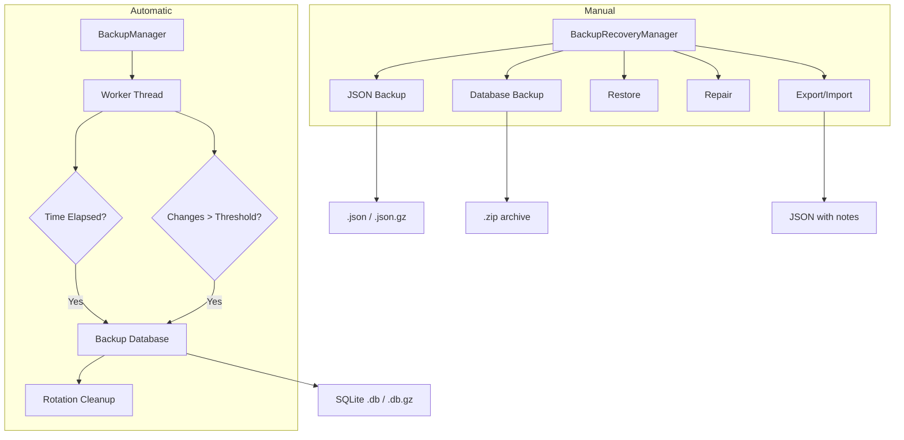
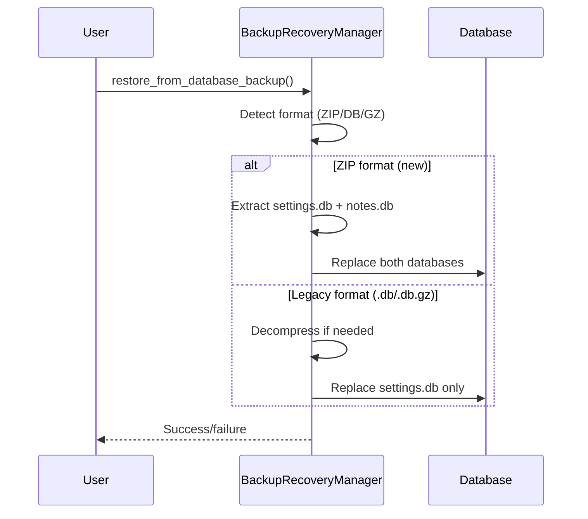

# Backup & Restore Architecture

> Automatic and manual backup with rotation policies, database repair, export/import with notes, and compression.

---

## Overview

Two complementary managers handle backup:

1. **`BackupManager`** — Automatic timed backups with rotation policies
2. **`BackupRecoveryManager`** — Manual backup, restore, repair, export/import

---

## Architecture

---

## BackupManager (`core/backup_manager.py`)

### Automatic Backup

- **Worker thread** runs in background, checks interval + change count
- **Default interval**: 300 seconds (5 minutes)
- **Change threshold**: 100 changes trigger backup regardless of time
- **Compression**: gzip enabled by default

### Rotation Policy (`BackupRotationPolicy`)

Grandfather-father-son rotation:

| Retention | Count | Purpose |
|-----------|-------|---------|
| Daily | 7 | Recent history |
| Weekly | 4 | Medium-term |
| Monthly | 12 | Long-term archive |
| Max total | 10 | Hard limit |
| Max age | 30 days | Expiry cutoff |

### Backup Triggers

| Trigger | When |
|---------|------|
| `TIME_BASED` | Automatic interval elapsed |
| `CHANGE_BASED` | Change count exceeded threshold |
| `MANUAL` | User-initiated backup |
| `SHUTDOWN` | Application closing |

---

## BackupRecoveryManager (`core/backup_recovery_manager.py`)

### Backup Types & Formats

| Type | Format | Use Case |
|------|--------|----------|
| Manual | JSON / SQLite / ZIP | User-requested backup |
| Automatic | SQLite (.db.gz) | Scheduled backup |
| Migration | JSON | Before database schema migration |
| Emergency | SQLite | Before risky operation |

### Database Backup (ZIP archive)

Since v1.3.x, database backup creates a ZIP containing both:
- `settings.db` — Tool settings and API keys
- `notes.db` — User notes with encryption status

### Restore Flow

### Database Repair

`repair_database()` attempts to fix corruption:
1. Run `PRAGMA integrity_check`
2. Extract valid records from corrupted tables
3. Create new clean database
4. Re-insert valid records
5. Validate repaired database

### Export/Import

**Export** (`export_settings()`):
- Exports settings to JSON
- Includes notes from `notes.db` if available
- Supports compression

**Import** (`import_settings()`):
- Validates JSON structure
- Merges or replaces settings
- Restores notes if present in export

---

## Design Decisions

1. **Two managers**: Automatic (background thread) vs manual (user-initiated) have different concerns — rotation vs repair
2. **ZIP for database backup**: Both `settings.db` and `notes.db` must be included for complete backup
3. **Legacy format support**: Old `.db` and `.db.gz` backups can still be restored
4. **Validation before backup**: `_validate_database_for_backup()` checks database has meaningful content before creating backup
5. **GFS rotation**: Industry-standard grandfather-father-son policy prevents unbounded backup growth while preserving history
