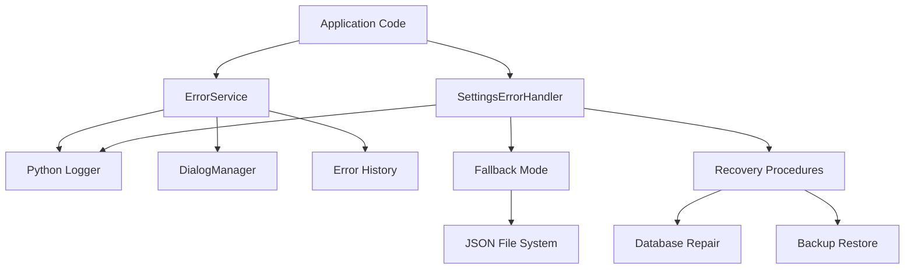
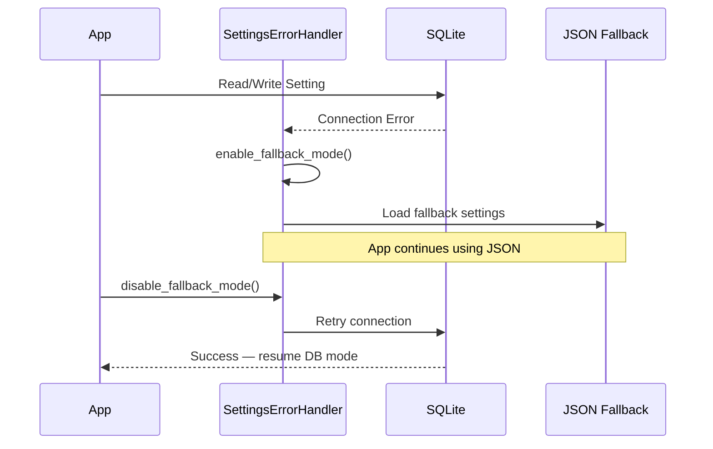

# Logging Architecture

> Centralized error handling and logging with security-aware sanitization, graceful degradation, and structured recovery.

---

## Overview

Pomera uses a two-layer error handling architecture:

1. **`ErrorService`** — Application-wide centralized error handler (operational errors, user notifications)
2. **`SettingsErrorHandler`** — Database-specific error handler with fallback mode and recovery procedures

Both integrate with Python's `logging` module and the `DialogManager` for user-facing notifications.

---

## Architecture Diagram

---

## Components

### ErrorService (`core/error_service.py`)

Centralized error handler for the entire application. Provides consistent logging, user notification, and error tracking.

| Method | Purpose |
|--------|---------|
| `handle()` | Log error + optional dialog + track in history |
| `handle_with_fallback()` | Return fallback value on non-critical errors |
| `log_warning()` | Warning messages without exception |
| `log_info()` | Contextual info messages |
| `suppress_dialogs()` | Batch mode — disable dialogs temporarily |

**Key pattern**: Every error call takes an `ErrorContext` dataclass with:
- `operation` — what was being performed
- `component` — which module
- `user_message` — safe message for dialogs
- `technical_details` — debug info for logs
- `recoverable` — whether app can continue

### SettingsErrorHandler (`core/error_handler.py`)

Database-specific error handler with **fallback mode** — when the SQLite database fails, the app transparently switches to a JSON file system.

**Error categories**: `DATABASE_CONNECTION`, `DATABASE_CORRUPTION`, `DISK_SPACE`, `PERMISSION`, `DATA_VALIDATION`, `MIGRATION`, `BACKUP`, `RECOVERY`

**Key patterns**:
- **Severity auto-detection** — determines severity from category and exception type
- **Recovery procedures** — category-specific recovery (e.g., disk space → cleanup, corruption → repair)
- **Error statistics** — tracks error counts by severity, recent errors, system health state
- **Thread-safe** — uses locks for error history manipulation

### Fallback Mode Flow

---

## Security in Logging

### MCP JSON-RPC Protection

The MCP server (`core/mcp/tool_registry.py`) uses `stderr` for all logging to prevent log output from corrupting the JSON-RPC communication on `stdout`. This is critical — any `print()` statement or stdout logging in MCP context will break the protocol.

**Pattern**: All MCP tool handlers use `logger.info/error/debug()` which writes to stderr, never stdout.

### API Key Sanitization

The `AIToolsEngine._sanitize_url()` method strips sensitive parameters from URLs before logging:
- API keys in query parameters are masked
- Bearer tokens are replaced with `[REDACTED]`
- Provider-specific key patterns are recognized

---

## Error Severity Levels

| Level | When Used | Action |
|-------|-----------|--------|
| `DEBUG` | Internal diagnostics | Log only |
| `INFO` | Normal operations | Log only |
| `WARNING` | Non-critical issues | Log + optional dialog |
| `ERROR` | Operation failures | Log + dialog + track |
| `CRITICAL` | System failures | Log + dialog + may trigger fallback |

---

## Design Decisions

1. **Two handlers, not one**: Settings DB errors need fallback mode (JSON filesystem), which is too specialized for a generic error service
2. **Error history is bounded**: Max 1000 errors in memory (configurable), prevents memory leaks in long-running sessions
3. **Dialogs can be suppressed**: Batch operations and testing can disable user dialogs without losing log output
4. **Error dialogs always show**: `DialogManager.show_error()` cannot be disabled — safety requirement
