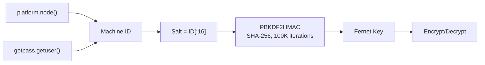
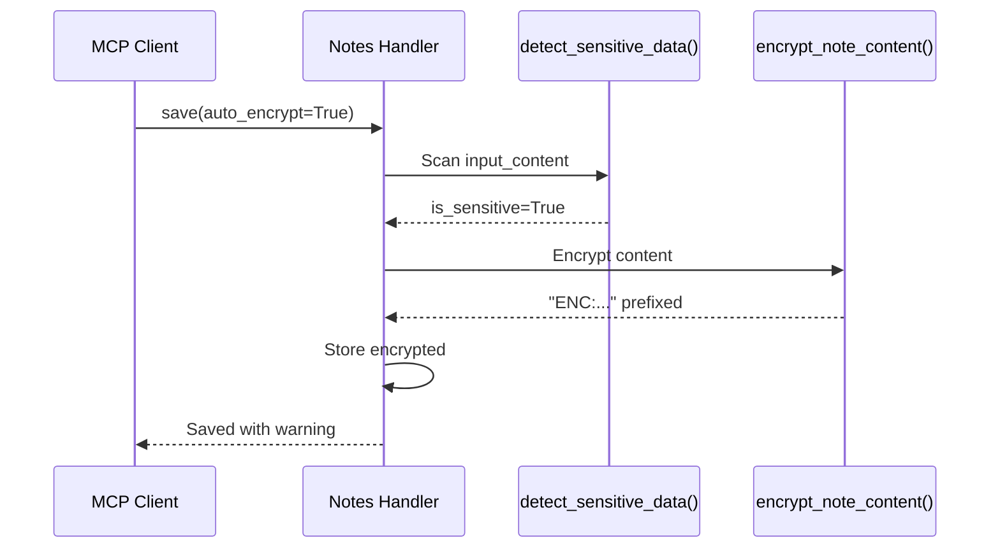
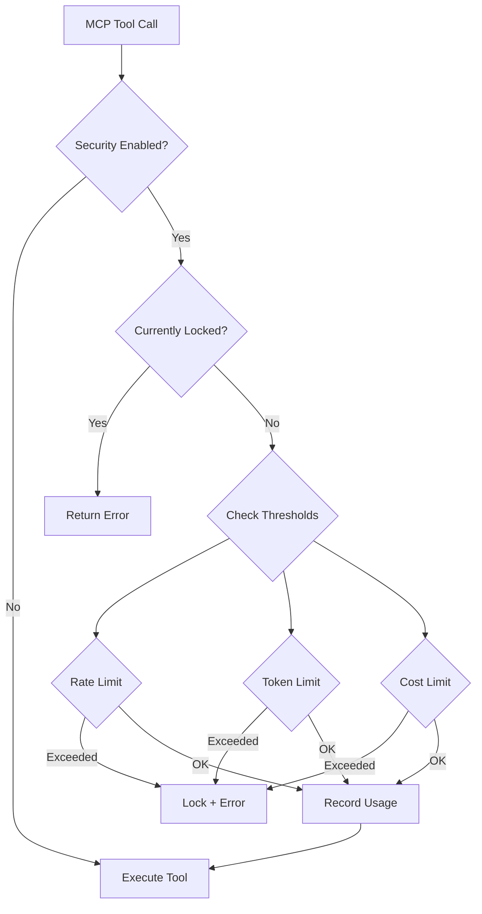

# Security Architecture

> Machine-specific encryption, API key protection, sensitive data detection, and MCP circuit breaker for cost/abuse prevention.

---

## Overview

Pomera's security spans three domains:

1. **Data encryption** — Notes and API keys encrypted at rest using machine-specific keys
2. **Sensitive data detection** — Automatic identification of API keys, passwords, tokens in user content
3. **MCP circuit breaker** — Rate limiting and cost controls for AI/search API calls via MCP

---

## Encryption Architecture

### Key Derivation



**Implementation**: `core/note_encryption.py` → `get_system_encryption_key()`

| Component | Source | Purpose |
|-----------|--------|---------|
| Machine ID | `platform.node() + getpass.getuser()` | Platform-native, works in GUI and MCP subprocess |
| Salt | First 16 bytes of machine ID, padded with `0` | Deterministic per machine |
| KDF | PBKDF2HMAC with SHA-256, 100K iterations | Industry-standard key stretching |
| Cipher | Fernet (AES-128-CBC + HMAC-SHA256) | Authenticated encryption |

**Design choice**: Uses `platform.node()` + `getpass.getuser()` instead of environment variables (`COMPUTERNAME`, `USERNAME`) because MCP subprocess may have different env context. Platform-native methods work consistently.

### Encryption Format

- Encrypted content is prefixed with `ENC:` followed by URL-safe Base64 of the Fernet ciphertext
- `is_encrypted()` checks for `ENC:` prefix — simple, fast, no false positives
- Decryption is transparent: `decrypt_note_content()` returns original text if not encrypted

### Where Encryption is Used

| Context | File | What's Encrypted |
|---------|------|-------------------|
| Notes widget | `core/note_encryption.py` | Note input/output content on `save`/`update` |
| API keys | `core/database_settings_manager.py` | Provider API keys stored in settings DB |
| cURL headers | `tools/curl_tool.py` | Bearer tokens in saved request headers |
| AI tools | `tools/ai_tools.py` | API keys retrieved from settings |

---

## Sensitive Data Detection

### Detection Methods

`detect_sensitive_data()` in `core/note_encryption.py` uses a two-tier strategy:

1. **Primary**: `detect-secrets` library (if installed) — scans line-by-line for secrets using multiple plugins
2. **Fallback**: Built-in regex patterns for common sensitive data:

| Category | Patterns |
|----------|----------|
| `api_key` | `api[_-]?key`, `apikey`, Stripe-style `sk_live_...` |
| `password` | `password`, `passwd`, `pwd` |
| `token` | `bearer <token>`, `token`, `jwt` |
| `secret` | `secret`, `private[_-]?key` |

### Auto-Encrypt Flow

When `auto_encrypt=True` on `pomera_notes save`:



---

## MCP Circuit Breaker (`core/mcp_security_manager.py`)

### Purpose

Prevents runaway costs from AI agents that might call paid APIs in loops. Monitors `pomera_ai_tools`, `pomera_web_search`, and `pomera_read_url`.

### Architecture



### Thresholds (Configurable)

| Threshold | Default | Window |
|-----------|---------|--------|
| Rate limit | 30 calls/minute | Rolling window |
| Token limit | 100,000 tokens/hour | Rolling window |
| Cost limit | $1.00/hour | Rolling window |

### Lock/Unlock

- **Auto-lock**: Triggered when any threshold is exceeded
- **Manual lock**: `manual_lock()` — panic button
- **Unlock**: Requires password (stored as SHA-256 hash in settings DB)
- **Persistence**: Lock state persisted to database, survives server restart

### Singleton Pattern

```python
_security_manager: Optional[MCPSecurityManager] = None

def get_security_manager(db_settings_manager=None):
    # Returns singleton, creates on first call
```

---

## Design Decisions

1. **Machine-specific keys**: Encryption is tied to the machine — moving the database to another machine requires re-encryption
2. **Graceful degradation**: If `cryptography` library isn't installed, encryption is silently skipped (content stored in plaintext)
3. **ENC: prefix convention**: Simple detection without metadata overhead — any content starting with `ENC:` is treated as encrypted
4. **Circuit breaker is opt-in**: Disabled by default (`enabled=False`), user must explicitly configure thresholds
5. **Protected tool list**: Only tools that make paid API calls are monitored: `pomera_ai_tools`, `pomera_web_search`, `pomera_read_url`
