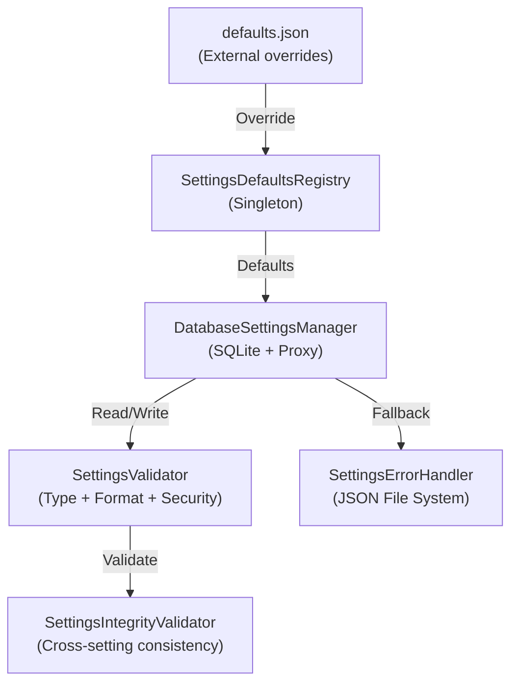
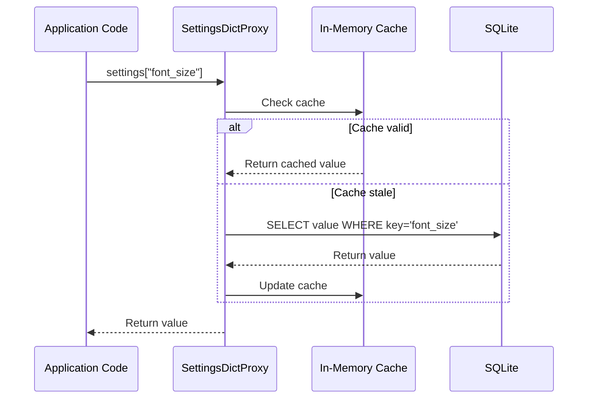
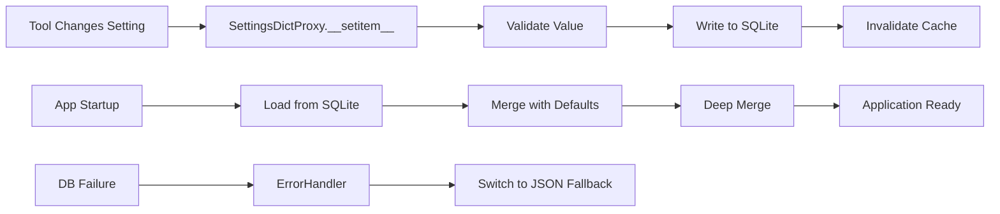

# Settings Architecture

> Singleton defaults registry, multi-layer validation pipeline, SQLite persistence with dictionary-compatible proxy, and JSON fallback.

---

## Overview

Settings flow through four layers:



---

## Components

### 1. SettingsDefaultsRegistry (`core/settings_defaults_registry.py`)

**Pattern**: Singleton — one registry per application instance.

Centralizes all default values for 37+ tools. Each tool registers a `ToolDefaultsSpec`:

```python
ToolDefaultsSpec(
    tool_name="Case Tool",
    defaults={"mode": "UPPER", "delimiter": " ", ...},
    required_keys={"mode"},
    description="Text case transformation",
    version="1.0"
)
```

**Key methods**:
| Method | Purpose |
|--------|---------|
| `_register_builtin_defaults()` | Registers all 37 tool defaults (~925 lines of specs) |
| `_register_app_defaults()` | App-level defaults (tabs, theme, performance) |
| `_load_from_json_file()` | Override defaults from external `defaults.json` |
| `get_tool_defaults(name)` | Get defaults for one tool |
| `get_all_defaults()` | Complete default settings (excludes user tab content) |
| `deep_merge(base, override)` | Merge user settings with defaults |

**External overrides**: `defaults.json` in app root can override built-in defaults without modifying Python code. Loaded on initialization with JSON overrides taking precedence.

### 2. DatabaseSettingsManager (`core/database_settings_manager.py`)

**Pattern**: Dictionary-compatible proxy — allows existing code using `self.settings["key"]` to work unchanged while actually reading/writing to SQLite.

Two proxy classes:
- **`SettingsDictProxy`** — Top-level proxy for `settings["key"]` access with caching
- **`NestedSettingsProxy`** — Nested proxy for `settings["tool_settings"]["Tool Name"]` with automatic DB writeback



**Cache invalidation**: Cache is invalidated on writes (`__setitem__`, `update`) and periodic refreshes. Thread-safe with TTL-based expiry.

### 3. SettingsValidator (`core/settings_validator.py`)

Multi-level validation pipeline (1824 lines, 81 methods):

| Level | What's Checked |
|-------|---------------|
| **Type validation** | Expected types per key (str, int, bool, list, dict) |
| **Format validation** | Ranges, regex patterns, enum values |
| **Security validation** | Path traversal, injection patterns, credential exposure |
| **Custom rules** | Per-key validation functions |
| **Tool integrity** | Tool-specific constraints (e.g., cURL URL format, AI provider config) |
| **Cross-setting consistency** | Tab counts match, performance settings coherent, font settings valid |

Tool-specific integrity validators:
- `_validate_curl_tool_integrity()` — URL format, method validation
- `_validate_ai_tool_integrity()` — Provider config, model names
- `_validate_json_xml_tool_integrity()` — Operation/format values

### 4. SettingsIntegrityValidator (`core/settings_integrity_validator.py`)

Cross-checks relationships between settings:
- Tab consistency (count matches actual tabs)
- Tool selection consistency (selected tool exists)
- Performance settings constraints
- Font configuration validity
- Dialog settings coherence

---

## Persistence Flow



---

## Design Decisions

1. **Proxy pattern over migration**: Rather than rewriting all `settings["key"]` code, the proxy intercepts dict operations transparently
2. **Singleton registry**: One source of truth for defaults prevents inconsistency across tools
3. **External defaults.json**: Non-developers can customize defaults without touching Python
4. **Tab content excluded from defaults**: Tab content is user data, not configuration — loaded separately from persistent storage
5. **Validation is layered**: Simple checks run first (type), expensive checks last (cross-setting), allowing early exit on obvious errors
