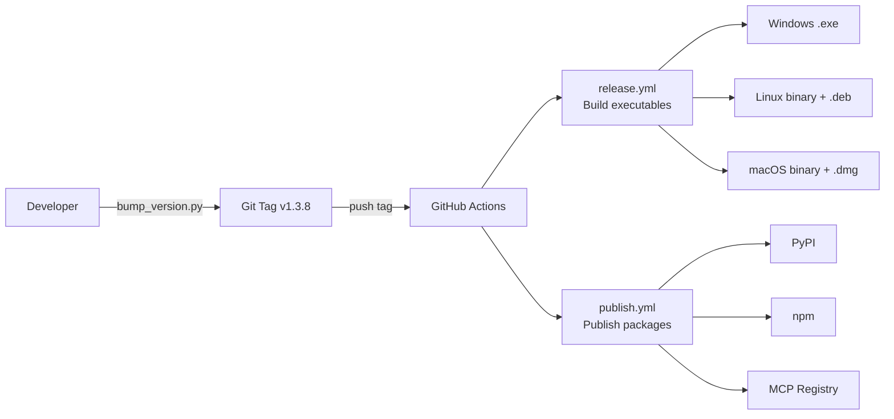
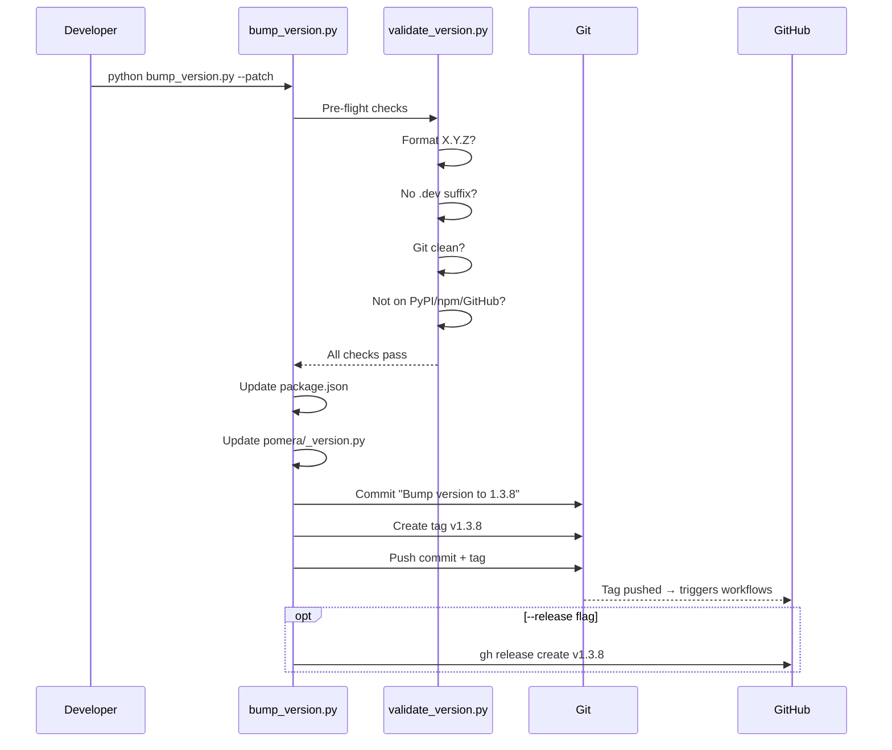
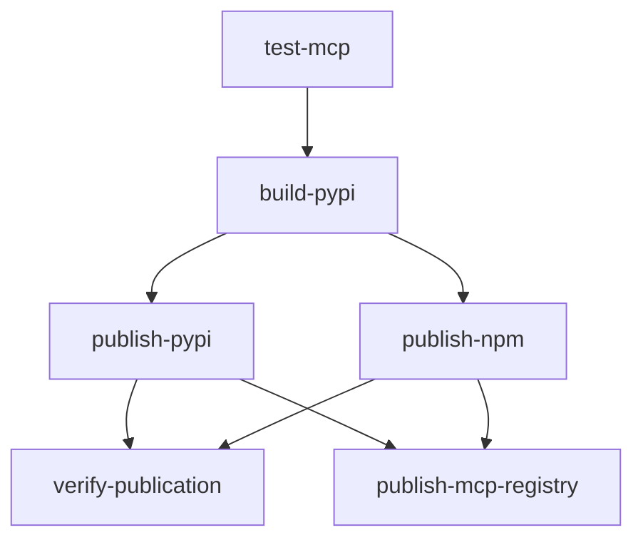

# Versioning & Release Pipeline Architecture

> 4-priority version fallback chain, pre-release validation, automated multi-platform builds, and triple-publish (PyPI + npm + MCP Registry).

---

## Overview

---

## Version Resolution (`pomera/version.py`)

4-priority fallback chain ensures version is always available:

| Priority | Source | Context |
|----------|--------|---------|
| 1 | `pomera/_version.py` | Built package (setuptools_scm generates this) |
| 2 | `importlib.metadata` | Installed package (`pip install pomera-ai-commander`) |
| 3 | `setuptools_scm` runtime | Dev from source with `.git` directory |
| 4 | `"unknown"` | Ultimate fallback |

**Debug**: Set `POMERA_VERSION_DEBUG=1` for version resolution logging to stderr.

---

## Version Bump (`bump_version.py`)

### Workflow

### Validation Checks (`tools/validate_version.py`)

| Check | What It Does |
|-------|-------------|
| Format | Must be `X.Y.Z` (3 integers) |
| No `.dev` | Release versions cannot have `.dev` suffix |
| Git clean | Working directory must have no uncommitted changes |
| Not on PyPI | Version must not already be published |
| Not on npm | Version must not already be published |
| Not on GitHub | Tag and release must not already exist |

---

## Release Pipeline (`release.yml`)

Triggered by: `push tag v*.*.*`

### Build Matrix

| Platform | Runner | Artifact |
|----------|--------|----------|
| Windows | `windows-latest` | `pomera-v1.3.8-windows.exe` |
| Linux | `ubuntu-latest` | `pomera-v1.3.8-linux` + `.deb` |
| macOS | `macos-latest` | `pomera-v1.3.8-macos-arm64` + `.dmg` |

### Build Steps

1. **Verify MCP files** — `mcp.json`, `llms.txt`, `context7.json`, `pyproject.toml`, `package.json`
2. **Set up Python 3.11** + install PyInstaller + dependencies
3. **Generate `_version.py`** from Git tag (strips `v` prefix)
4. **Build executable** via PyInstaller spec file
5. **Create platform packages** — DMG (macOS), DEB (Linux)
6. **Upload artifacts** to GitHub Actions
7. **Create GitHub Release** with `softprops/action-gh-release@v1`

---

## Publish Pipeline (`publish.yml`)

Triggered by: `release published` or manual `workflow_dispatch`

### Jobs

| Job | Purpose |
|-----|---------|
| `test-mcp` | Verify MCP server starts + manifest files exist |
| `build-pypi` | Build sdist + wheel with `python -m build` |
| `publish-pypi` | Trusted publishing (OIDC, no API token) |
| `publish-npm` | `npm publish --access public` with NPM_TOKEN secret |
| `verify-publication` | Install from both registries and verify |
| `publish-mcp-registry` | Update `server.json` version, publish via `mcp-publisher` |

### Key Design Details

- **PyPI trusted publishing**: Uses OIDC (no API token needed), configured at pypi.org
- **npm**: Requires `NPM_TOKEN` secret
- **MCP Registry**: Uses GitHub OIDC for authentication, waits for PyPI propagation (up to 5 min)
- **Version extraction**: Git tag → strip `v` prefix → inject into `_version.py`

---

## Test Release (`test-release.yml`)

Separate workflow for validating the release pipeline without publishing. Used for CI testing.

---

## Files Involved

| File | Purpose |
|------|---------|
| `pomera/version.py` | Runtime version with 4-priority fallback |
| `pomera/_version.py` | Generated by setuptools_scm (not in repo) |
| `bump_version.py` | Version bump script with validation |
| `tools/validate_version.py` | Pre-release validation checks |
| `package.json` | npm version (single source of truth for bump) |
| `pyproject.toml` | PyPI metadata (dynamic version from setuptools_scm) |
| `mcp.json` | MCP Registry manifest |
| `server.json` | MCP Registry server definition |
| `pomera.spec` | PyInstaller build specification |
| `.github/workflows/release.yml` | Build executables + GitHub Release |
| `.github/workflows/publish.yml` | Publish to PyPI + npm + MCP Registry |
| `.github/workflows/test-release.yml` | CI release testing |

---

## Design Decisions

1. **4-priority version chain**: Handles dev, installed, built, and unknown contexts without crashing
2. **Tag-driven releases**: Pushing a Git tag triggers the entire build + publish pipeline automatically
3. **Pre-flight validation**: Prevents accidental duplicate releases by checking all registries
4. **Trusted publishing**: PyPI uses OIDC instead of API tokens — more secure, no secret rotation
5. **MCP Registry propagation wait**: publish-mcp-registry waits for PyPI availability to ensure package can be installed
6. **Version single source of truth**: `package.json` is updated by `bump_version.py`, all other files derive from Git tag at build time
