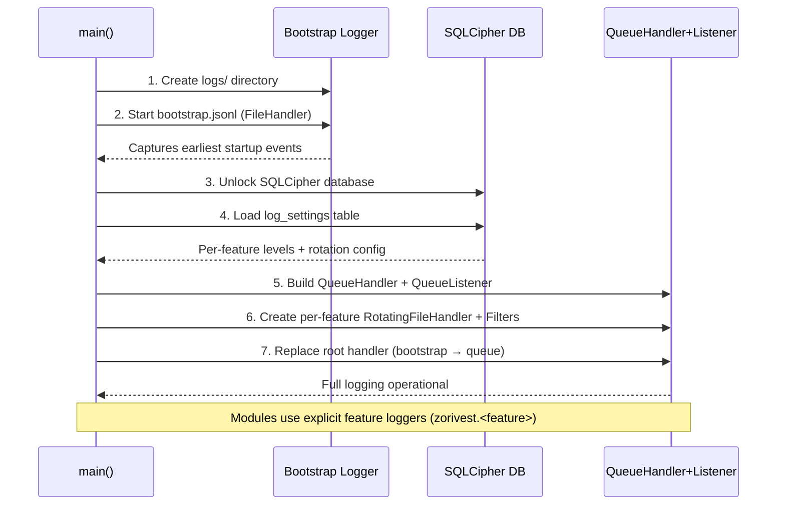

# Phase 1A: Logging Infrastructure

> Part of [Zorivest Build Plan](../BUILD_PLAN.md) | Prerequisites: Nothing | Consumed by: All phases
>
> **Build this immediately — in parallel with Phase 1.** Logging must be available before any outer-layer module is implemented so that all development, testing, and AI-assisted troubleshooting benefits from structured logs from day one. Phase 1 (Domain) and Phase 1A (Logging) both have zero dependencies and start simultaneously.

---

## Goal

Implement a centralized, file-only, thread-safe logging infrastructure with per-feature log files, runtime-configurable log levels, JSONL structured output, and non-blocking I/O — designed for both human developers and AI agent consumption.

## Design Decisions

### Correlation with `_logging-architecture.md`

The existing [`_logging-architecture.md`](../_logging-architecture.md) documents Pomera's logging patterns (ErrorService + SettingsErrorHandler). Zorivest adopts the following concepts from that reference:

| Pomera Concept | Zorivest Adaptation |
|---|---|
| `ErrorContext` dataclass (operation, component, user_message) | Structured JSONL fields: `feature`, `operation`, `module`, `message` |
| Thread-safe error history | `QueueHandler` → `QueueListener` (no shared state across threads) |
| Severity levels (DEBUG–CRITICAL) | Same 5 levels, configurable per feature via settings DB |
| MCP stderr-only logging (no stdout corruption) | File-only logging; no console/GUI output at all |
| API key sanitization | Log redaction filter for API keys, passwords, tokens |
| Bounded error history (max 1000) | `RotatingFileHandler` with configurable `maxBytes` + `backupCount` |
| Fallback mode (DB → JSON files) | Bootstrap logger (file) → DB-configured queue logging |

### Why QueueHandler + QueueListener

```
                                    ┌──────────────────────────────────┐
                                    │       QueueListener Thread       │
                                    │                                  │
 ┌──────────────┐                   │  ┌──────────────────────────────┐│
 │ Trade Thread  │──┐               │  │ trades.jsonl  (Rotating)    ││
 └──────────────┘  │                │  │ Filter: name.startswith     ││
 ┌──────────────┐  │  ┌──────────┐  │  │   ("zorivest.trades")       ││
 │ Market Data  │──┼─▶│  Queue   │──┼─▶├──────────────────────────────┤│
 │   Thread     │  │  └──────────┘  │  │ marketdata.jsonl (Rotating) ││
 └──────────────┘  │       ▲        │  │ Filter: name.startswith     ││
 ┌──────────────┐  │       │        │  │   ("zorivest.marketdata")   ││
 │  Tax Engine  │──┘       │        │  ├──────────────────────────────┤│
 │   Thread     │    QueueHandler   │  │ tax.jsonl   (Rotating)      ││
 └──────────────┘    on root logger │  │ ...etc per feature          ││
 ┌──────────────┐                   │  └──────────────────────────────┘│
 │  Scheduler   │──────────────────▶│                                  │
 │   Thread     │                   └──────────────────────────────────┘
 └──────────────┘
```

**Rationale** (from research):

1. **Non-blocking** — `QueueHandler` only enqueues (fast); file I/O happens in the listener thread
2. **Thread-safe** — Python's `logging` is thread-safe by default; queue decoupling eliminates contention
3. **Single writer per file** — Avoids `RotatingFileHandler` rotation anomalies that occur with multiple handlers writing the same file
4. **Per-feature routing** — Filters on each handler in the listener ensure records go to the correct file only

> [!IMPORTANT]
> Without explicit routing filters on each handler, `QueueListener` dispatches every record to every handler — causing all features to log into all files. This is a well-documented pitfall.

### Why JSONL (Not Plain Text)

AI agents (and `jq`/`grep` tooling) can parse JSONL reliably without fragile regex. Each log line is a self-contained JSON object:

```json
{
  "timestamp": "2026-02-16T19:10:57.123456-05:00",
  "level": "INFO",
  "logger": "zorivest.marketdata.alpha_vantage",
  "thread": "MarketDataThread",
  "module": "provider_service",
  "funcName": "fetch_quote",
  "lineno": 142,
  "message": "Quote fetched successfully",
  "symbol": "SPY",
  "provider": "alpha_vantage",
  "latency_ms": 234
}
```

**Library**: Python stdlib `json` + custom `JsonFormatter`. No external dependencies required.

---

## Architecture

### Logger Naming Convention

All loggers use a hierarchical namespace rooted at `zorivest`:

| Feature | Logger Name | Log File |
|---|---|---|
| Trades | `zorivest.trades` | `trades.jsonl` |
| Accounts | `zorivest.accounts` | `accounts.jsonl` |
| Market Data | `zorivest.marketdata` | `marketdata.jsonl` |
| Tax Engine | `zorivest.tax` | `tax.jsonl` |
| Scheduler | `zorivest.scheduler` | `scheduler.jsonl` |
| Database | `zorivest.db` | `db.jsonl` |
| Calculator | `zorivest.calculator` | `calculator.jsonl` |
| Images | `zorivest.images` | `images.jsonl` |
| API (FastAPI) | `zorivest.api` | `api.jsonl` |
| Frontend (Electron) | `zorivest.frontend` | `frontend.jsonl` |
| App Lifecycle | `zorivest.app` | `app.jsonl` |
| Uvicorn Server | `uvicorn` | `uvicorn.jsonl` |

Child loggers (e.g., `zorivest.marketdata.alpha_vantage`) inherit routing to the parent feature file.

### Logger Usage Policy

> [!IMPORTANT]
> Packages are named `zorivest_core`, `zorivest_infra`, `zorivest_api`. Using `logging.getLogger(__name__)` produces names like `zorivest_infra.repos.trade_repo` which will **NOT** match `zorivest.trades` prefix routing. You must use explicit feature loggers for business events.

**Two patterns, one system:**

| Pattern | When to Use | Where It Routes |
|---|---|---|
| `logging.getLogger("zorivest.trades")` | Business events that must reach a specific feature file | `trades.jsonl` via `FeatureFilter` |
| `logging.getLogger(__name__)` | Low-level module diagnostics, utility logging | `app.jsonl` via catchall (safety net) |

```python
# ✅ CORRECT — business events use explicit feature loggers
from zorivest_infra.logging import get_feature_logger

logger = get_feature_logger("trades")  # → logging.getLogger("zorivest.trades")
logger.info("Trade created", extra={"trade_id": "T001", "symbol": "SPY"})

# ✅ ALLOWED — module loggers for utility/diagnostic logging (routes to app.jsonl)
import logging
logger = logging.getLogger(__name__)  # → zorivest_infra.repos.trade_repo
logger.debug("Cache miss for trade lookup")
```

The `app.jsonl` handler uses a `CatchallFilter` that accepts any record NOT matched by a specific feature prefix. This prevents silent log loss from `__name__`-based loggers.

### Log Directory Structure

```
{APP_DATA}/zorivest/logs/
├── trades.jsonl           # Active log file
├── trades.jsonl.1         # Rotated backup 1
├── trades.jsonl.2         # Rotated backup 2
├── accounts.jsonl
├── marketdata.jsonl
├── tax.jsonl
├── scheduler.jsonl
├── db.jsonl
├── calculator.jsonl
├── images.jsonl
├── api.jsonl
├── frontend.jsonl         # Electron renderer telemetry
├── app.jsonl              # App lifecycle + catchall for __name__ loggers
├── uvicorn.jsonl          # Uvicorn server logs (access + error)
└── bootstrap.jsonl        # Pre-DB startup capture
```

`{APP_DATA}` resolves to:
- **Windows**: `%LOCALAPPDATA%/zorivest/logs/`
- **macOS**: `~/Library/Application Support/zorivest/logs/`
- **Linux**: `~/.local/share/zorivest/logs/`

### Two-Phase Initialization



### Runtime Log Level Configuration

**Strategy: Handler-level gating** (recommended by research over logger-level gating).

- All feature loggers remain at `DEBUG` (permissive) so records always enter the queue
- Each feature's file handler has a configurable level that gates what's written
- Changing a level at runtime = `handler.setLevel(new_level)` — immediate, no restart

**Settings storage** (extends existing `settings` table):

```python
# Settings key convention (extends existing namespace):
# logging.trades.level       = "INFO"
# logging.marketdata.level   = "DEBUG"
# logging.tax.level          = "WARNING"
# logging.db.level           = "DEBUG"
# logging.rotation_mb        = 10        (global: 10 MB per file)
# logging.backup_count       = 5         (global: 5 rotated files)
```

> [!NOTE]
> Rotation is a **global** policy (disk management). Log levels are **per-feature** (debugging). The GUI exposes one rotation control that applies to all feature files.

### Log Redaction

A filter strips sensitive data before writing:

| Pattern | Replacement |
|---|---|
| API keys in URLs (`?apikey=...`) | `?apikey=[REDACTED]` |
| Bearer tokens | `Bearer [REDACTED]` |
| Database passphrases | `[REDACTED]` |
| Credit card patterns | `[REDACTED]` |

This reuses the sanitization concept from `_logging-architecture.md` (`AIToolsEngine._sanitize_url()`).

---

## Step 1A.1: Logging Core Module

```python
# packages/infrastructure/src/zorivest_infra/logging/__init__.py
# packages/infrastructure/src/zorivest_infra/logging/config.py
# packages/infrastructure/src/zorivest_infra/logging/filters.py
# packages/infrastructure/src/zorivest_infra/logging/formatters.py
# packages/infrastructure/src/zorivest_infra/logging/redaction.py
# packages/infrastructure/src/zorivest_infra/logging/bootstrap.py
```

### `config.py` — Central Configuration

```python
# packages/infrastructure/src/zorivest_infra/logging/config.py

import logging
import logging.handlers
import os
import queue
from pathlib import Path
from typing import Optional

from .filters import FeatureFilter
from .formatters import JsonFormatter
from .redaction import RedactionFilter

# Feature registry: maps feature name → logger prefix
FEATURES = {
    "trades":      "zorivest.trades",
    "accounts":    "zorivest.accounts",
    "marketdata":  "zorivest.marketdata",
    "tax":         "zorivest.tax",
    "scheduler":   "zorivest.scheduler",
    "db":          "zorivest.db",
    "calculator":  "zorivest.calculator",
    "images":      "zorivest.images",
    "api":         "zorivest.api",
    "frontend":    "zorivest.frontend",
    "app":         "zorivest.app",
    "uvicorn":     "uvicorn",
}

DEFAULT_LOG_LEVEL = "INFO"
DEFAULT_ROTATION_MB = 10
DEFAULT_BACKUP_COUNT = 5


def get_feature_logger(feature: str) -> logging.Logger:
    """Get a logger for a registered feature name."""
    if feature not in FEATURES:
        raise ValueError(f"Unknown feature: {feature}. Register in FEATURES first.")
    return logging.getLogger(FEATURES[feature])


def get_log_directory() -> Path:
    """Resolve platform-appropriate log directory."""
    if os.name == "nt":
        base = Path(os.environ.get("LOCALAPPDATA", Path.home() / "AppData" / "Local"))
    elif os.uname().sysname == "Darwin":
        base = Path.home() / "Library" / "Application Support"
    else:
        base = Path(os.environ.get("XDG_DATA_HOME", Path.home() / ".local" / "share"))
    log_dir = base / "zorivest" / "logs"
    log_dir.mkdir(parents=True, exist_ok=True)
    return log_dir


class LoggingManager:
    """Manages the QueueHandler/QueueListener logging lifecycle."""

    def __init__(self):
        self._log_dir: Optional[Path] = None
        self._queue: Optional[queue.Queue] = None
        self._listener: Optional[logging.handlers.QueueListener] = None
        self._handlers: dict[str, logging.handlers.RotatingFileHandler] = {}
        self._formatter = JsonFormatter()
        self._redaction_filter = RedactionFilter()

    def bootstrap(self) -> None:
        """Phase 1: Minimal file logging before DB is available."""
        self._log_dir = get_log_directory()
        handler = logging.FileHandler(self._log_dir / "bootstrap.jsonl")
        handler.setFormatter(self._formatter)
        handler.addFilter(self._redaction_filter)

        root = logging.getLogger()
        root.setLevel(logging.DEBUG)
        root.addHandler(handler)
        logging.getLogger("zorivest.app").info(
            "Bootstrap logging started", extra={"phase": "bootstrap"}
        )

    def configure_from_settings(self, settings: dict[str, str]) -> None:
        """Phase 2: Build full queue-based logging from DB settings."""
        self._queue = queue.Queue(-1)  # Unbounded

        # Global rotation policy (applies to all feature files)
        rotation_mb = int(settings.get(
            "logging.rotation_mb", DEFAULT_ROTATION_MB
        ))
        backup_count = int(settings.get(
            "logging.backup_count", DEFAULT_BACKUP_COUNT
        ))

        # Create per-feature handlers
        handlers = []
        for feature, logger_prefix in FEATURES.items():
            level_str = settings.get(
                f"logging.{feature}.level", DEFAULT_LOG_LEVEL
            )

            handler = logging.handlers.RotatingFileHandler(
                filename=self._log_dir / f"{feature}.jsonl",
                maxBytes=rotation_mb * 1024 * 1024,
                backupCount=backup_count,
                encoding="utf-8",
            )
            handler.setLevel(getattr(logging, level_str.upper(), logging.INFO))
            handler.setFormatter(self._formatter)
            handler.addFilter(FeatureFilter(logger_prefix))
            handler.addFilter(self._redaction_filter)
            self._handlers[feature] = handler
            handlers.append(handler)

        # Catchall handler for __name__-based loggers → app.jsonl
        catchall_handler = logging.handlers.RotatingFileHandler(
            filename=self._log_dir / "app.jsonl",
            maxBytes=rotation_mb * 1024 * 1024,
            backupCount=backup_count,
            encoding="utf-8",
            mode="a",
        )
        catchall_handler.setLevel(logging.DEBUG)
        catchall_handler.setFormatter(self._formatter)
        catchall_handler.addFilter(CatchallFilter(list(FEATURES.values())))
        catchall_handler.addFilter(self._redaction_filter)
        handlers.append(catchall_handler)

        # Start listener
        self._listener = logging.handlers.QueueListener(
            self._queue, *handlers, respect_handler_level=True
        )
        self._listener.start()

        # Replace root handler with QueueHandler
        root = logging.getLogger()
        for h in root.handlers[:]:
            root.removeHandler(h)
        root.addHandler(logging.handlers.QueueHandler(self._queue))
        root.setLevel(logging.DEBUG)

        logging.getLogger("zorivest.app").info(
            "Full queue-based logging configured",
            extra={"phase": "configured", "features": list(FEATURES.keys())}
        )

    def update_feature_level(self, feature: str, level: str) -> None:
        """Runtime level change for a single feature (no restart)."""
        if feature in self._handlers:
            self._handlers[feature].setLevel(
                getattr(logging, level.upper(), logging.INFO)
            )

    def shutdown(self) -> None:
        """Graceful shutdown: stop listener, flush handlers."""
        if self._listener:
            self._listener.stop()
```

### `filters.py` — Feature Routing + Catchall

```python
# packages/infrastructure/src/zorivest_infra/logging/filters.py

import logging


class FeatureFilter(logging.Filter):
    """Routes log records to the correct feature file by logger name prefix."""

    def __init__(self, prefix: str):
        super().__init__()
        self.prefix = prefix

    def filter(self, record: logging.LogRecord) -> bool:
        return record.name.startswith(self.prefix)


class CatchallFilter(logging.Filter):
    """Accepts records NOT matched by any feature prefix.

    Prevents silent log loss from __name__-based loggers.
    Records matching a known feature prefix are rejected (they go
    to that feature's dedicated handler instead).
    """

    def __init__(self, known_prefixes: list[str]):
        super().__init__()
        self.known_prefixes = known_prefixes

    def filter(self, record: logging.LogRecord) -> bool:
        return not any(
            record.name.startswith(prefix)
            for prefix in self.known_prefixes
        )
```

### `formatters.py` — JSONL Formatter

```python
# packages/infrastructure/src/zorivest_infra/logging/formatters.py

import json
import logging
import traceback
from datetime import datetime, timezone

# Stdlib LogRecord attributes to exclude from extras
_RESERVED_ATTRS = frozenset({
    "name", "msg", "args", "created", "relativeCreated", "exc_info",
    "exc_text", "stack_info", "lineno", "funcName", "pathname",
    "filename", "module", "thread", "threadName", "process",
    "processName", "levelname", "levelno", "msecs", "message",
    "taskName",
})


class JsonFormatter(logging.Formatter):
    """Formats log records as single-line JSON objects (JSONL).

    Uses a deny-list approach: ALL extra attributes are included
    except reserved stdlib ones. This preserves arbitrary structured
    data passed via extra={} (e.g., startup metrics, trade context).
    """

    def format(self, record: logging.LogRecord) -> str:
        log_entry = {
            "timestamp": datetime.fromtimestamp(
                record.created, tz=timezone.utc
            ).isoformat(),
            "level": record.levelname,
            "logger": record.name,
            "thread": record.threadName,
            "module": record.module,
            "funcName": record.funcName,
            "lineno": record.lineno,
            "message": record.getMessage(),
        }
        # Include ALL non-reserved extras (deny-list, not whitelist)
        for key, value in record.__dict__.items():
            if key not in _RESERVED_ATTRS and not key.startswith("_"):
                log_entry[key] = value

        if record.exc_info and record.exc_info[1]:
            log_entry["exception"] = {
                "type": record.exc_info[0].__name__,
                "message": str(record.exc_info[1]),
                "traceback": traceback.format_exception(*record.exc_info),
            }
        return json.dumps(log_entry, default=str, ensure_ascii=False)
```

### `redaction.py` — Sensitive Data Filter

```python
# packages/infrastructure/src/zorivest_infra/logging/redaction.py

import logging
import re


class RedactionFilter(logging.Filter):
    """Redacts API keys, tokens, and sensitive data from log messages."""

    PATTERNS = [
        (re.compile(r'(apikey|api_key|key|token|password|secret)=([^&\s]+)', re.I),
         r'\1=[REDACTED]'),
        (re.compile(r'Bearer\s+\S+', re.I),
         'Bearer [REDACTED]'),
        (re.compile(r'(?:ENC:)[A-Za-z0-9+/=]+'),
         '[ENCRYPTED_VALUE]'),
    ]

    def filter(self, record: logging.LogRecord) -> bool:
        record.msg = self._redact(str(record.msg))
        if record.args:
            record.args = tuple(
                self._redact(str(a)) if isinstance(a, str) else a
                for a in record.args
            ) if isinstance(record.args, tuple) else record.args
        return True

    def _redact(self, text: str) -> str:
        for pattern, replacement in self.PATTERNS:
            text = pattern.sub(replacement, text)
        return text
```

### `bootstrap.py` — Logger Usage Examples

```python
# packages/infrastructure/src/zorivest_infra/logging/bootstrap.py
"""
Logger usage patterns for Zorivest modules:

Pattern 1 — Feature loggers (PREFERRED for business events):

    from zorivest_infra.logging.config import get_feature_logger

    logger = get_feature_logger("trades")

    def create_trade(trade):
        logger.info("Trade created", extra={"trade_id": trade.exec_id, "symbol": trade.instrument})
        try:
            ...
        except Exception:
            logger.exception("Failed to create trade", extra={"trade_id": trade.exec_id})

Pattern 2 — Module loggers (for utility/diagnostic logging, routes to app.jsonl):

    import logging
    logger = logging.getLogger(__name__)

    def utility_function():
        logger.debug("Cache miss for key", extra={"key": some_key})
"""
```

---

## Step 1A.2: Settings Integration

Logging settings are stored in the existing `settings` table using namespaced keys:

```python
# Settings keys (loaded at startup, watched for changes):
#
# logging.trades.level       → "INFO"    (default)
# logging.accounts.level     → "INFO"
# logging.marketdata.level   → "DEBUG"   (verbose for debugging providers)
# logging.tax.level          → "INFO"
# logging.scheduler.level    → "INFO"
# logging.db.level           → "WARNING" (quiet by default)
# logging.calculator.level   → "INFO"
# logging.images.level       → "INFO"
# logging.api.level          → "INFO"
# logging.app.level          → "DEBUG"   (lifecycle events)
#
# logging.rotation_mb        → "10"      (global default, 10 MB per file)
# logging.backup_count       → "5"       (global default, 5 rotated files)
```

### GUI Settings Integration

> [!NOTE]
> The logging settings page is part of Phase 6 (GUI Settings — [06f-gui-settings.md](06f-gui-settings.md)). The backend support is built here in Phase 1A.

The settings GUI will expose:
- A table of features with a dropdown for each log level
- Global rotation size and backup count controls
- A "View Logs" button that opens the log directory in the system file manager

---

## Step 1A.3: Test Plan

### Unit Tests

```python
# tests/unit/test_logging_config.py

import logging
import pytest

class TestLoggingManager:
    def test_bootstrap_creates_log_directory(self, tmp_path, monkeypatch):
        """Bootstrap creates logs dir and bootstrap.jsonl."""
        monkeypatch.setattr("zorivest_infra.logging.config.get_log_directory",
                            lambda: tmp_path)
        manager = LoggingManager()
        manager.bootstrap()
        assert (tmp_path / "bootstrap.jsonl").exists()

    def test_configure_creates_per_feature_files(self, tmp_path, monkeypatch):
        """Full config creates one JSONL file per feature."""
        monkeypatch.setattr("zorivest_infra.logging.config.get_log_directory",
                            lambda: tmp_path)
        manager = LoggingManager()
        manager.bootstrap()
        manager.configure_from_settings({})
        # Log to each feature
        for feature, prefix in FEATURES.items():
            logging.getLogger(prefix).info(f"Test message for {feature}")
        manager.shutdown()
        # Verify files exist and contain data
        for feature in FEATURES:
            log_file = tmp_path / f"{feature}.jsonl"
            assert log_file.exists()

    def test_runtime_level_change(self, tmp_path, monkeypatch):
        """Changing feature level at runtime filters messages."""
        monkeypatch.setattr("zorivest_infra.logging.config.get_log_directory",
                            lambda: tmp_path)
        manager = LoggingManager()
        manager.bootstrap()
        manager.configure_from_settings({"logging.trades.level": "WARNING"})
        # INFO should be filtered out
        logging.getLogger("zorivest.trades").info("Should not appear")
        logging.getLogger("zorivest.trades").warning("Should appear")
        manager.shutdown()

        content = (tmp_path / "trades.jsonl").read_text()
        assert "Should not appear" not in content
        assert "Should appear" in content


class TestFeatureFilter:
    def test_matches_prefix(self):
        f = FeatureFilter("zorivest.trades")
        record = logging.LogRecord("zorivest.trades.service", logging.INFO, "", 0, "", (), None)
        assert f.filter(record) is True

    def test_rejects_different_prefix(self):
        f = FeatureFilter("zorivest.trades")
        record = logging.LogRecord("zorivest.marketdata", logging.INFO, "", 0, "", (), None)
        assert f.filter(record) is False


class TestJsonFormatter:
    def test_output_is_valid_json(self):
        formatter = JsonFormatter()
        record = logging.LogRecord("zorivest.trades", logging.INFO, "module", 42,
                                   "Test message", (), None)
        output = formatter.format(record)
        parsed = json.loads(output)
        assert parsed["level"] == "INFO"
        assert parsed["logger"] == "zorivest.trades"
        assert parsed["message"] == "Test message"

    def test_extras_included(self):
        formatter = JsonFormatter()
        record = logging.LogRecord("zorivest.trades", logging.INFO, "module", 42,
                                   "Trade created", (), None)
        record.trade_id = "T001"
        record.symbol = "SPY"
        output = formatter.format(record)
        parsed = json.loads(output)
        assert parsed["trade_id"] == "T001"
        assert parsed["symbol"] == "SPY"

    def test_exception_included(self):
        formatter = JsonFormatter()
        try:
            raise ValueError("test error")
        except ValueError:
            import sys
            record = logging.LogRecord("zorivest.trades", logging.ERROR, "module", 42,
                                       "Failure", (), sys.exc_info())
        output = formatter.format(record)
        parsed = json.loads(output)
        assert "exception" in parsed
        assert parsed["exception"]["type"] == "ValueError"


class TestRedactionFilter:
    def test_redacts_api_key(self):
        f = RedactionFilter()
        record = logging.LogRecord("test", logging.INFO, "", 0,
                                   "URL: https://api.example.com?apikey=SECRET123", (), None)
        f.filter(record)
        assert "SECRET123" not in record.msg
        assert "[REDACTED]" in record.msg

    def test_redacts_bearer_token(self):
        f = RedactionFilter()
        record = logging.LogRecord("test", logging.INFO, "", 0,
                                   "Auth: Bearer eyJhbGciOi...", (), None)
        f.filter(record)
        assert "eyJhbGciOi" not in record.msg


class TestThreadSafety:
    def test_concurrent_logging(self, tmp_path, monkeypatch):
        """Multiple threads logging simultaneously produce valid JSONL."""
        import threading
        import json

        monkeypatch.setattr("zorivest_infra.logging.config.get_log_directory",
                            lambda: tmp_path)
        manager = LoggingManager()
        manager.bootstrap()
        manager.configure_from_settings({})

        def log_from_thread(feature_prefix, count):
            logger = logging.getLogger(feature_prefix)
            for i in range(count):
                logger.info(f"Thread message {i}")

        threads = [
            threading.Thread(target=log_from_thread,
                             args=(prefix, 50))
            for prefix in ["zorivest.trades", "zorivest.marketdata", "zorivest.tax"]
        ]
        for t in threads:
            t.start()
        for t in threads:
            t.join()
        manager.shutdown()

        # Verify each line is valid JSON
        for feature in ["trades", "marketdata", "tax"]:
            log_file = tmp_path / f"{feature}.jsonl"
            for line in log_file.read_text().strip().split("\n"):
                if line:
                    json.loads(line)  # Should not raise
```

### Test Commands

```bash
# Unit tests (fast, no DB)
pytest tests/unit/test_logging_config.py -v

# Specific test class
pytest tests/unit/test_logging_config.py::TestLoggingManager -v

# With coverage
pytest tests/unit/test_logging_config.py --cov=zorivest_infra.logging --cov-report=term-missing
```

---

## Step 1A.4: Dependencies

> [!NOTE]
> Phase 1A has **zero external dependencies**. Everything uses Python's stdlib `logging`, `logging.handlers`, `queue`, and `json` modules.
>
> No `pyproject.toml` changes needed for this phase.

---

## Build Order Integration

### Where This Fits

```
BUILD ORDER (with logging):

  ┌─────────┐     ┌──────────┐
  │ Phase 1  │     │Phase 1A  │     ┌──────────────┐     ┌─────────────┐
  │ Domain   │───┬│ LOGGING  │───▶│   Phase 2    │───▶│   Phase 3   │─▶ ...
  │ + Ports  │   ││          │     │ Infrastructure│     │  Services   │
  └─────────┘   │└──────────┘     │  (DB, Repos) │     │ (Use Cases) │
    0 deps      │  0 deps          └──────────────┘     └─────────────┘
    pure Python │  stdlib only      depends on 1      depends on 1,1A,2
    100% unit   │  100% unit        integration       mock repos
                └─▶ (parallel start)
```

> [!IMPORTANT]
> Phase 1A has **zero dependencies** (stdlib only). It starts in parallel with Phase 1. All subsequent phases use feature loggers (`get_feature_logger("trades")`) and benefit automatically.

### Priority Matrix Entry

| Order | What | Tests First? | Deps on | Key Test Strategy |
|---|---|---|---|---|
| **1A** | Logging infrastructure (QueueHandler, JSONL, rotation, redaction) | ✅ Yes | Nothing | `pytest` — formatter, filter, routing, thread safety |

---

## Exit Criteria

**Run `pytest tests/unit/test_logging_config.py` — all should pass.**

After this phase:
- ✅ Feature loggers (`get_feature_logger("trades")`) route to dedicated JSONL files
- ✅ Module loggers (`__name__`) caught by CatchallFilter, routed to `app.jsonl`
- ✅ Each feature writes to its own rotating JSONL file
- ✅ Log levels are configurable per feature at runtime
- ✅ Sensitive data is redacted before writing
- ✅ Multiple threads can log concurrently without blocking or corruption
- ✅ AI agents can parse log files as structured JSON for autonomous troubleshooting
- ✅ Bootstrap logging captures pre-DB startup events
- ✅ Arbitrary `extra={}` data preserved via deny-list formatter

## Outputs

- `LoggingManager` class with bootstrap → configure → shutdown lifecycle
- `FeatureFilter` for per-file routing
- `CatchallFilter` safety net for `__name__`-based loggers
- `JsonFormatter` for JSONL output (deny-list approach for extras)
- `RedactionFilter` for sensitive data masking
- `get_feature_logger()` helper function
- Settings integration for runtime level changes
- 12+ unit tests covering all components

---

## AI Agent Consumption Guide

AI agents analyzing Zorivest logs can:

1. **Parse any `.jsonl` file** — each line is a JSON object with stable keys
2. **Filter by feature** — read only `trades.jsonl` when debugging trade issues
3. **Filter by level** — `jq 'select(.level == "ERROR")' trades.jsonl`
4. **Correlate by extras** — `jq 'select(.trade_id == "T001")' trades.jsonl`
5. **Read stack traces** — `exception.traceback` is a list of formatted lines
6. **Check timing** — `timestamp` in ISO-8601 UTC for cross-file correlation
7. **Follow threads** — `thread` field identifies which thread produced the record

Example `jq` queries:
```bash
# All errors in the last hour
jq 'select(.level == "ERROR")' logs/trades.jsonl

# Market data provider failures
jq 'select(.level == "ERROR" and .provider != null)' logs/marketdata.jsonl

# Slow operations (>1s)
jq 'select(.latency_ms > 1000)' logs/api.jsonl
```
