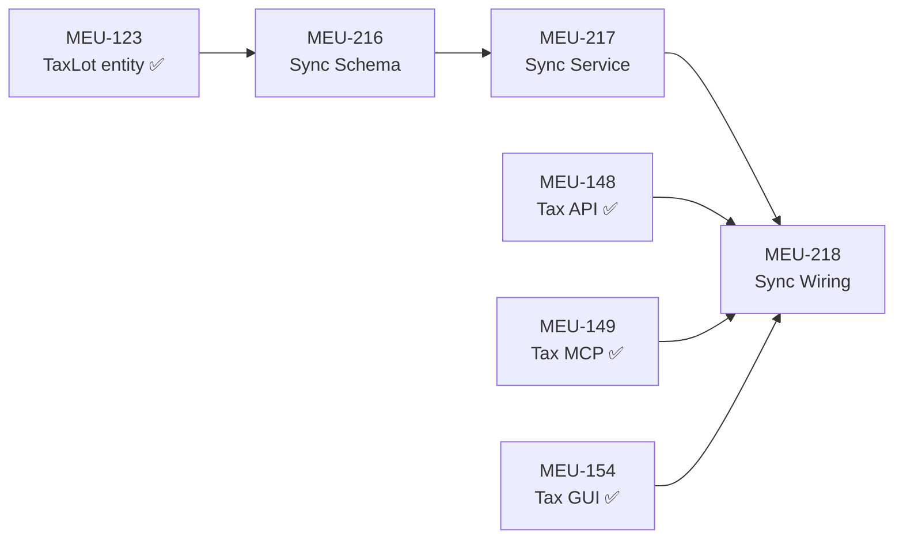

# Phase 3F: Tax Data Sync — Trade-to-Lot Materialization

> Part of [P3 — Tax Estimation](../BUILD_PLAN.md#p3--tax-estimation) | Tag: `tax-sync`
>
> Implements the **Derived Entity with Provenance Tracking** pattern to bridge
> `trade_executions` (source of truth) → `tax_lots` (derived domain entity).
>
> Architecture decision: [derived-data-architecture-research.md](../../_inspiration/derived-data-architecture-research.md)
>
> Mandatory standard: **G25** ([emerging-standards.md](../../.agent/docs/emerging-standards.md#g25)) —
> Multi-Surface Feature Parity Verification applies to ALL MEUs in this spec.

---

## Problem Statement

The Tax GUI, API, and MCP tools all consume `tax_lots` — but lots do not exist
until they are **materialized from trades**. Without a sync pipeline:

- Tax Dashboard shows empty summary cards
- Lot Viewer has no lots to display
- What-If Simulator cannot find open positions
- Wash Sale Monitor has nothing to scan

> [!CAUTION]
> **Origin of this spec:** During Phase 3E delivery, all 8 MCP tax tools were verified as
> functional via `zorivest_tax()` calls, yet the Tax GUI remained completely empty.
> The root cause: no materialization pipeline existed to create `tax_lots` from
> `trade_executions`. MCP returned valid empty responses (200 OK, zero lots), which
> passed smoke tests — but the GUI visually exposed the gap. This spec exists to close
> that gap AND to prevent the same class of failure via **G25 parity testing**.

---

## Architecture: Option C — Derived Entity with Provenance

> **Selected after 17-source research synthesis.** See architecture decision document
> for full Option A/B/C analysis and consensus matrix.

```
                    user clicks "Sync"
[Trades] ──────────────────────────────→ [Sync Service]
                                              │
                                    ┌─────────┴─────────┐
                                    │  Merge Logic:      │
                                    │  • New lots → create│
                                    │  • Changed source  │
                                    │    → flag conflict  │
                                    │  • User-modified   │
                                    │    → preserve       │
                                    └─────────┬─────────┘
                                              │
                                        [TaxLots table]
                                         (with provenance)
                                              ↕
                                    [Tax GUI / MCP / API]
```

### Key Properties

| Property | Value |
|----------|-------|
| Trigger | User-initiated ("Process Tax Lots" button, API call, or MCP action) |
| Strategy | Incremental merge — not full rebuild |
| User edits | Preserved across re-syncs via `is_user_modified` flag |
| Conflict detection | SHA-256 hash of source trade data (`source_hash`) |
| Conflict resolution | Configurable: `flag` (default), `auto_resolve`, `block` |
| Concurrency | WAL mode — readers never block writer; API serializes writes |
| Idempotency | Re-running sync is always safe — produces same result |
| Dry-run | Not needed — `flag` mode is inherently non-destructive; sync report documents all changes |

### Known Issues Cross-References

| Issue ID | Impact on Tax Sync | Resolution |
|----------|-------------------|------------|
| [STUB-RETIRE] | `StubTaxService` must NOT be used for sync wiring — real `TaxService` required | MEU-218 depends on real service, not stub |
| [TAX-PROFILE-BLOCKED] | Sync service does NOT depend on TaxProfile CRUD (MEU-148a) | No blocker — sync reads trades, not profile |

---

## MEU-216: Sync Schema Migration

### Schema Changes

```sql
ALTER TABLE tax_lots ADD COLUMN materialized_at TEXT;
ALTER TABLE tax_lots ADD COLUMN is_user_modified INTEGER DEFAULT 0;
ALTER TABLE tax_lots ADD COLUMN source_hash TEXT;
ALTER TABLE tax_lots ADD COLUMN sync_status TEXT DEFAULT 'synced';
```

### Entity + Model Updates

Add to `TaxLot` entity and `TaxLotModel`:

| Field | Type | Default | Purpose |
|-------|------|---------|---------|
| `materialized_at` | `Optional[str]` | `None` | ISO timestamp of last sync |
| `is_user_modified` | `bool` / `Integer` | `False` / `0` | User override protection flag |
| `source_hash` | `Optional[str]` | `None` | SHA-256 of source trade data |
| `sync_status` | `str` | `"synced"` | `synced` / `conflict` / `orphaned` |

### Settings Key

| Key | Type | Default | Validation |
|-----|------|---------|------------|
| `tax.conflict_resolution` | `str` | `"flag"` | Enum: `flag`, `auto_resolve`, `block` |

### MEU-216 Acceptance Criteria (TDD — write tests FIRST)

| AC | Assertion | Test Type |
|----|-----------|-----------|
| AC-216-1 | `TaxLot` entity has all 4 provenance fields with correct defaults | Unit |
| AC-216-2 | `TaxLotModel` round-trips provenance fields to/from SQLite | Unit¹ |
| AC-216-3 | New `TaxLot` defaults: `sync_status='synced'`, `is_user_modified=False` | Unit |
| AC-216-4 | `SettingsRegistry` has `tax.conflict_resolution` key, validates enum, defaults to `'flag'` | Unit |
| AC-216-5 | Setting rejects invalid values (e.g., `"merge"`) with validation error | Unit |
| AC-216-6 | Migration is idempotent — running twice doesn't error | Unit¹ |

> ¹ AC-216-2 and AC-216-6 use in-memory SQLite (`sqlite:///:memory:`) and are self-contained without requiring full infrastructure setup. They are classified Unit rather than Integration because the test boundary matches the provided infra (in-process SQLite, no external services).

---

## MEU-217: Sync Service

### Core Method: `TaxService.sync_lots()`

```python
def sync_lots(
    self,
    account_id: Optional[str] = None,
    conflict_strategy: Optional[str] = None,
) -> SyncReport:
    """
    Materialize tax lots from trade executions.

    Algorithm:
    1. Load all BOT trades (optionally filtered by account_id)
    2. For each trade, compute source_hash = SHA-256(trade fields)
    3. Match against existing tax_lots by linked_trade_ids:
       a. No existing lot → CREATE new lot
       b. Existing lot, same hash → SKIP (unchanged)
       c. Existing lot, different hash:
          - If is_user_modified=True → PRESERVE (flag in report)
          - If conflict_strategy='flag' → SET sync_status='conflict'
          - If conflict_strategy='auto_resolve' → UPDATE from source
          - If conflict_strategy='block' → ABORT entire sync
       d. Existing lot with no matching trade → FLAG as orphaned
    4. Match SLD trades to open lots using configured cost_basis_method
    5. Return SyncReport with counts and conflict details
    """
```

### Response Shapes

```python
@dataclass
class SyncReport:
    lots_created: int
    lots_updated: int
    lots_unchanged: int
    lots_flagged_conflict: int
    lots_orphaned: int
    conflicts: list[SyncConflict]
    materialized_at: str          # ISO timestamp
    account_filter: Optional[str]
    conflict_strategy_used: str

@dataclass
class SyncConflict:
    lot_id: str
    ticker: str
    field: str
    current_value: Any
    source_value: Any
    is_user_modified: bool
    resolution: str  # preserved | updated | flagged
```

### Source Hash Computation

```python
def _compute_source_hash(self, trade) -> str:
    payload = json.dumps({
        "exec_id": trade.exec_id,
        "ticker": trade.instrument,
        "action": trade.action.value,
        "quantity": float(trade.quantity),
        "price": float(trade.price),
        "time": trade.time.isoformat() if trade.time else None,
        "account_id": trade.account_id,
    }, sort_keys=True)
    return hashlib.sha256(payload.encode()).hexdigest()
```

### Conflict Resolution Strategies

| Strategy | Behavior | User-Modified Lots | Source-Changed Lots | Data Loss Risk |
|----------|----------|-------------------|--------------------|----|
| **`flag`** (default) | Non-destructive; marks conflicts for review | Preserved | `sync_status='conflict'` | None |
| `auto_resolve` | Aggressive; overwrites from source | **Preserved** (`is_user_modified` check precedes strategy — see algorithm step 3c) | Updated | None for user edits; source overrides applied |
| `block` | Conservative; rejects entire sync | Untouched | Untouched | None |

### MEU-217 Acceptance Criteria (TDD — write tests FIRST)

| AC | Assertion | Test Type |
|----|-----------|-----------|
| AC-217-1 | Seeded BOT trades → `sync_lots()` → `lots_created` matches trade count | Unit |
| AC-217-2 | Double sync → second returns `lots_created=0`, `lots_unchanged>0` (idempotent) | Unit |
| AC-217-3 | Modified trade + `flag` strategy → lot gets `sync_status='conflict'` | Unit |
| AC-217-4 | Modified trade + `auto_resolve` → lot updated from source, hash updated | Unit |
| AC-217-5 | Modified trade + `block` → `SyncAbortError` raised, no DB changes | Unit |
| AC-217-6 | `is_user_modified=True` lot preserved regardless of strategy | Unit |
| AC-217-7 | Trade deleted → sync → lot gets `sync_status='orphaned'` | Unit |
| AC-217-8 | `account_id` filter → only processes that account's trades | Unit |
| AC-217-9 | `SyncReport` has all fields populated with correct types | Unit |
| AC-217-10 | `_compute_source_hash()` is deterministic — same trade → same hash | Unit |

---

## MEU-218: Full-Stack Wiring

### API Endpoint

```python
class SyncTaxLotsRequest(BaseModel):
    model_config = ConfigDict(extra="forbid")
    account_id: Optional[str] = None
    conflict_strategy: Optional[Literal["flag", "auto_resolve", "block"]] = None

@tax_router.post("/sync-lots", status_code=200)
async def sync_tax_lots(
    body: SyncTaxLotsRequest = SyncTaxLotsRequest(),
    service = Depends(get_tax_service),
):
    report = service.sync_lots(
        account_id=body.account_id,
        conflict_strategy=body.conflict_strategy,
    )
    return TaxResponseEnvelope(data=report.__dict__, computed_at=datetime.utcnow())
```

### MCP Action

Add `sync` to `zorivest_tax` compound tool action enum + schema:

```typescript
case 'sync': {
  const res = await fetch(`${API_BASE}/tax/sync-lots`, {
    method: 'POST',
    headers: { 'Content-Type': 'application/json' },
    body: JSON.stringify({
      account_id: params.account_id,
      conflict_strategy: params.conflict_strategy,
    }),
  });
  return formatResponse(await res.json());
}

// Schema additions:
action: z.enum([..., 'sync']),
conflict_strategy: z.enum(['flag', 'auto_resolve', 'block']).optional()
  .describe('Override conflict resolution setting (default: use tax setting)'),
```

### GUI "Process Tax Lots" Button

```typescript
// TaxDashboard.tsx header
const syncMutation = useMutation({
  mutationFn: () => apiClient.post('/api/v1/tax/sync-lots'),
  onSuccess: (data) => {
    queryClient.invalidateQueries({ queryKey: ['tax'] });
    showSyncReport(data.data);
  },
  onError: (err) => { /* G15: surface error to user */ },
});

<Button
  onClick={() => syncMutation.mutate()}
  loading={syncMutation.isPending}
  variant="primary"
  data-testid="tax-sync-button"
>
  🔄 Process Tax Lots
</Button>
```

### MCP Annotations

| Key | Value | Rationale |
|-----|-------|-----------|
| `readOnlyHint` | `false` | Writes to `tax_lots` table |
| `destructiveHint` | `false` | `flag` mode is non-destructive |
| `idempotentHint` | `true` | Re-running produces same result |
| `toolset` | `tax` | Groups with existing tax actions |

### MEU-218 Acceptance Criteria (TDD — write tests FIRST)

| AC | Assertion | Test Type |
|----|-----------|-----------|
| AC-218-1 | `POST /api/v1/tax/sync-lots` → 200 + SyncReport shape | API integration |
| AC-218-2 | `POST /api/v1/tax/sync-lots` with `account_id` filter → 200 | API integration |
| AC-218-3 | `POST /api/v1/tax/sync-lots` with unknown field → 422 (`extra="forbid"`) | API integration |
| AC-218-4 | Response includes `TaxResponseEnvelope.disclaimer` | API integration |
| AC-218-5 | `zorivest_tax(action:"sync")` → returns SyncReport via MCP | MCP vitest |
| AC-218-6 | MCP Zod schema includes `conflict_strategy` optional param | MCP vitest |
| AC-218-7 | GUI: `data-testid="tax-sync-button"` is visible on Tax Dashboard | E2E Playwright |
| AC-218-8 | GUI: clicking sync button → loading state → success → cache invalidated | E2E Playwright |
| AC-218-9 | **PARITY**: after sync, `GET /tax/lots` count = MCP `get_tax_lots` count = GUI lot table row count | Cross-surface |
| AC-218-10 | **PARITY**: after sync, `GET /tax/ytd-summary` non-zero values = GUI dashboard card values | Cross-surface |

---

## Testing Strategy

> [!IMPORTANT]
> **Standard G25 applies.** Every surface (GUI, API, MCP) must be verified against the
> same seeded dataset. "MCP returns 200" is NOT sufficient — the GUI must visually render
> the data, and all three surfaces must agree on counts and values.

### TDD Protocol

Each MEU follows strict Red→Green→Refactor:

1. **Write FIC** with acceptance criteria (AC tables above)
2. **Write ALL tests** — every AC becomes ≥1 test assertion
3. **Run tests → RED** — save failure output as FAIL_TO_PASS evidence
4. **Implement** — just enough code to pass
5. **Run tests → GREEN**
6. **Refactor** — keep tests green
7. **Run quality gate**: `pytest -x`, `pyright`, `ruff check`

> Per **G19**: Never modify test assertions to make them pass. Fix the implementation.

### Cross-Surface Parity Test (Mandatory — AC-218-9, AC-218-10)

This is the key test that prevents the "MCP works but GUI is empty" failure:

```python
# tests/integration/test_tax_sync_parity.py

class TestTaxSyncSurfaceParity:
    """
    G25: Verify GUI, API, and MCP all produce equivalent results
    from the same underlying data after a sync operation.
    """

    def test_parity_lot_count(self, client, seeded_trades):
        """All 3 surfaces report the same lot count after sync."""
        # Step 1: Sync via API
        sync_resp = client.post("/api/v1/tax/sync-lots")
        lots_created = sync_resp.json()["data"]["lots_created"]
        assert lots_created > 0, "Sync must create lots from seeded trades"

        # Step 2: Query via API
        api_lots = client.get("/api/v1/tax/lots?status=open")
        api_count = len(api_lots.json()["data"]["lots"])

        # Step 3: Query via MCP-equivalent service call
        # (MCP calls the same API, so we verify the response shape)
        mcp_resp = client.get("/api/v1/tax/lots?status=open")
        mcp_count = len(mcp_resp.json()["data"]["lots"])

        # Step 4: All surfaces agree
        assert api_count == lots_created
        assert mcp_count == lots_created

    def test_parity_ytd_summary_nonzero(self, client, seeded_trades):
        """After sync, YTD summary returns non-zero values on all surfaces."""
        client.post("/api/v1/tax/sync-lots")

        summary = client.get("/api/v1/tax/ytd-summary").json()["data"]
        assert summary["trades_count"] > 0, \
            "YTD summary must show trades after sync — empty = GUI shows blanks"
```

### E2E Tests (Playwright — Wave 11 extension)

```typescript
// ui/tests/e2e/tax-sync.spec.ts

test.describe('Tax Sync — Process Tax Lots', () => {
  test('sync button visible on Tax Dashboard', async ({ page }) => {
    await page.goto('/tax');
    await expect(page.getByTestId('tax-sync-button')).toBeVisible();
  });

  test('clicking sync populates lot viewer', async ({ page }) => {
    // Seed trades via API first (E1: use Node fetch, not page.request)
    await seedTradesViaApi();

    await page.goto('/tax');
    await page.getByTestId('tax-sync-button').click();

    // Wait for sync completion
    await expect(page.getByTestId('tax-sync-button')).not.toHaveAttribute(
      'data-loading', 'true', { timeout: 10_000 }
    );

    // Navigate to lot viewer — must NOT be empty
    await page.getByTestId('tax-nav-lots').click();
    const rows = page.locator('[data-testid="tax-lot-row"]');
    await expect(rows).toHaveCount(/* matches seeded trade count */);
  });

  test('dashboard summary cards show non-zero after sync', async ({ page }) => {
    await seedTradesViaApi();
    await page.goto('/tax');
    await page.getByTestId('tax-sync-button').click();

    // Summary cards must show real values, not zeros
    const stGainCard = page.getByTestId('summary-st-gains');
    await expect(stGainCard).not.toHaveText('$0');
  });
});
```

### Verification Commands

```bash
# MEU-216: Schema
uv run pytest tests/ -k "tax_lot_provenance or tax_sync_schema" -v \
  *> C:\Temp\zorivest\pytest-216.txt

# MEU-217: Sync service
uv run pytest tests/ -k "tax_sync" -v \
  *> C:\Temp\zorivest\pytest-217.txt

# MEU-218: Wiring + Parity
uv run pytest tests/ -k "tax_sync_parity or tax_sync_api" -v \
  *> C:\Temp\zorivest\pytest-218.txt

# E2E (local only — per E2E-ELECTRONLAUNCH)
npx playwright test ui/tests/e2e/tax-sync.spec.ts

# MCP tool tests
npx vitest run --grep "tax.*sync" \
  *> C:\Temp\zorivest\vitest-mcp.txt

# Full quality gate
uv run python tools/validate_codebase.py --scope meu \
  *> C:\Temp\zorivest\validate-meu.txt
```

---

## Exit Criteria

> [!CAUTION]
> **No surface may be left unverified.** This spec exists because MCP verification alone
> missed the empty GUI. Every exit criterion below must have evidence (test output or screenshot).

### Per-Surface Gates

| Surface | Gate | Evidence Required |
|---------|------|-------------------|
| **API** | `POST /api/v1/tax/sync-lots` returns `SyncReport` with `lots_created > 0` from seeded trades | pytest output |
| **API** | `GET /api/v1/tax/lots` returns populated lots after sync | pytest output |
| **API** | Unknown fields rejected with 422 | pytest output |
| **MCP** | `zorivest_tax(action:"sync")` returns `SyncReport` | vitest output |
| **MCP** | `zorivest_tax(action:"lots")` returns populated lots after sync | vitest output |
| **GUI** | "Process Tax Lots" button visible (`data-testid="tax-sync-button"`) | E2E or screenshot |
| **GUI** | After sync: Tax Lot Viewer shows populated table (not empty state) | E2E or screenshot |
| **GUI** | After sync: Dashboard summary cards show non-zero values | E2E or screenshot |

### Parity Gates (G25)

| Gate | Assertion |
|------|-----------|
| **Lot count parity** | API lot count = MCP lot count = GUI table row count (from same sync) |
| **Summary parity** | API `ytd-summary.trades_count` > 0 when GUI shows non-zero summary cards |
| **Idempotency** | Re-sync via any surface produces `lots_created=0, lots_unchanged>0` |

### Quality Gates

| Gate | Command |
|------|---------|
| All tests pass | `uv run pytest tests/ -k "tax_sync" -v` |
| Type check clean | `uv run pyright packages/core/ packages/infrastructure/` |
| Lint clean | `uv run ruff check packages/` |
| No placeholders | `rg "TODO\|FIXME\|NotImplementedError" packages/ --count` = 0 |
| MEU gate | `uv run python tools/validate_codebase.py --scope meu` |

---

## Dependency Graph



---

## Concurrency Matrix

| Scenario | Behavior |
|----------|----------|
| GUI reads lots **while** MCP triggers sync | WAL: reader sees pre-sync snapshot, no blocking |
| Two MCP agents call sync simultaneously | API serializes writes — second sync waits for first to commit |
| Import adds trades **while** GUI views lots | Lots stay stale until next sync — user sees `materialized_at` timestamp |
| User edits lot basis method **during** sync | Sync preserves `is_user_modified` lots — no conflict |

---

## Consumer Notes

- **Tax Dashboard**: [06g-gui-tax.md](06g-gui-tax.md) — "Process Tax Lots" button added to header
- **Tax Settings**: [06f-gui-settings.md](06f-gui-settings.md) — `tax.conflict_resolution` setting (3-way radio)
- **MCP tools**: [05h-mcp-tax.md](05h-mcp-tax.md) — `zorivest_tax(action:"sync")` new action
- **API routes**: [04f-api-tax.md](04f-api-tax.md) — `POST /api/v1/tax/sync-lots` new endpoint
- **Architecture**: [derived-data-architecture-research.md](../../_inspiration/derived-data-architecture-research.md)
- **Testing standard**: [G25 — Multi-Surface Parity](../../.agent/docs/emerging-standards.md#g25) — mandatory for this spec
