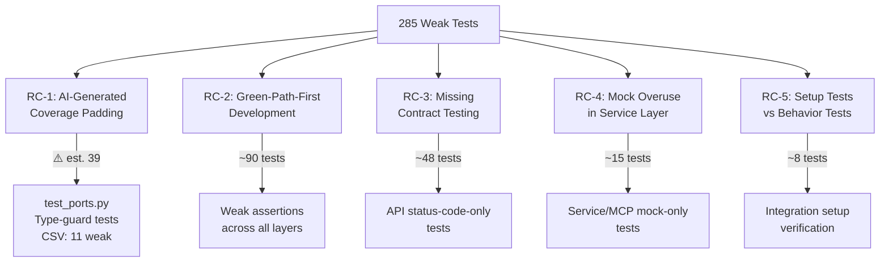

# Phase 1 IR-5 Pattern Analysis

> **Scope:** 1,469 tests audited · 71 🔴 · 214 🟡 · 1,184 🟢 · **19.4% weak**

> [!WARNING]
> **This document uses preliminary estimates** from sequential-thinking analysis, not final CSV-extracted counts. Per-file counts (e.g., `test_ports.py` listed as 39 weak here vs 11 in the CSV) reflect the initial Codex heuristic audit, which used broader criteria than the Opus manual re-audit. **For execution and prioritization, use:**
> - Canonical per-file counts: `phase1-ir5-per-test-ratings.csv`
> - Canonical task list: `docs/execution/plans/2026-03-16-ir5-test-corrections/task.md`

---

## Anti-Pattern Taxonomy

Seven distinct anti-patterns emerge from the 285 weak tests, grouped into three 🔴 and four 🟡 patterns.

### 🔴 Red Anti-Patterns (71 tests)

| # | Anti-Pattern | Count | Top Files | Reason String |
|:-:|-------------|------:|-----------|---------------|
| R1 | **Type-Guard Tests** | ⚠️ ≈45 | `test_ports.py` (⚠️ est. 22), `test_trade_model.py`, `test_provider_registry.py` | "type or presence checks only without value assertions" |
| R2 | **Status-Code Only** | ≈18 | `test_trade_api.py`, `test_settings_api.py`, `test_backup_api.py` | "status-code assertion without response body verification" |
| R3 | **No-Op Verification** | ≈8 | `test_step_registry.py`, `test_market_provider_settings_repo.py` | "trivially weak structure (private patch or no assertions)" |

### 🟡 Yellow Anti-Patterns (214 tests)

| # | Anti-Pattern | Count | Top Files | Reason String |
|:-:|-------------|------:|-----------|---------------|
| Y1 | **Weak Assertions** | ⚠️ ≈90 | `test_policy_validator.py` (⚠️ est. 22), `test_ports.py` (⚠️ est. 17), `test_logging_config.py` | "right target, but weak assertions only" |
| Y2 | **Private State Coupling** | ≈50 | `test_trade_model.py`, `test_config_export.py`, `test_backup_manager.py` | "couples to private or internal state" |
| Y3 | **Status-Code Overlap** | ≈30 | `test_market_data_api.py`, `test_trade_api.py` | "status-code assertion without response body verification" |
| Y4 | **Mock-Only Structure** | ≈15 | MCP `confirmation.test.ts`, UI `CommandPalette.test.tsx` | "weak structural or mock-only assertions" |

---

## Concentration Heatmap

Weakness is **not** evenly distributed. Five files account for the highest concentration of weak tests (⚠️ counts below are preliminary estimates; see CSV for canonical values):

| File | 🔴 | 🟡 | Total Weak | % of File |
|------|:---:|:---:|:----------:|:---------:|
| `test_ports.py` | 22 | 17 | **39** | ~65% |
| `test_policy_validator.py` | 0 | 22 | **22** | ~55% |
| `test_trade_api.py` | 8 | 8 | **16** | ~40% |
| `test_trade_model.py` | 5 | 8 | **13** | ~35% |
| `test_logging_config.py` | 1 | 8 | **9** | ~35% |

> [!IMPORTANT]
> Fixing just these 5 files would address a large share of all weak tests (⚠️ "99 of 285" is an estimate — see CSV for canonical per-file counts).

> [!NOTE]
> The counts in this heatmap were derived from sequential-thinking analysis estimates, not from the final CSV extraction. The canonical per-file counts are in `phase1-ir5-per-test-ratings.csv`. For example, the CSV shows `test_ports.py` at 11 weak (8🔴 + 3🟡), not 39. The discrepancy arises because the initial Codex heuristic audit used broader criteria to flag tests, while the Opus manual re-audit applied stricter IR-5 standards. Use the CSV for prioritization.

---

## Root Cause Analysis



| Root Cause | Description | Impact |
|-----------|-------------|--------|
| **RC-1:** AI-Generated Coverage Padding | Tests written to inflate count, not verify behavior. `test_ports.py` has `test_trade_id_is_string` — verifies type, not value. | ⚠️ est. 39 tests (CSV: 11 weak) |
| **RC-2:** Green-Path-First Development | Tests prove "it returns something" but not "the right thing." Common in TDD where impl wasn't finalized yet. | ~90 tests (32%) |
| **RC-3:** Missing API Contract Testing | API tests verify reachability (status codes) without checking response schema or field values. | ~48 tests (17%) |
| **RC-4:** Mock Overuse in Service Layer | Service tests mock all deps, assert `called()` but not `called_with(exact_args)`. Can't detect wrong data flow. | ~15 tests (5%) |
| **RC-5:** Setup-vs-Behavior Confusion | Integration tests verify "repos exist" or "connection works" without testing round-trip behavior. | ~8 tests (3%) |

---

## Remediation Strategy

### Tier 1: Quick Wins (≈100 tests, ~4–6 hours)

| Action | Tests | Effort | Anti-Patterns Addressed |
|--------|------:|--------|------------------------|
| **Port/Domain type → value tests** | ⚠️ est. 39 (CSV: 11) | 1–2h | R1, Y1 in `test_ports.py` |
| **API status-code → contract tests** | ⚠️ est. 30 | 2–3h | R2, Y3 |
| **Infra type-guard → value tests** | ⚠️ est. 15 | 1h | R1 scattered |
| **No-op → idempotency verification** | ⚠️ est. 8 | 30min | R3 |

### Tier 2: Systematic Strengthening (≈140 tests, ~8–12 hours)

| Action | Tests | Effort | Anti-Patterns Addressed |
|--------|------:|--------|------------------------|
| **Tighten weak assertions** | ⚠️ est. 90 | 4–6h | Y1 across all layers |
| **Decouple private-state tests** | ⚠️ est. 50 | 4–6h | Y2 |

### Tier 3: Structural Changes (≈45 tests, ~4–6 hours)

| Action | Tests | Effort | Anti-Patterns Addressed |
|--------|------:|--------|------------------------|
| **Service mock → behavioral verification** | ⚠️ est. 15 | 2–3h | Y4, RC-4 |
| **MCP/UI mock assertion strengthening** | ⚠️ est. 15 | 2–3h | Y4 |

---

## Implementation Approach

### Opportunistic Upgrades (Recommended)
When an MEU touches code covered by a weak test, upgrade that test as part of the MEU scope. Add an IR-5 line to each MEU's acceptance criteria:

```
AC-IR5: Tests touching {module} rated 🔴/🟡 upgraded to 🟢
```

### Dedicated Hardening Sprints
Schedule focused sessions at phase gates:

| Phase Gate | Target Files | Expected Upgrades |
|-----------|-------------|:-----------------:|
| Phase 6 end | `test_ports.py`, `test_trade_model.py` | ⚠️ est. 52 → 🟢 |
| Phase 7 end | `test_trade_api.py`, `test_settings_api.py` | ⚠️ est. 24 → 🟢 |
| Phase 8 end | `test_policy_validator.py`, logging tests | ⚠️ est. 31 → 🟢 |

### Prevention Measures

1. **AGENTS.md Anti-Pattern Examples** — Add concrete do/don't code snippets for each anti-pattern
2. **Mutation Testing (Advisory)** — Add `mutmut` to quality gate advisory checks
3. **IR-5 Metric Tracking** — Track `weak_test_ratio` alongside coverage in metrics table
4. **Mandatory Re-Audit** — Run IR-5 re-audit after each phase gate on modified test files

---

## Appendix: Anti-Pattern Code Examples

### R1: Type-Guard → Value Test

```diff
 # ❌ Red: Type-guard only
 def test_trade_id_is_string(self):
-    assert isinstance(TradeId("ABC123"), str)
+    # ✅ Green: Value assertion
+    tid = TradeId("ABC123")
+    assert tid == "ABC123"
+    assert str(tid) == "ABC123"
```

### R2: Status-Code → Contract Test

```diff
 # ❌ Red: Status-code only
 def test_get_trade_404(self, client):
     resp = client.get("/trades/nonexistent")
-    assert resp.status_code == 404
+    # ✅ Green: Contract test
+    assert resp.status_code == 404
+    body = resp.json()
+    assert body["detail"] == "Trade not found"
```

### Y1: Weak → Strong Assertion

```diff
 # 🟡 Yellow: Weak assertion
 def test_list_backups(self, manager):
     backups = manager.list_backups()
-    assert len(backups) > 0
+    # 🟢 Green: Exact assertion
+    assert len(backups) == 3
+    assert backups[0].name == "expected_backup_name"
```

### Y2: Private State → Public Interface

```diff
 # 🟡 Yellow: Couples to private state
 def test_is_portable_false_for_sensitive(self):
-    assert not registry._is_portable("api_key")
+    # 🟢 Green: Test via public interface
+    export = build_export(registry)
+    assert "api_key" not in export
```
