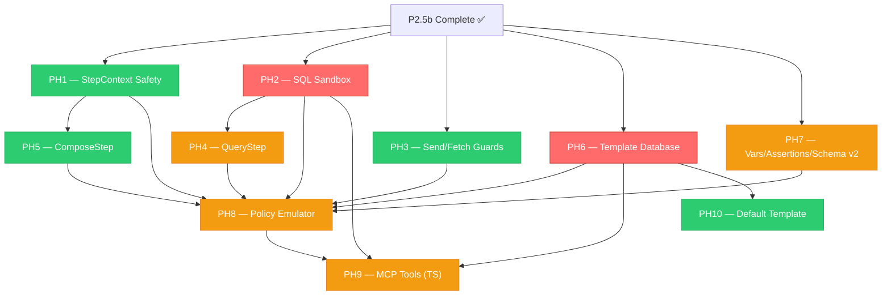

# P2.5c — Pipeline Security Hardening Analysis

> 10 MEUs · ~93 Python tests + TypeScript MCP tools · 3 new dependencies
> Spec docs: [09c](file:///p:/zorivest/docs/build-plan/09c-pipeline-security-hardening.md), [09d](file:///p:/zorivest/docs/build-plan/09d-pipeline-step-extensions.md), [09e](file:///p:/zorivest/docs/build-plan/09e-template-database.md), [09f](file:///p:/zorivest/docs/build-plan/09f-policy-emulator.md), [05g](file:///p:/zorivest/docs/build-plan/05g-mcp-scheduling.md)

---

## MEU Inventory

| MEU | Slug | Spec | Core Deliverable | Tests | Complexity |
|:---:|------|------|-----------------|:-----:|:----------:|
| PH1 | `stepcontext-safety` | 09c §9C.1 | `safe_copy.py` — Secret type + safe_deepcopy + StepContext isolation | 9 | 🟢 Low |
| PH2 | `sql-sandbox` | 09c §9C.2 | `sql_sandbox.py` — 6-layer read-only enforcement, AST allowlist, callsite migration | 20 | 🔴 High |
| PH3 | `send-fetch-guards` | 09c §9C.3–4 | SendStep confirmation gate, FetchStep MIME/size/fan-out caps | 6 | 🟢 Low |
| PH4 | `query-step` | 09d §9D.1 | QueryStep — read-only SQL via SqlSandbox, named binds, ref support | 8 | 🟡 Med |
| PH5 | `compose-step` | 09d §9D.2 | ComposeStep — multi-source merging, dict_merge / array_concat | 5 | 🟢 Low |
| PH6 | `template-database` | 09e | EmailTemplateModel + repo + HardenedSandbox + nh3 + SendStep DB lookup | 17 | 🔴 High |
| PH7 | `policy-vars-assertions` | 09d §9D.3–6 | Variables + assertion gates + step-count cap + schema v2 migration | 11 | 🟡 Med |
| PH8 | `policy-emulator` | 09f | 4-phase emulator (PARSE→VALIDATE→SIMULATE→RENDER), output containment | 15 | 🟡 Med |
| PH9 | `emulator-mcp-tools` | 05g | 11 MCP tools + 4 resources (TypeScript) | TS | 🟡 Med |
| PH10 | `default-template` | 09e §9E.6 | Morning Check-In default template seed | 2 | 🟢 Low |

---

## Dependency Graph

**Critical path:** PH2 → PH4 → PH8 → PH9 (SQL sandbox is the gating dependency)

---

## New Dependencies Required

| Package | Version | Size | Required By | Purpose |
|---------|---------|------|-------------|---------|
| `sqlglot` | latest | ~2 MB | PH2 | SQL AST parsing + allowlist validation |
| `nh3` | latest | ~0.5 MB | PH6 | Rust-based HTML sanitization (replaces bleach) |
| `markdown-it-py` | latest | ~0.3 MB | PH6 | CommonMark Markdown → HTML rendering |

---

## File Impact Map

### New Files (14)

| File | MEU | Layer |
|------|-----|-------|
| `packages/core/.../safe_copy.py` | PH1 | Core |
| `packages/core/.../services/sql_sandbox.py` | PH2 | Core |
| `packages/core/.../pipeline_steps/query_step.py` | PH4 | Core |
| `packages/core/.../pipeline_steps/compose_step.py` | PH5 | Core |
| `packages/core/.../ports/email_template_port.py` | PH6 | Core |
| `packages/core/.../services/secure_jinja.py` | PH6 | Core |
| `packages/core/.../services/safe_markdown.py` | PH6 | Core |
| `packages/infra/.../persistence/email_template_repository.py` | PH6 | Infra |
| `alembic/versions/xxxx_add_email_templates_table.py` | PH6 | Infra |
| `packages/core/.../services/policy_emulator.py` | PH8 | Core |
| `packages/core/.../services/emulator_budget.py` | PH8 | Core |
| `packages/core/.../services/emulator_models.py` | PH8 | Core |
| `mcp-server/src/tools/pipeline-security-tools.ts` | PH9 | MCP |
| `alembic/versions/xxxx_seed_morning_checkin.py` | PH10 | Infra |

### Modified Files (~15)

| File | MEUs | Changes |
|------|------|---------|
| `pipeline.py` (PolicyDocument) | PH1, PH3, PH7 | Secret type, confirmation_required, variables, step-cap |
| `pipeline_runner.py` | PH1, PH2 | safe_deepcopy wrapping, sandbox injection |
| `send_step.py` | PH3, PH6 | Confirmation gate, DB template lookup |
| `fetch_step.py` | PH3 | MIME allowlist, size cap, fan-out cap |
| `step_registry.py` | PH4, PH5 | Register new step types |
| `ref_resolver.py` | PH7 | `{"var": "name"}` resolution |
| `transform_step.py` | PH7 | `kind: assertion` discriminator |
| `policy_validator.py` | PH2, PH7 | Sandbox reference validation, schema v2 gates |
| `models.py` | PH6 | EmailTemplateModel |
| `unit_of_work.py` | PH6 | email_templates repo |
| `pyproject.toml` | PH2, PH6 | New dependencies |
| `scheduling-tools.ts` | PH9 | New MCP tools |

---

## Critical Design Decisions (From Spec)

> [!IMPORTANT]
> These are **settled decisions** from the spec documents — no human gates needed.

1. **SQL Sandbox PRIMARY control is `set_authorizer()`** — C-level callback, not PRAGMA-only. `mode=ro` and `query_only=ON` are defense-in-depth layers 2+3.
2. **`sqlglot` for AST allowlist** — structural validation, not regex/string matching.
3. **`ImmutableSandboxedEnvironment`** for Jinja2 — not vanilla `SandboxedEnvironment`. SSTI → RCE is a one-shot compromise.
4. **Output containment via SHA-256 hash** — emulator RENDER phase returns hashes, never raw content to MCP. 4 KiB MCP payload cap.
5. **Schema v2 is opt-in per policy** — no automatic migration. `model_validator` rejects v2 features with v1 version.
6. **SendStep confirmation gate** — `confirmation_required: true` default on all SendSteps. Pipeline runner pauses for human-in-the-loop.
7. **FetchStep caps** — 10 MB per response, 5 URLs per step, MIME allowlist (JSON/HTML/XML/CSV/text only).

---

## Known Issues Resolved by P2.5c

| Issue ID | Description | Resolved By |
|----------|-------------|-------------|
| PIPE-NOLOCALQUERY | No way to query internal DB from pipeline | PH4 (QueryStep) |
| PIPE-NOTEMPLATEDB | Templates hardcoded in Python | PH6 (Template Database) |
| PIPE-NOCOMPOSE | No multi-source data merging | PH5 (ComposeStep) |
| PIPE-NOVARS | No parameterized policies | PH7 (Variables) |
| PIPE-NOASSERT | No pre-send data validation | PH7 (Assertion Gates) |

---

## Recommended Execution Plan

### Session 1 — Security Primitives (PH1 + PH2 + PH3)

> **Theme:** Establish all security boundaries before building on them.
> **Tests:** 35 · **Risk:** 🔴 Heavy (PH2 callsite migration)

| MEU | Key Work | Effort |
|-----|----------|--------|
| PH1 | `safe_copy.py`, `Secret` type, `safe_deepcopy()`, StepContext wrapping | ~1h |
| PH2 | `sql_sandbox.py`, 6-layer enforcement, `sqlglot` AST allowlist, callsite migration (4 files) | ~3h |
| PH3 | SendStep `confirmation_required`, FetchStep MIME/size/fan-out validators | ~1h |

**Why this grouping:** All three are security primitives with no cross-dependencies. PH2 is the riskiest MEU — failing fast here prevents cascading issues in PH4/PH8. Shipping them together means "security is on or off" — no partial state.

---

### Session 2 — Pipeline Capabilities (PH4 + PH5 + PH6 + PH7)

> **Theme:** Extend the pipeline with new step types, template infrastructure, and schema evolution.
> **Tests:** 41 · **Risk:** 🔴 Heavy (PH6 spans core+infra+migration)

| MEU | Key Work | Effort |
|-----|----------|--------|
| PH4 | `query_step.py`, SqlSandbox integration, ref binds, fan-out cap | ~1.5h |
| PH5 | `compose_step.py`, dict_merge/array_concat, deep-copy isolation | ~45m |
| PH6 | EmailTemplateModel, repo, UoW, HardenedSandbox, safe_markdown, SendStep DB lookup, Alembic | ~3h |
| PH7 | PolicyDocument `variables`, RefResolver `{"var":...}`, TransformStep assertion kind, step-count cap, schema v2 migration | ~2h |

**Why this grouping:** PH4+PH5 are pure step extensions (natural pair). PH6 builds template infrastructure that PH8 needs. PH7's schema v2 migration gates the new step types. All four must land before the emulator can work.

> [!WARNING]
> **Session 2 is the largest session (4 MEUs, 41 tests).** If velocity is a concern, split into:
> - Session 2a: PH4 + PH5 + PH7 (step extensions, 24 tests)
> - Session 2b: PH6 (template database, 17 tests)

---

### Session 3 — Emulator + MCP Integration (PH8 + PH9 + PH10)

> **Theme:** Capstone — the emulator ties everything together, MCP exposes it.
> **Tests:** ~20 Python + TypeScript · **Risk:** 🟡 Medium

| MEU | Key Work | Effort |
|-----|----------|--------|
| PH8 | `policy_emulator.py` — 4-phase engine, budget containment, mock data injection, output hashing | ~2.5h |
| PH9 | 11 MCP tools + 4 resources in TypeScript, REST endpoints for template/schema/provider CRUD | ~2h |
| PH10 | Morning Check-In default template seed (Alembic migration) | ~30m |

**Why this grouping:** PH8 is the emulator that validates everything built in Sessions 1+2. PH9 wraps it for MCP consumption. PH10 seeds the default template that demonstrates the full v2 pipeline. Natural capstone.

> [!NOTE]
> PH9 crosses the Python→TypeScript language boundary. The MCP tools are thin REST proxies — the complexity is in the Python backend routes, not the TS layer.

---

## Session Summary Table

| Session | MEUs | Tests | New Deps | Risk | Theme |
|:-------:|:----:|:-----:|:--------:|:----:|-------|
| **S1** | PH1 + PH2 + PH3 | 35 | `sqlglot` | 🔴 | Security Primitives |
| **S2** | PH4 + PH5 + PH6 + PH7 | 41 | `nh3`, `markdown-it-py` | 🔴 | Pipeline Capabilities |
| **S3** | PH8 + PH9 + PH10 | ~20 + TS | — | 🟡 | Emulator + MCP |

**Total estimated effort:** 3 sessions × 4-6 hours = 12-18 hours of implementation
