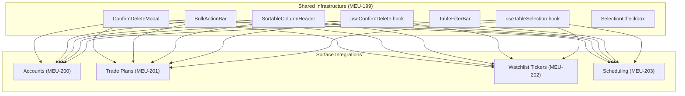
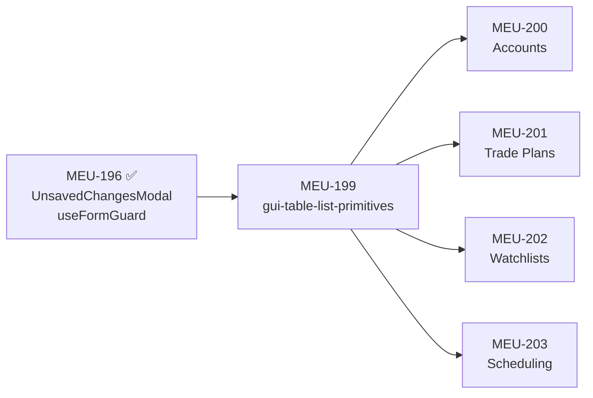

# GUI Table & List Enhancements — Project Proposal

> **Priority**: P2.2 — GUI Table & List UX Standardization  
> **Depends on**: MEU-196/197/198 ✅ (GUI UX Hardening — `useFormGuard`, `UnsavedChangesModal`)  
> **Source**: User request (2026-05-03) + UX research  
> **Build Plan Phase**: 6 (GUI)

---

## 1. Problem Statement

Across the Zorivest GUI, deletion operations lack confirmation dialogs, tables/lists have inconsistent filtering/sorting implementations (some manual `useMemo`, some ad-hoc), and there is no multi-select/bulk-action capability. This creates three UX gaps:

| Gap | Risk | Affected Surfaces |
|-----|------|--------------------|
| **No delete confirmation** | Accidental data loss | All 6 CRUD surfaces |
| **No bulk actions** | Tedious one-by-one deletion | All 6 list/table surfaces |
| **Inconsistent filter/sort** | Cognitive load switching between modules | 5 surfaces (Trades already has TanStack) |

---

## 2. UX Research Summary

### 2.1 Deletion Confirmation (Industry Standard)

> [!IMPORTANT]
> **Mandatory for all destructive actions.** WCAG 2.1 AA requires confirmation for irreversible operations.

**Pattern**: Modal dialog with:
- Clear description of what will be deleted  
- Item count for bulk operations ("Delete 5 accounts?")
- Cancel (default focus) + Confirm (red/destructive styling)
- Escape key dismisses (same as `UnsavedChangesModal`)

**Implementation**: Create `ConfirmDeleteModal` modeled after existing `UnsavedChangesModal` (portal-based, focus trap, WCAG compliant).

### 2.2 Multi-Select & Bulk Delete

**Research findings** (industry best practices 2025):

| Feature | Best Practice |
|---------|---------------|
| **Checkboxes** | Always visible in first column, not hover-only |
| **Select All** | Header checkbox selects current page only |
| **Action Bar** | Contextual toolbar appears when ≥1 row selected |
| **Count** | "{N} items selected" clearly displayed |
| **Confirmation** | Mandatory modal before bulk destructive actions |
| **Feedback** | Selected rows get subtle highlight (`rgba(99,102,241,0.08)`) |
| **Accessibility** | 24×24px min checkbox target, keyboard Tab navigation |

**Implementation**: TanStack Table built-in row selection (`getRowSelectionModel()`) + contextual `BulkActionBar` component.

### 2.3 Unified Filter/Sort

**Reference pattern**: [TradesTable.tsx](file:///p:/zorivest/ui/src/renderer/src/features/trades/TradesTable.tsx) + [TradesLayout.tsx](file:///p:/zorivest/ui/src/renderer/src/features/trades/TradesLayout.tsx)

| Feature | TradesTable Pattern |
|---------|---------------------|
| **Sorting** | TanStack `getSortedRowModel()` + clickable column headers with `▲▼` indicators |
| **Filtering** | Top-bar search input + category dropdowns, debounced |
| **Pagination** | TanStack `getPaginationRowModel()` with page size selector |

**Implementation**: Extract shared components from TradesTable and standardize across all surfaces.

---

## 3. Surfaces to Address

| # | Surface | Component(s) | Current State |
|---|---------|-------------|---------------|
| 1 | **Accounts** | `AccountsHome.tsx` | Manual sort/filter via `useMemo`; no delete confirmation; no multi-select |
| 2 | **Trade Plans** | `TradePlanPage.tsx` | Manual filter; no delete confirmation; no multi-select |
| 3 | **Watchlist Tickers** | `WatchlistTable.tsx`, `WatchlistPage.tsx` | Manual sort; no delete confirmation; no multi-select |
| 4 | **Report Policies** | `PolicyList.tsx`, `SchedulingLayout.tsx` | No filter/sort; no delete confirmation; no multi-select |
| 5 | **Email Templates** | `EmailTemplateList.tsx`, `SchedulingLayout.tsx` | No filter/sort; no delete confirmation; no multi-select |

> [!NOTE]
> **Trades** (`TradesTable.tsx`) already has TanStack sorting/filtering/pagination. It should receive the `ConfirmDeleteModal` addition but is **not** in scope for table migration. Recommend adding as a follow-up or including in MEU-199 infrastructure testing.

---

## 4. Component Architecture



### 4.1 New Shared Components

| Component | File | Purpose |
|-----------|------|---------|
| `ConfirmDeleteModal` | `components/ConfirmDeleteModal.tsx` | Portal-based delete confirmation dialog (single + bulk modes) |
| `useConfirmDelete` | `hooks/useConfirmDelete.ts` | State management for delete confirmation flow |
| `BulkActionBar` | `components/BulkActionBar.tsx` | Contextual toolbar: "{N} selected" + action buttons |
| `SortableColumnHeader` | `components/SortableColumnHeader.tsx` | Clickable column header with sort direction indicators |
| `TableFilterBar` | `components/TableFilterBar.tsx` | Search input + category dropdown filter row |
| `SelectionCheckbox` | `components/SelectionCheckbox.tsx` | Row/header checkbox with indeterminate state |
| `useTableSelection` | `hooks/useTableSelection.ts` | TanStack row selection state wrapper |

### 4.2 `ConfirmDeleteModal` API

```tsx
interface ConfirmDeleteModalProps {
    open: boolean
    /** Single item: { type: "account", name: "Schwab IRA" } */
    /** Bulk: { type: "trade plans", count: 5 } */
    target: { type: string; name?: string; count?: number }
    onCancel: () => void
    onConfirm: () => void
    /** Optional: show loading spinner while delete is in progress */
    isDeleting?: boolean
}
```

### 4.3 `useConfirmDelete` Hook API

```tsx
interface UseConfirmDeleteReturn {
    showModal: boolean
    target: DeleteTarget | null
    /** Call to initiate single-item delete confirmation */
    confirmSingle: (type: string, name: string, onConfirm: () => void) => void
    /** Call to initiate bulk delete confirmation */  
    confirmBulk: (type: string, count: number, onConfirm: () => void) => void
    /** Cancel handler (dismiss modal) */
    handleCancel: () => void
    /** Confirm handler (execute delete + dismiss) */
    handleConfirm: () => void
}
```

### 4.4 `BulkActionBar` API

```tsx
interface BulkActionBarProps {
    selectedCount: number
    itemType: string   // "accounts" | "trade plans" | etc.
    onDelete: () => void
    /** Future: additional bulk actions */
    actions?: { label: string; onClick: () => void; icon?: ReactNode }[]
}
```

---

## 5. MEU Breakdown

### MEU-199: `gui-table-list-primitives` — Shared Infrastructure

> **Matrix Item**: 35l  
> **Depends on**: MEU-196 ✅  
> **Unblocks**: MEU-200, MEU-201, MEU-202, MEU-203

| Deliverable | Description |
|-------------|-------------|
| `ConfirmDeleteModal.tsx` | Delete confirmation dialog (single + bulk modes), WCAG 2.1 AA |
| `useConfirmDelete.ts` | Hook for delete confirmation state management |
| `BulkActionBar.tsx` | Contextual action bar (selected count + delete button) |
| `SortableColumnHeader.tsx` | TanStack-compatible sortable header with `▲▼` indicators |
| `TableFilterBar.tsx` | Reusable search + category filter bar |
| `SelectionCheckbox.tsx` | Row/header checkbox with indeterminate state support |
| `useTableSelection.ts` | TanStack row selection state wrapper |
| `table-enhancements.css` | Styles for selection highlight, bulk bar, sort indicators |
| **Tests** | Vitest: ConfirmDeleteModal (open/close, single/bulk, escape, focus trap), useConfirmDelete (state transitions), BulkActionBar (visibility, count display) |

**Estimated size**: ~400 LOC components + ~200 LOC tests

---

### MEU-200: `gui-accounts-table-enhance` — Accounts

> **Matrix Item**: 35m  
> **Depends on**: MEU-199  

| Deliverable | Description |
|-------------|-------------|
| Account deletion confirmation | Wrap `handleDeleteAccount` with `useConfirmDelete` |
| Multi-select | Add row selection checkboxes to accounts table |
| Bulk delete | Wire `BulkActionBar` → batch `DELETE /api/v1/accounts/{id}` |
| Filter bar | Search by name/institution, filter by account type dropdown |
| Column sorting | TanStack sorting on: Name, Type, Institution, Balance, Updated |
| **Tests** | Vitest: filter/sort state, bulk selection count; Playwright E2E: delete confirmation flow |

**Current**: `AccountsHome.tsx` uses manual `useMemo` sort/filter  
**Target**: TanStack Table with shared components  
**Estimated size**: ~200 LOC changes + ~100 LOC tests

---

### MEU-201: `gui-tradeplans-table-enhance` — Trade Plans

> **Matrix Item**: 35n  
> **Depends on**: MEU-199

| Deliverable | Description |
|-------------|-------------|
| Trade plan deletion confirmation | Wrap delete handler with `useConfirmDelete` |
| Multi-select | Add row selection checkboxes to trade plans list |
| Bulk delete | Wire `BulkActionBar` → batch `DELETE /api/v1/plans/{id}` |
| Filter bar | Search by ticker/strategy, filter by status/conviction/direction |
| Column sorting | TanStack sorting on: Ticker, Strategy, Status, Conviction, Entry, Target, Created |
| **Tests** | Vitest: filter/sort state; Playwright E2E: bulk delete confirmation |

**Current**: `TradePlanPage.tsx` has manual filter  
**Target**: TanStack Table with shared components  
**Estimated size**: ~250 LOC changes + ~100 LOC tests

---

### MEU-202: `gui-watchlist-table-enhance` — Watchlist Tickers

> **Matrix Item**: 35o  
> **Depends on**: MEU-199

| Deliverable | Description |
|-------------|-------------|
| Ticker removal confirmation | Wrap remove-ticker handler with `useConfirmDelete` |
| Multi-select | Add row selection checkboxes to watchlist ticker table |
| Bulk remove | Wire `BulkActionBar` → batch `DELETE /api/v1/watchlists/{id}/tickers/{ticker}` |
| Filter bar | Search by ticker/notes |
| Column sorting | Standardize sort on: Ticker, Price, Change, Change%, Position Size, Added |
| **Tests** | Vitest: selection state; Playwright E2E: ticker removal confirmation |

**Current**: `WatchlistTable.tsx` has manual sort implementation  
**Target**: TanStack Table with shared sort components  
**Estimated size**: ~200 LOC changes + ~80 LOC tests

---

### MEU-203: `gui-scheduling-table-enhance` — Policies + Email Templates

> **Matrix Item**: 35p  
> **Depends on**: MEU-199

| Deliverable | Description |
|-------------|-------------|
| **Policies** | |
| Policy deletion confirmation | Wrap delete handler with `useConfirmDelete` |
| Multi-select | Add selection to PolicyList sidebar |
| Bulk delete | Wire `BulkActionBar` → batch policy deletion |
| Filter/sort | Search by name, filter by enabled/disabled status, sort by name/next-run/last-run |
| **Email Templates** | |
| Template deletion confirmation | Wrap delete handler with `useConfirmDelete` (protect default template) |
| Multi-select | Add selection to EmailTemplateList sidebar |
| Bulk delete | Wire `BulkActionBar` → batch template deletion (skip protected defaults) |
| Filter/sort | Search by name, sort by name/modified date |
| **Tests** | Vitest: filter/sort state for both; Playwright E2E: delete confirmation for both |

**Current**: `PolicyList.tsx` and `EmailTemplateList.tsx` are simple sidebar lists  
**Target**: Enhanced lists with filter/sort/select capabilities  
**Estimated size**: ~300 LOC changes + ~120 LOC tests

> [!NOTE]
> Policies and Templates share `SchedulingLayout.tsx` — combining them in one MEU avoids cross-MEU layout conflicts. The sidebar list pattern differs from full table surfaces, so the filter/sort will be adapted (collapsible filter row instead of table headers).

---

## 6. Dependency Graph



**Execution order**: MEU-199 first (infrastructure), then MEU-200–203 in any order (independent surfaces).

---

## 7. Build Plan Integration

### New Section: P2.2 — GUI Table & List Enhancements

| MEU | Slug | Matrix Item | Build Plan Ref | Description | Status |
|-----|------|:-----------:|----------------|-------------|:------:|
| MEU-199 | `gui-table-list-primitives` | 35l | [06-gui §Table UX] | Shared ConfirmDeleteModal + BulkActionBar + SortableColumnHeader + TableFilterBar + hooks | ⬜ |
| MEU-200 | `gui-accounts-table-enhance` | 35m | [06d §Accounts] | Accounts: delete confirm + multi-select + filter/sort | ⬜ |
| MEU-201 | `gui-tradeplans-table-enhance` | 35n | [06c §Planning] | Trade Plans: delete confirm + multi-select + filter/sort | ⬜ |
| MEU-202 | `gui-watchlist-table-enhance` | 35o | [06c §Planning] | Watchlist Tickers: delete confirm + multi-select + filter/sort | ⬜ |
| MEU-203 | `gui-scheduling-table-enhance` | 35p | [06e §Scheduling] | Policies + Templates: delete confirm + multi-select + filter/sort | ⬜ |

### MEU Summary Impact

| Priority | Count Change |
|----------|:------------|
| P2.2 — GUI Table & List Enhancements | +5 MEUs (MEU-199 → MEU-203) |
| **Total** | 253 → 258 |

---

## 8. Estimation

| MEU | LOC (est.) | Tests (est.) | Effort |
|-----|:----------:|:----------:|:------:|
| MEU-199 | ~600 | ~15 Vitest | 2–3 hours |
| MEU-200 | ~300 | ~8 Vitest + 2 E2E | 1.5–2 hours |
| MEU-201 | ~350 | ~8 Vitest + 2 E2E | 1.5–2 hours |
| MEU-202 | ~280 | ~6 Vitest + 2 E2E | 1–1.5 hours |
| MEU-203 | ~420 | ~10 Vitest + 2 E2E | 2–2.5 hours |
| **Total** | **~1,950** | **~47 Vitest + 8 E2E** | **8–11 hours** |

---

## 9. Open Questions

> [!IMPORTANT]
> **Decision needed before implementation:**

1. **Trades table** — Should `TradesLayout.tsx` also receive the `ConfirmDeleteModal`? It currently has no delete confirmation. I recommend yes, and it would be trivial to add alongside MEU-199 testing.

2. **Undo vs. Confirm** — The research shows two patterns: (a) confirmation modal before delete, or (b) optimistic delete with undo toast. The proposal uses confirmation modals for consistency with the existing `UnsavedChangesModal` pattern. Should we add an undo toast as a secondary safety net?

3. **Sidebar lists vs. full tables** — Policies and Email Templates are currently sidebar lists, not full tables. Should MEU-203 migrate them to full TanStack tables, or keep the sidebar list pattern with enhanced filter/sort overlays?

4. **API batch endpoints** — Do bulk deletes call individual `DELETE` endpoints in a loop, or should we create dedicated batch `DELETE` endpoints (e.g., `DELETE /api/v1/accounts/batch` with body `{ ids: [...] }`)? Individual calls are simpler but less efficient for large selections.

---

## 10. Recommendation

**Start with MEU-199** (shared infrastructure) as an immediate next step after approving this proposal. The infrastructure MEU creates all reusable components and hooks, enabling the 4 surface MEUs to be implemented rapidly with minimal boilerplate.

**Suggested execution order within a session:**
1. MEU-199 (foundation) — blocks all others
2. MEU-200 (Accounts) — highest visibility surface
3. MEU-201 (Trade Plans) — medium complexity
4. MEU-202 (Watchlist Tickers) — smallest surface
5. MEU-203 (Scheduling) — largest surface (2 sub-lists), save for last
